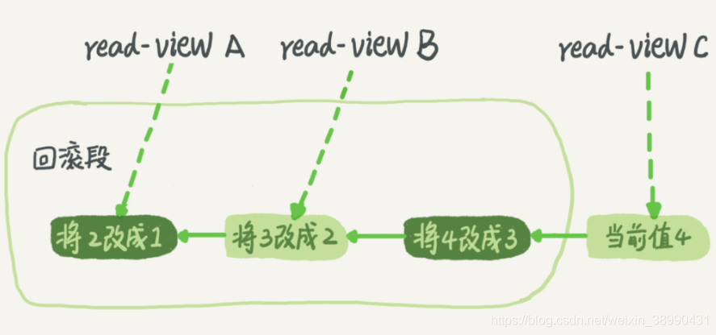

## 事务隔离机制

### MySQL事务四大特性

> 事务：由一个有限的数据库操作序列组成，这些操作要么全部执行，要么全部不执行，是一个不可分割的工作单位。

+ 原子性(Atomicity)：事务作为一个整体被执行，包含在其中的对数据库的操作要么全部被执行，要么都不执行
+ 一致性(Consistency)：指在事务开始之前和事务结束以后，数据不会被破坏(转账场景)
+ 隔离性(Isolation)：多个事务并发访问时，事务之间是相互隔离的，即一个事务不影响其他事务运行效果
+ 持久性(Durability)：表示事务完成以后，该事务对数据库所作的操作更改，将持久地保存在数据库之中

### 事务的启动方式

+ 显示启动事务语句，begin 或 start transaction。配套的提交语句是 commit，回滚语句是 rollback
+ set autocommit = 0，这个命令会将这个线程的自动提交关掉。如果只执行 select 语句，事务就启动了，持续存在直到你主动执行 commit 或 rollback 语句，或者断开连接。

注：begin/start transaction 命令并不是一个事务的起点，在执行到它们之后的第一个操作InnoDB表的语句，创建一致性视图，事务才真正启动。如果想要马上启动一个事务，可以使用 start transaction with consistent snapshot 这个命令，便可创建一致性视图

### 事务并发产生的问题（脏读、不可重复读与幻读）

事务并执行发过程中，可能会出现一系列问题

现有如下数据

| id   | username | money |
| ---- | -------- | ----- |
| 1    | aaa      | 100   |
| 2    | bbb      | 200   |

假设现在有两个事务A、B

+ 脏读 (事务A读取到事务B未提交的数据)

  假设A查询 bbb 的数据前，id = 2 的数据被事务B 修改了

  最后事务A 读到的是 修改后的余额

  | 时间编号 | 事务A                                       | 事务B                                                  |
  | -------- | ------------------------------------------- | :----------------------------------------------------- |
  | 1        | Begin                                       |                                                        |
  | 2        |                                             | Begin                                                  |
  | 3        |                                             | update account set money = 180 where username = 'bbb'; |
  | 4        | select * from table where username = 'bbb'; |                                                        |
  | 5        | 最后的结果是180                             |                                                        |

+ 不可重复读(在事务A范围内，两个相同的查询，读取同一条记录，却返回不同的结果)

  假设事务A先去查询 aaa 的数据，查到结果是 100

  此时事务B对 aaa 账务余额更改，减了10，提交事务

  事务A再去查询 aaa 的数据，查到的结果是 90

  | 时间编号 | 事务A                                            | 事务B                                                 |
  | -------- | ------------------------------------------------ | ----------------------------------------------------- |
  | 1        | Begin                                            |                                                       |
  | 2        | select money from account where username = 'bbb' |                                                       |
  | 3        | 查询的结果是200                                  |                                                       |
  | 4        |                                                  | Begin                                                 |
  | 5        |                                                  | update account set money = 180 where username = 'bbb' |
  | 6        |                                                  | Commit                                                |
  | 7        | select money from account where username = 'bbb' |                                                       |
  | 8        | 查询的结果是180                                  |                                                       |
  | 10       | Commit                                           |                                                       |

+ 幻读(事务A查询两次同一个范围的结果集，由另一个事务的增删操作导致查询的结果集不一致)

  事务A先查询id小于5的账户记录，得到记录 id = 1 和 id = 2 的两条记录

  事务B插入一条 id = 4 的记录，并且提交

  事务A再去执行相同的查询，得到了 3条记录

  | 时间编号 | 事务A                                                        | 事务B                                             |
  | -------- | ------------------------------------------------------------ | ------------------------------------------------- |
  | 1        | Begin                                                        |                                                   |
  | 2        | select * from account where id < 5;                          |                                                   |
  | 3        | 返回 id = 1，2 的两条记录                                    |                                                   |
  | 4        |                                                              | Begin                                             |
  | 5        |                                                              | insert account(username,money) values ('C', 300); |
  | 6        |                                                              | Commit                                            |
  | 7        | select * from account where id < 5;                          |                                                   |
  | 8        | 返回 id = 1，2 两条记录                                      |                                                   |
  |          | update account set money = 280 where username = 'C';(修改事务B新增的记录) |                                                   |
  | 10       | select * from account where id < 5;                          |                                                   |
  | 11       | 返回 id = 1，2，3 三条记录                                   |                                                   |

> 不可重复读与幻读的区别：
>
> + 不可重复读的重点是修改：数据内容发生变化
> + 幻读的重点在于新增或者删除：数据的数量发生了变化

### 事务的隔离级别

| 隔离级别         | 脏读 | 不可重复读 | 幻读 |
| ---------------- | ---- | ---------- | ---- |
| read uncommitted | YES  | YES        | YES  |
| read committed   | NO   | YES        | YES  |
| repeatable read  | NO   | NO         | YES  |
| serializable     | NO   | NO         | NO   |

### MySQL隔离级别的实现原理

实现隔离机制的方法主要有两种：

1. 读写锁 (RU Serializable)
2. 一致性快照读，即 MVCC (RC RR)

+ 读未提交(Read Uncommitted)

  事务读不加锁，不阻塞其他事务的读和写

  事务写阻塞其他事务写，不阻塞其他事务读

+ 串行化(Serializable)

  所有 SELECT 语句会隐式转化为 SELECT ... FOR SHARE，即加共享锁

  读加共享锁，写加排他锁，读写互斥。如果有未提交的事务正在修改某些行，所有 select 这些行的语句都会阻塞

### MVCC的实现原理

MVCC，又叫多版本并发控制，它是同个读取历史版本的数据，来降低并发事务冲突，从而提高并发性能。

#### 隐式字段

对于 InnoDB 存储引擎，每一行记录都有两个隐藏列 DB_TRX_ID DB_ROLL_PTR，如果表中没有主键和非NULL唯一键时，则还会有第三个隐藏的主键列 DB_ROW_ID

+ DB_TRX_ID：记录每一行最近一次修改它的事务ID，大小为 6 字节
+ DB_ROLL_PTR：记录指向 undo 日志的指针，大小为 7 字节
+ DB_ROW_ID：单调递增的行ID，大小为 6 字节

#### undo 日志

+ 事务未提交时，被修改数据的镜像(修改前的旧版本)会存到 undo 日志里。以便事务回滚时，恢复旧版本数据，撤销未提交事务数据对数据库的影响。
+ undo 日志是逻辑日志。当 delete 一条记录时，undo log 中会记录一条对那个的 insert 记录，当 udpate 一条记录时，它记录一条对应相反的 update 记录。
+ 存储 undo 日志的地方，就是回滚段。

假设一个值从1被按顺序改成了2、3、4，在回滚日志里就会有类似下面的记录。



当前值是4，但是在查询这条记录的时候，不同时刻启动的事务会有不同的read-view。在试图A、B、C里，这一个记录的值分别是1、2、4，同一条记录在系统中可以存在多个版本。对于read-view A，要得到1，就必须将当前值依次执行图中所有的回滚操作得到。

##### undo日志何时删除？

当没有事务再需要用到这些回滚日志(系统里没有比这个回滚日志更早的read-view)时

#### 快照读 & 当前读

> 快照读：读取的是记录数据的可见版本(旧版本数据)，不加锁，普通的select语句都是快照读
>
> + 不加锁的非阻塞读，select 注：非Serializable的隔离级别下
>
> 当前读：读取的是记录数据的最新版本，显示加锁的都是当前读
>
> + select ... lock in share mode , select ... for update
> + update delete insert (update之前innodb会先返回最新的当前读数据，并加上锁)

#### Read View

+ Read View 就是事务执行快照读时，产生的读视图

+ 事务执行快照读时，会产生数据库系统当前的一个快照，记录当前系统中还有哪些活跃的读写事务，把它们放到一个列表里，记作 limited_ids，数组里事务ID最小值记为低水位，当前系统里已经创建过的事务ID的最大值加1记为高水位。

+ Read View (由视图数组和高水位组成)主要是用来做可见性判断，即判断当前事务可见哪个版本的数据（DB_TRX_ID not in limited_ids 表明该版本的事务不是活跃的状态，当前事务可以见到该版本事务修改后的结果）

  

  对于当前事务的启动瞬间来说，一个数据版本的row_trx_id，有以下几种可能：

  1. 如果落在绿色部分，表示这个版本是已提交的事务或者是当前事务自己生成的，这个数据可见
  2. 如果落在红色部分，表示这个版本是由将来启动的事务生成的，是肯定不可见的
  3. 如果落在黄色部分，就包括两种情况
     1. 若 row_trx_id 在数组中，表示这个版本是由还没提交的事务生成的，不可见
     2. 若 row_trx_id 不在数组中，表示这个版本是已经提交了的事务生成的，可见

> 注：RR 和 RC 最大的区别是：RC 每次读取数据前都生成一个 ReadView，而 RR 只在第一次读取数据时生成一个 ReadView

#### InnoDB可重复读隔离级别下如何避免幻读

```mysql
# 场景举例
事务1 共享读锁的形式进行select 表中有id 1 2 3 条数据
事务2 插入 id 4 的数据 发现被阻塞
```

+ 表象：快照读(非阻塞读) -- 伪MVCC
+ 内在：next-key锁(行锁+gap锁)

#### 事务的可重复读的能力是怎么实现的？

可重复读的核心是一致性读；而事务更新数据的时候，只能用当前读。如果当前的记录的行锁被其他事务占用的话，就需要进入锁等待。


**在上图的例子中，事务B查到的 k 值是3，事务A查到的 k 值是 1**

假设如下：

1. 事务A开始前，系统里面只有一个活跃事务ID是99
2. 事务ABC的版本号分别是100、101、102，且当前系统里只有这四个事务
3. 三个事务开始前，(1,1)这一行数据的 row_trx_id 是 90
4. 事务A 的视图数组是 [99,100]，事务B 的视图数组是 [99,100,101]，事务C 的视图数组是 [99,100,101,102]


由上图可知，事务A查询语句的读数据流程如下：

+ 找到(1,3)的时候，判断出 row_trx_id = 101，比高水位大，处于红色区域，不可见；
+ 接着根据undo log，找到上一个历史版本，row_trx_id = 102，比高水位大，处于红色区域，不可见；
+ 再往前找，终于找到了(1,1)，它的 row_trx_id = 90 比低水位小，处于绿色区域，可见；

可见性判断规则简单来说：

+ 版本未提交，不可见
+ 版本已提交，但是是在视图创建后提交的，不可见
+ 版本已提交，而且是在视图创建前提交的，可见

**在上述事务B的更新过程中，得到的结果是 2 + 1 = 3 而不是 1 + 1 = 2 ，原因是？**

更新数据都是先读后写的，而这个读只能是当前读

因此，在更新的时候，当前读拿到的数据是 (1,2)，更新后生成了新版本的数据 (1,3)，这个新版本的 row trx_id 是 101

所以，在执行事务 B 查询语句的时候，一看自己的版本号是 101，最新数据的版本号也是 101，是自己的更新，可以直接使用，所以查询得到的 k 的值是 3。

**事务C的更新没有立即提交会发生什么？**


事务 C’的不同是，更新后并没有马上提交，在它提交前，事务 B 的更新语句先发起了。前面说过了，虽然事务 C’还没提交，但是 (1,2) 这个版本也已经生成了，并且是当前的最新版本。那么，事务 B 的更新语句会怎么处理呢？

这时候，借助的是“两阶段锁协议”。事务 C’没提交，也就是说 (1,2) 这个版本上的写锁还没释放。而事务 B 是当前读，必须要读最新版本，而且必须加锁，因此就被锁住了，必须等到事务 C’释放这个锁，才能继续它的当前读

> 查看自动提交事务配置：show VARIABLES like 'autocommit'; 
> 查看隔离级别：select @@tx_isolation;
> 设置隔离级别：set session transaction isolation level repeatable read;
> 查询当前活跃事务：select * from information_schema.INNODB_TRX;