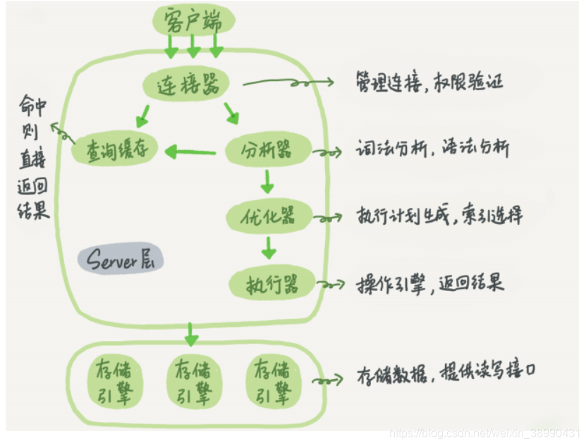
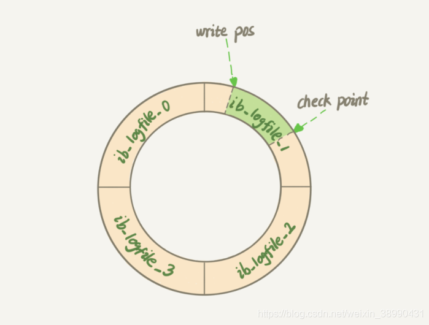
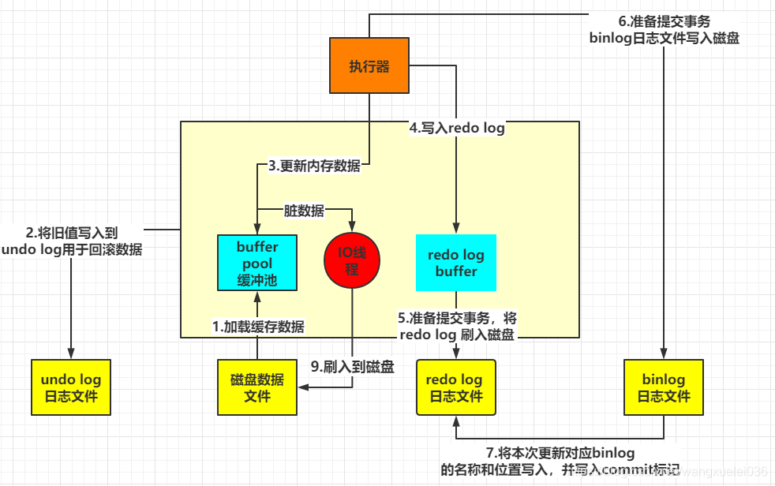

## MySQL基础架构及日志系统

### 一条SQL查询语句的执行过程



+ 连接器：负责跟客户端建立连接、获取权限、维持和管理连接。

  1. mysql客户端和服务端建立连接，完成经典的TCP握手后，连接器使用输入的用户名和密码认证身份，认证通过后会到权限表里查出该用户拥有的权限(当前用户的权限被修改在下次重连时才生效)
  2. 由于MySQL执行过程中临时使用的内存是管理在连接对象里的，这些资源在连接断开时才释放。所以长期使用长连接导致内存占用太大引发OOM，导致MySQL异常重启。以下两种方案：
     + 定期断开长连接
     + MySQL5.7或更新版本，在每次执行较大操作后，执行mysql_reset_connection来重新初始化连接资源。这一过程无需重连和重新权限验证

+ 查询缓存：之前执行过的语句及其结果，以KV形式直接缓存在内存中。查询缓存的失效非常频繁，只要有对一个表的更新，这个表上所有的查询缓存都会被清空

  对于更新压力大的数据库，查询缓存的命中率非常低。对于更新较少的静态配置表较为适用

  MySQL提供按需使用的方式：(MySQL8.0直接将查询缓存的整块功能删掉了)

  1. 将参数query_cache_type设置为DEMAND，对于默认的SQL语句都不使用查询缓存

  2. 使用 SQL_CACHE 显示指定 

     ```mysql
     select SQL_CACHE * from T where Id = 10;
     ```

+ 分析器

  1. 词法分析
  2. 语法分析

+ 优化器

  1. 决定使用哪个索引
  2. 多表关联时决定各个表的连接顺序

+ 执行器

  1. 判断用户是否对表有查询权限

  2. 根据表的引擎定义，使用这个引擎提供的接口

     查询条件没有(有)索引：

     + 调用InnoDB引擎接口获取这个表(满足条件)的第一行，判断ID是否为10，如果不是则跳过，如果是则将这行存在结果集中
     + 调用引擎接口取下一行，重复相同的判断逻辑，直到取到表的最后一行
     + 执行器将上述遍历过程中所有满足条件的行组成的记录集作为结果集返回给客户端

### 日志模块

#### redo log

redo log 重做日志是innoDB存储引擎特有的，用来保证事务安全。redo 日志使用WAL(Write-Ahead Logging)技术，其关键点是先写日志，再写磁盘。redo日志是物理日志，记录的是"在某个数据页上做了什么修改"。redo 日志大小是固定的，采用循环写的方式。如下图，wirte pos是当前记录的位置，一边写一边后移，check point是当前要擦除的位置，也是往后推移并且循环的，擦除记录前要把记录更新到数据文件。



事务没有提交前，每一个修改操作都会记录到 redo log，防止在发生故障的时间点，尚有脏页未写入磁盘，在重启mysql服务的时候，根据redo log进行重做，从而达到事务的持久性这个特性，这个能力称为 **crash-safe**

innodb_flush_log_at_trx_commit参数设置为1，表示每次事务的 redo log 都直接持久化到磁盘，可以保证MySQL异常重启后数据不丢失

#### bin log

binlog二进制日志文件，是server层逻辑日志，记录数据库执行的查询、DML、DDL语句，例如"给 ID=2这一行的c字段加1"，记录内容是追加写，binlog文件写到一定大小后会切换到下一个，可以生成多个文件，不会覆盖以前的日志。

sync_binlog参数设置为1，表示每次事务的 binlog 都持久化到磁盘，可以保证MySQL异常重启后binlog不丢失

bin log 有两种模式：

+ statement格式是记录sql语句
+ row格式会记录行的内容，记两条，更新前和更新后

#### undo log

undo log 回滚日志用于mvcc中的可见性判断

### 一条SQL更新语句的执行过程 ( update T set c = c + 1 where ID = 2)

1. 更新语句经过解析，优化后生成执行计划，交由执行器调用存储引擎接口
2. 执行器先找引擎去ID=2这行，ID是主键，引擎用树搜索到这行，如果内存存在数据，直接返回给执行器，否则需要先从磁盘中加载到内存，并将旧值写入到Undo log日志中，用于回滚数据
3. 执行器拿到引擎给的行数据，将该值加1，得到新的一行数据，再调用引擎接口写入这行新数据
4. 引擎将这行数据更新到内存，同时将更新操作记录到redo log，redo log处于prepare状态，然后告知执行器执行完毕，随时可以提交事务，Redo Log根据刷盘策略刷到磁盘
5. 准备提交事务，执行器生成这个操作的binlog，并把binlog写入磁盘
6. 执行器调用引擎的提交事务接口，引擎把刚写入的redo log改成提交(commit)状态，更新完成 (两阶段提交保证两个状态保持逻辑上的一致)
7. mysql会有个后台线程将内存数据刷入到磁盘



#### 两阶段提交的意义 (假设当前id = 2 的行，字段 c 的值是 0)

1. 先写 redo log 后写 binlog

   假设在 redo log 写完，binlog还没有写完的时候，MySQL进程异常重启。系统恢复后，这一行 c 的值是1

   但由于binlog里没有记录这个语句。如果需要用这个binlog来备份或者恢复临时库，会造成数据不一致

2. 先写 binlog 后写 redo log

   如果在binlog写完之后crash，由于redo log 还没写，崩溃恢复后该事务无效，所以该行 c 的值是 0 但是 binlog 来恢复时候会多出来一个事务，恢复出来的这一行 c 的值就是1，数据不一致