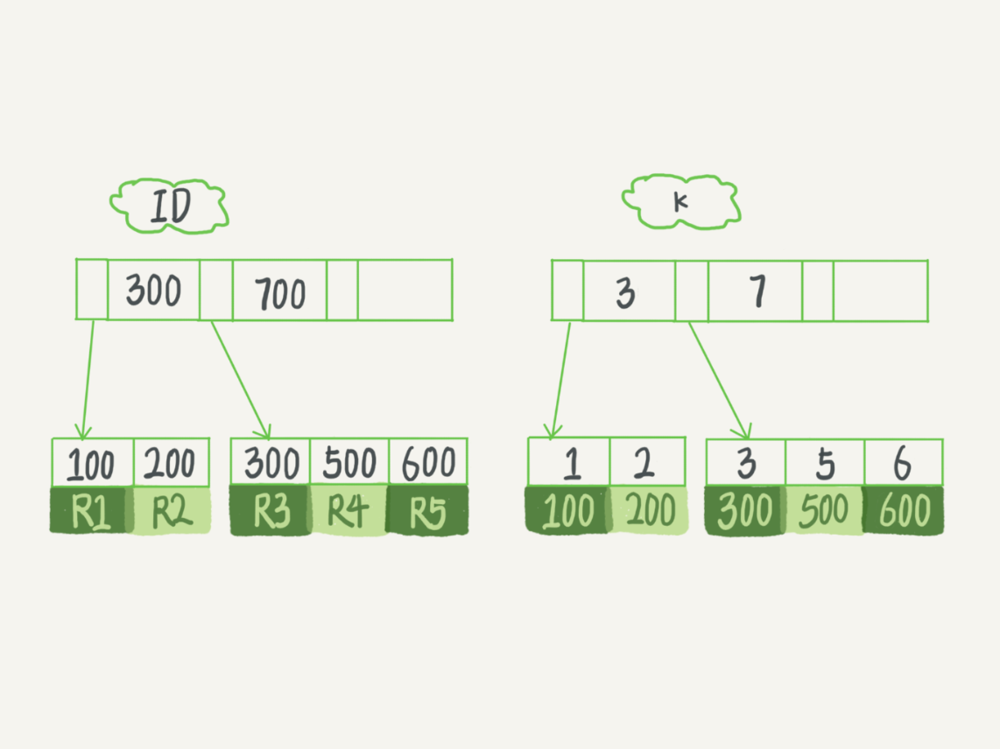

## 索引

### 索引的常见模型

+ 哈希表：适合只有等值查询的场景，区间查询的效率很低
+ 有序数组：适合静态存储引擎，更新数据代价较大
+ 搜索树：二叉树 -> 平衡二叉树 -> B树 -> B+树 (查询效率，减少磁盘IO)

### 索引不适合哪些场景

+ 数据量少
+ 更新数据比较频繁
+ 区分度低的字段(如性别)

### InnoDB引擎的索引模型  (B+树)

#### 二叉查找树 平衡二叉树 的劣势

+ 二叉查找树在最坏情况会变成链表，树的高度急剧增加，数据查询相当于全表扫描
+ 平衡二叉树通过旋转使得树一直保证平衡状态。 平衡二叉树每个节点只存储一个键值和数据，当需存储海量的数据时，树的节点会非常多，而且高度会很高，每次查找数据会进行多次磁盘 IO 

#### B树与B+树

B树(Balance Tree)每个节点能存储更多的键值和数据，子节点的个数一般称为阶，每个节点存储了两个数据节点以及三个指向子节点的指针，每个节点也称为页，即磁盘块，mysql中数据读取的基本单位都是页，因此B树的设计也符合mysql中索引的底层数据结构

B+树是对B树的进一步优化。B+树的非叶子节点上不存储数据，仅存储键值，在数据库页的大小是固定的(Innodb中页的默认大小是16KB)。不存储数据仅存储键值的情况下，会使树的阶数更大，树就会更矮更胖，查询所需磁盘IO次数会进一步减少，提升查询效率。B+树的阶数等于键值的数量。B+树的叶子节点存储数据，且是按照顺序排列的，使得范围查找，排序查找，分组查找以及去重查找变得异常简单(B树的数据分散在各个节点)。B+树上的各个页之间通过双向链表连接，叶子节点中的数据是通过单向链表连接的。    

### 主键索引与非主键索引

1.主键索引(聚簇索引)：以主键作为B+树索引的键值而构建的B+树索引，叶子节点存储表中所有数据

2.非主键索引(二级索引)：以主键以外的列值作为键值构建的B+树索引，叶子节点不存储数据，而是存储该列对应的主键，想要查找数据还需要根据主键再去聚集索引中进行查找，这一过程称为 回表

### 覆盖索引

#### Q: 在上图的索引结构下，执行 select * from T where k between 3 and 5 需要执行几次树的搜索操作，会扫描多少行？（读了 k 索引树的 3 条记录，回表了两次）

1. 在 k 索引树上找到 k = 3 的记录，取得 ID = 300
2. 再到 ID 索引树查到 ID = 300 对应的 R3
3. 在 k 索引树取下一个值 k = 5，取得 ID = 500
4. 再回到 ID 索引树查到 ID = 500 对应的 R4
5. 在 k 索引树取下一个值 k = 6，不满足条件，循环结束

SQL只需要通过覆盖索引就可以返回查询所需要的数据，而不需要回表。故覆盖索引可以减少树的搜索次数，显著提升查询性能，是常用的性能优化手段。

### 回表

SQL通过辅助索引查询到对应数据的主键，然后通过聚簇索引查到对应的数据记录

### 最左匹配原则

对于联合索引最左优先，查询条件中，以最左边为起点任何连续的索引都能匹配上。同时遇到范围查询(> < between like)就会停止匹配。查询条件中顺序无关。

索引为 abcd 查询为 =a =b >c =d 命中 abc

索引为 abdc 查询为 =a =b >c =d 命中 abdc

原因是：MySQL创建联合索引的规则是首先对第一个索引字段的数据排序，在此基础上再对第二个索引字段数据进行排序，以此类推，类似于order by field1，order by field2。故而在上述例子中，在 > c 的查找结果中不是确定的，可能是一个，也可能是百万个，这些数值对应的d值是无序

### 索引下推

ICP(index condition pushdown)，MySQL 5.6 引入的在非主键索引上的优化，可以在索引遍历过程中，对索引中包含的字段先做判断，直到过滤掉不满足条件的记录，可以有效减少回表的次数，大大提高查询的效率。

举例说明：SQL: select * from user where name like '张%' and age = 10;

无索引下推执行过程：

从ID3开始一个个回表。到主键索引上找到数据行，再比对字段值；需要回表4次

索引下推执行过程：

InnoDB在(name, age)索引内部就判断了 age 是否等于 10，对于不等于10的记录，直接判断并跳过。只需回表两次

### 索引哪些情况会失效

+ 查询条件中包含 or ，like通配符，非联合索引中的第一个列
+ 在索引列上使用 mysql 的内置函数，索引失效
+ 对索引列运算( + - * /)，索引失效
+ 索引字段上使用 is null，is not null，!= ，<>，not in 时，可能会导致索引失效
+ mysql 估计使用全表扫描要比使用索引快

### 如何优化SQL

+ 通过慢查询日志定位具体的查询SQL
+ explain分析慢SQL，能走索引尽量走索引
+ 优化SQL结构，避免返回不必要的数据
+ 适当分批量进行
+ 分库分表
+ 读写分离