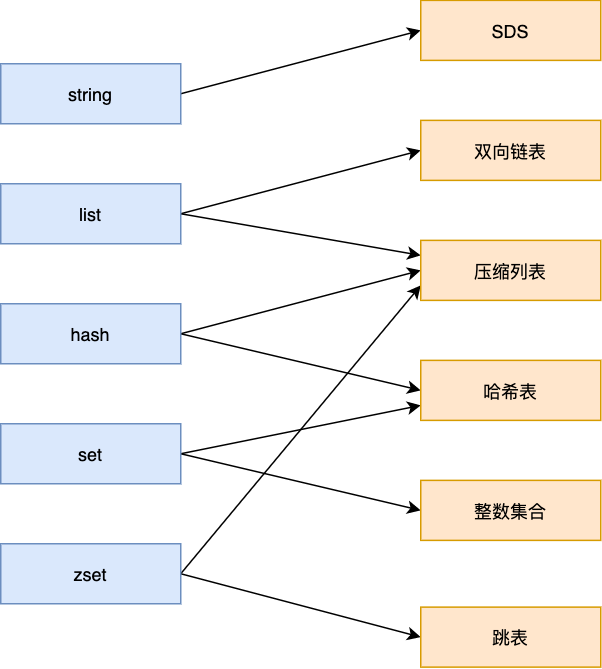
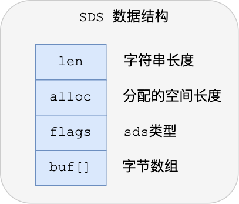
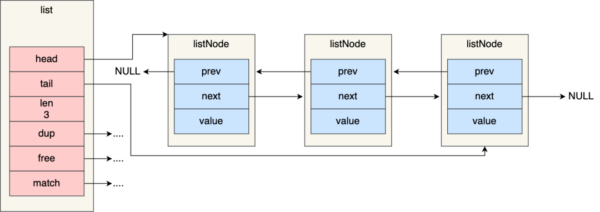
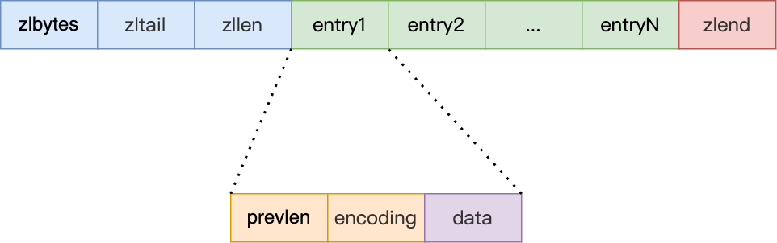
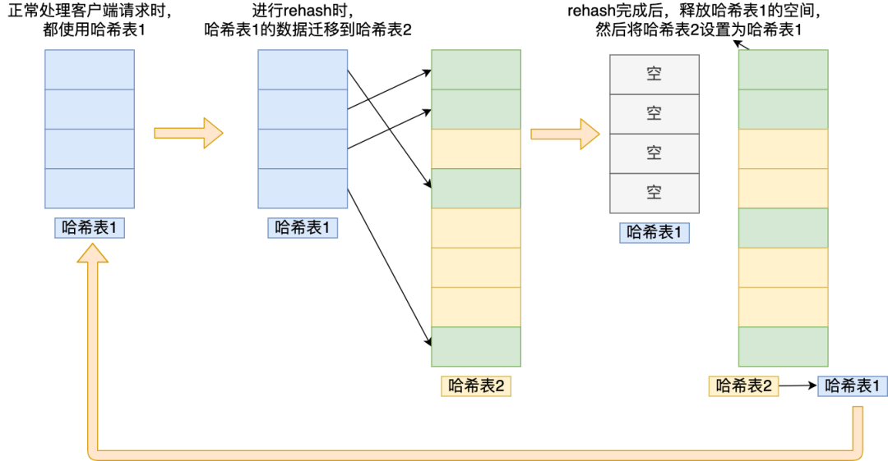
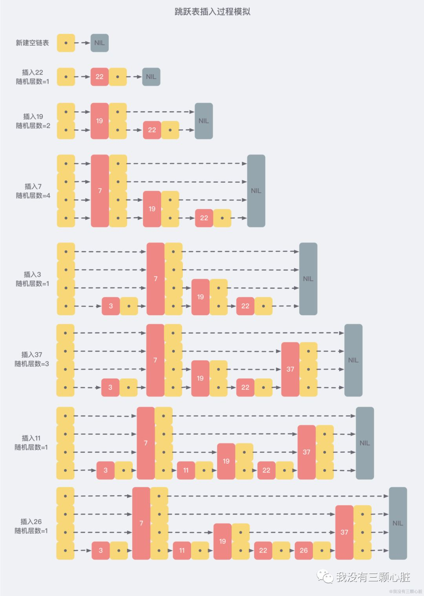

### Redis常见的数据类型
#### 数据类型与底层数据结构映射关系

#### String

1. 介绍：String 数据结构是简单的 key-value 类型。Redis自己构建了一种 **简单动态字符串** (simple dynamic string，SDS)。相比于C的原生字符串，Redis的SDS不光可以保存文本数据还可以保存二进制数据，并且获取字符串长度复杂度为O(1)(C字符串为O(N))。SDS的api是安全的，不会造成缓冲区溢出

   SDS的优点：1.O(1)时间复杂度获取字符串长度 2.类似于ArrayList有空间预分配，增长或缩短字符串不需要在内存重新分配。

2. 常用命令：set get strlen exists dect incr setex 等

3. 应用场景：计数场景，比如用户的访问次数、热点文章点赞转发数量

#### List

1. 介绍：list即链表。Redis实现了自己的链表数据结构 -- 双向链表，即可以支持反向查找和遍历，更方便操作，不过带来了部分额外的内存开销
2. 常用命令：rpush lpop lpush rpop lrange llen 等
3. 应用场景：发布于订阅模式、实现队列栈等

#### hash

1. 介绍：类似JDK1.8前的HashMap，hash是一个String类型的field和value的映射表，适合存储对象
2. 常用命令：hset hmset hexists hget hgetall hkeys hvalues
3. 应用场景：系统中对象数据的存储

#### set

1. 介绍：类似于Java的HashSet
2. 常用命令：sadd spop smembers sismember scard sinterstore sunion 等
3. 应用场景：需要存放数据不能重复及需要获取多个数据源交集和并集等场景

#### zset (sorted set)

1. 介绍：和set相比，zset增加了一个权重参数score，使得集合中的元素能够按照score进行有序排列，还可以通过score的范围来获取元素的列表
2. 常用命令：zadd zcard zscore zrange zrevrange zrem 等
3. 应用场景：需要对数据根据某个权重进行排序的场景。

底层数据结构是跳表(Skip List)

#### bitmap

1. bitmap存储的是连续的二进制数字，通过bitmap，只需要一个bit位来表示某个元素对应的值或状态，key就是对应元素本身。能够极大的节省存储空间
2. 常用命令：setbit getbit bitcount bitop
3. 应用场景：适合需要保存状态(比如是否签到、是否登陆)

### Redis 底层数据结构

#### SDS(Simple Dynamic String)

C语言字符数组的缺点：

+ 获取字符串长度的时间复杂度是O(N)
+ 结束符"\0" 不能作为存储内容，且需符合某种编码(如ASCII)，故只能保存文本，不能支持图片、音视频等二进制数据
+ 字符串操作函数不高效且不安全，容易发生缓冲区溢出造成程序运行终止

+ len，字符串长度，时间复杂度O(1)
+ alloc，分配给字符数组的空间长度。修改字符串时，通过 alloc - len 计算剩余空间大小，自动扩容至所需大小
+ flags，SDS类型，分别是 sdshdr5、sdshdr8、sdshdr16、sdshdr32和sdshdr64，含义是 len 和 alloc 分配空间的大小不能超过 2 的 n 次方
+ buf[]，字节数组，保存实际数据

#### 链表

+ ListNode 链表节点带有prev和next指针，链表是双向无环
+ 头尾节点 head 和 tail
+ 链表节点数量 len

> 缺点：链表的每个节点之间内存都是不连续的，意味着无法很好利用CPU缓存
>
> Redis 的 list 数据类型在数据量较少的情况下，会采用**压缩列表**作为底层数据结构

#### 压缩列表

压缩列表是 Redis 数据类型为 list 和 hash 的底层实现之一。

+ 当一个列表键 (list) 只包含少量的列表项，且每个列表项都是小整数值，或者长度比较短的字符串
+ 当一个哈希键 (hash) 只包含少量键值对，且每个键值对的键和值都是小整数值，或者长度比较短的字符串

+ zlbytes：记录整个压缩列表占用堆内存字节数
+ zltail：记录压缩列表尾部节点距离起始地址的偏移量
+ zllen：记录压缩列表包含的节点数量
+ zlend：标记压缩列表的结束点，特殊值OxFF (十进制255)
+ prevlen：记录前一个节点的长度
+ encoding：记录当前节点实际数据类型及长度
+ data：记录当前节点的实际数据

> 缺点：插入元素时，若内存空间不够，需要重新分配一块连续的内存，可能引发**连锁更新**问题，导致压缩列表占用的内存空间要多次重新分配，直接影响到压缩列表的访问性能
>
> 压缩列表只用于保存的节点数量不多的场景

#### 哈希表

哈希表是一种保存键值对（key-value）的数据结构

优点：以O(1)的复杂度快速查询数据。通过hash函数快速定位数据在表中的位置

缺点：数据不断增多，**哈希冲突**的可能性会增加

##### 哈希冲突：当有两个以上数量的key被分配到了同一个哈希桶上

##### 链式哈希：发生哈希冲突的多个节点通过next指针构成一个单向链表

> 链表程度增加，查询性能降低，使用**rehash**对哈希表进行扩容

##### rehash

> 当原表数据量非常大，第二步迁移会涉及大量的数据拷贝，可能会对redis造成阻塞，无法提供其他服务

##### 渐进式rehash

在rehash期间，每次哈希表元素进行新增、删除、查找或者更新操作时，Redis除了会执行对应操作外，还会顺序将哈希表1中索引位置上的所有k-v迁移到哈希表2上。把一次性大量数据迁移工作的开销分摊到了多次处理请求的过程中，避免一次性rehash的耗时操作

#### 跳表

跳表本质就是多层链表的结构，上面一层链表的节点个数大约是下面一层节点个数的一半，查找过程类似于一个二分查找。

> 缺点：插入或者删除节点时会打乱上下两层链表节点个数的2:1对应关系，若要维持该关系，需要调整后面的所有节点，时间复杂度会蜕化为O(n)
>
> skiplist不要求上下两层链表的节点个数有严格的对应关系，为每个节点随机出一个层数(level)

跳表默认允许最大层数是32，第N层的被分到的概率为2^(-n)，插入操作只需要修改节点前后的指针，而不需要对多个节点进行调整