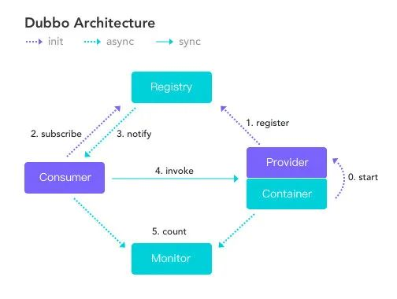
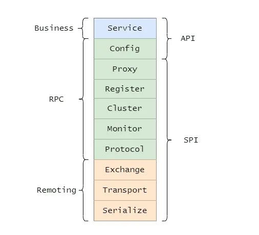
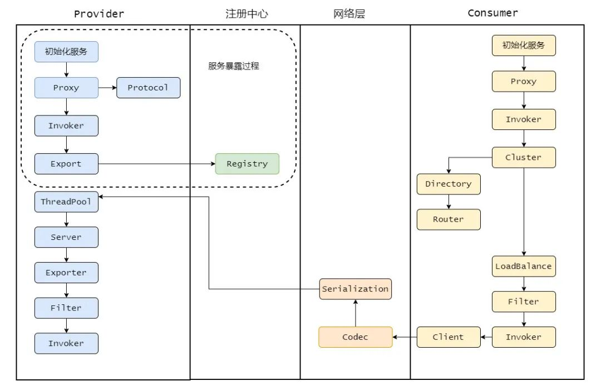
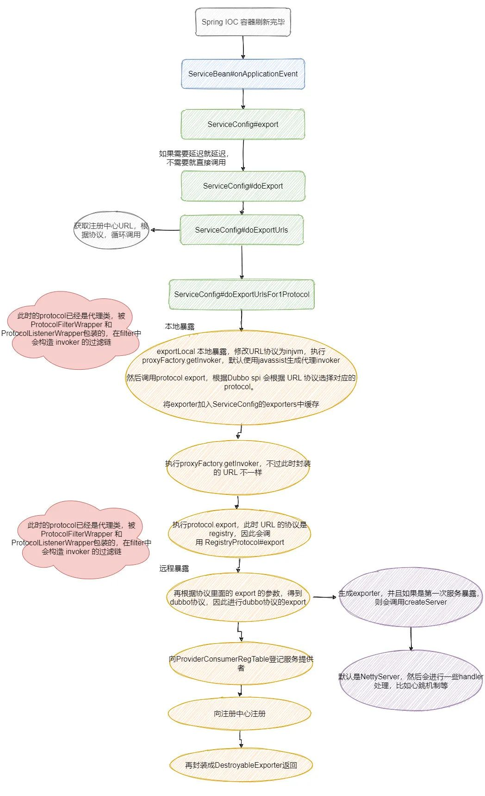
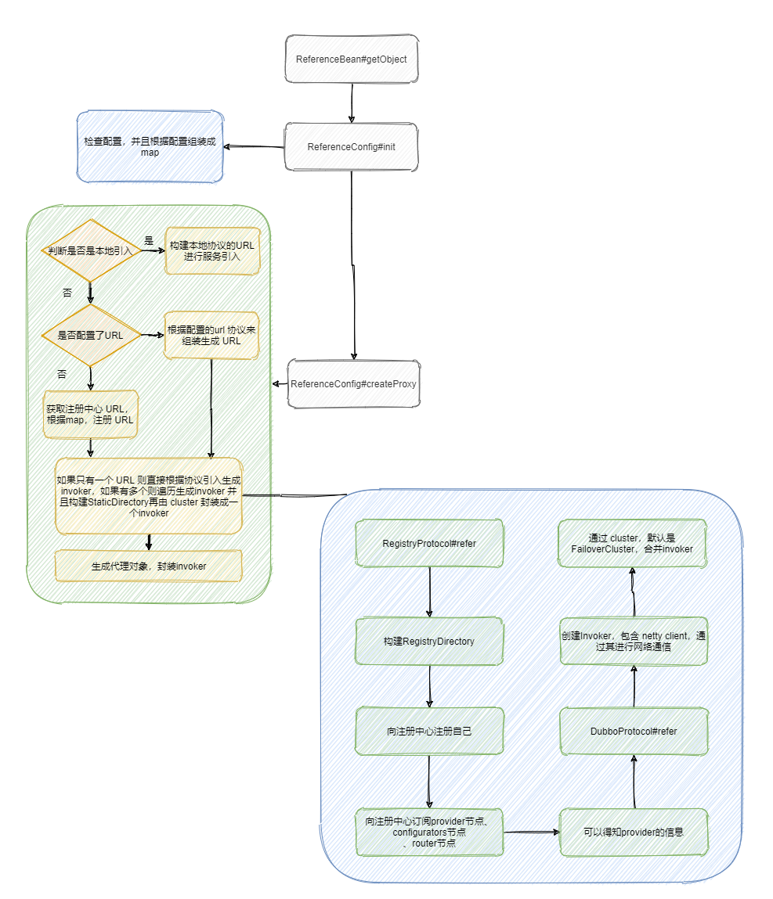
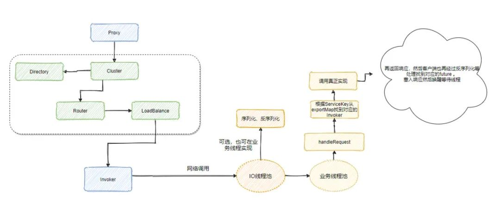
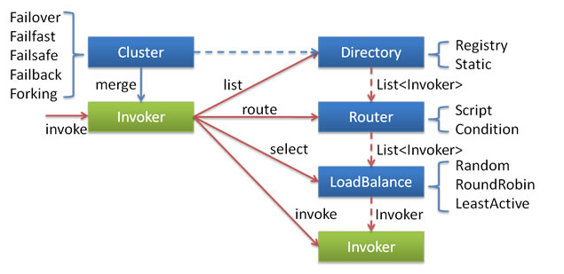
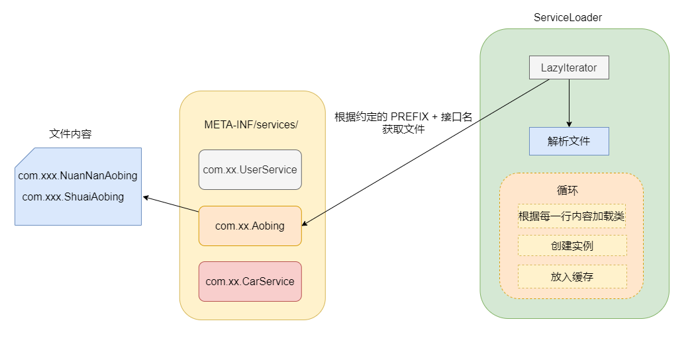
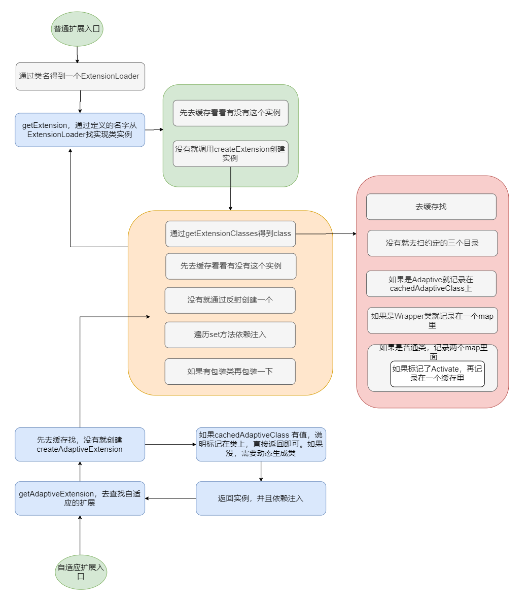
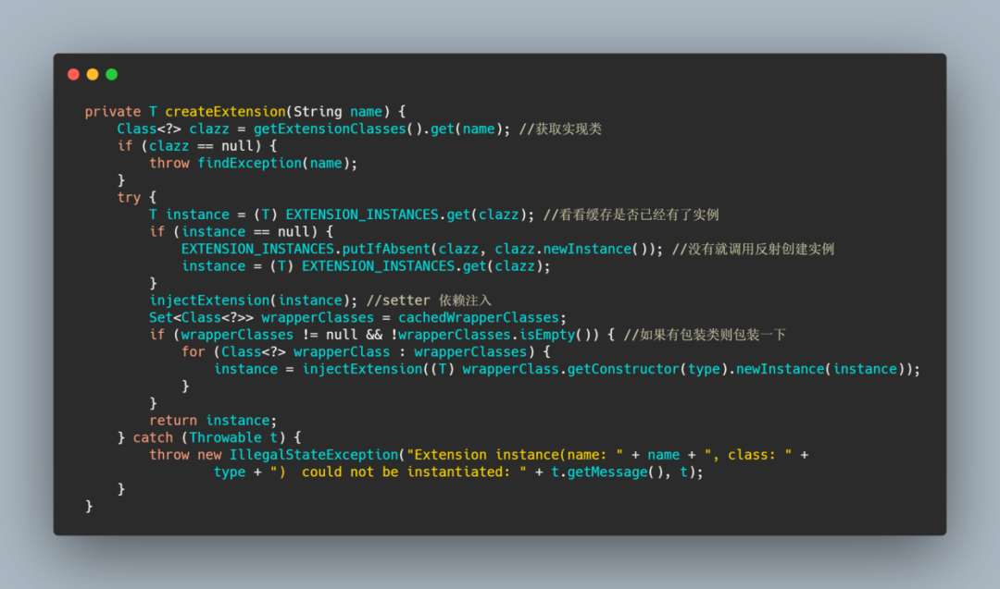

##  Dubbo

### 简介

​	Dubbo是阿里巴巴于2011年开源的基于Java的RPC框架。它实现了面向接口的代理RPC调用，并且可以配置ZK等组件实现服务注册和发现功能，并且拥有负载均衡、容错机制等。

### 总体架构



| 节点      | 角色说明                     |
| --------- | ---------------------------- |
| Consumer  | 需要调用远程服务的服务消费方 |
| Registry  | 注册中心                     |
| Provider  | 服务提供方                   |
| Container | 服务运行的容器               |
| Monitor   | 监控中心                     |

整体流程

1. 服务提供者Provider启动然后向注册中心注册自己能提供的服务
2. 服务消费者Consumer启动向注册中心订阅自己所需的服务。注册中心将提供者元信息通知给Consumer，之后Consumer通过负载均衡选择一个Provider直接调用
3. 服务提供方元数据变更的话注册中心会把变更推送给服务消费者
4. 服务提供者和消费者都会在内存中记录调用的次数和时间，然后定时的发送统计数据到监控中心

### 核心组件



+ Service 业务层，咱开发的业务逻辑层
+ Config 配置层，主要围绕ServiceConfig和ReferenceConfig，初始化配置信息
+ Proxy 代理层，服务提供和消费者都会生成一个代理类，使得服务接口透明化，代理层做远程调用和返回结果
+ Register 注册层，封装了服务注册和发现
+ Cluster 路由和集群容错层，负责选取具体调用的节点，处理特殊的调用要求和负责远程调用失败的容错措施
+ Monitor 监控层，负责监控统计调用时间和次数
+ Protocol 远程调用层，主要是封装RPC调用，主要负责管理Invoker，代表一个抽象封装了的执行体
+ Exchange 信息交换层，用来封装请求响应模型，同步转异步
+ Transport 网络传输层，抽象了网络传输的统一接口，用户可以按需选择底层实现(如Netty)
+ Serialize 序列化层，定义序列化反序列化规则

### 大致调用流程



##### 服务暴露过程

+ Provider服务启动
+ Proxy组件根据具体的协议Protocol将需要暴露出去的接口封装成Invoker
+ 再通过Exporter封装，通过Registry注册到注册中心



##### 服务引入



##### 消费过程

+ 消费者启动向注册中心拉取服务提供者的元信息
+ Proxy持有一个Invoker对象，调用invoke后需要通过Cluster先从Directory获取所有可调用的远程服务的Invoker列表
+ 通过LoadBalance做负载均衡选取一个，通过Client做数据传输
+ 通过Codec接口做协议构造，再序列化。发送对应的服务提供者
+ 服务提供者接收到请求后会进行Codec协议处理，反序列化后将请求扔到线程池处理。线程根据请求找到对应的Exporter、Invoker，最后调用实现类然后原路返回结果





### SPI

​	Java SPI 约定在Classpath下的META-INF/services/目录里创建一个以服务接口命名的文件，文件里记录的是此jar包提供的具体实现类的全限定名。通过ServiceLoader读取配置的实现类，遍历将其全部实例化



> Java SPI在查找扩展实现类的时候是将所有实现类全部实例化，假设一个实现类初始化比较消耗资源且耗时，但代码用不上它，就产生了资源的浪费。**Java SPI 无法按需加载实现类**

​	Dubbo SPI的配置文件存放的是键值对，除了可按需加载实现类外，增加了IOC和AOP的特性，还有自适应扩展机制。配置文件的约定如下：

+ META-INF/services/目录：兼容Java SPI
+ META-INF/dubbo/目录：用户自定义的SPI配置文件
+ META_INF/dubbo/internal/目录：Dubbo内部使用的SPI配置文件





##### @Adaptive 注解-自适应扩展

若不想在启动的时候让扩展被加载，而是根据请求的参数来动态选择对应的扩展。

dubbo为接口生成一个代理类，可通过JDK或javassist编译成代理类，然后通过反射创建实例。该实例会根据方法的请求参数得知需要的扩展类，然后通过ExtensionLoader.getExtensionLoader(type.class).getExtension(param)来获取真正的实例来调用。

```java
// DEMO
public interface WheelMaker { Wheel makWheel(URL url); }
public class AdaptiveWheelMaker implements WheelMaker {
  public Wheel makWheel(URL url) {
    String name = url.getParameter("Wheel.maker");
    WheelMaker wheelMaker = ExtensionLoader.getExtensionLoader(WheelMaker.class).getExtension(name);
    return wheelMaker.makeWheel(url);
  }
}
```

##### WrapperClass - AOP

​	包装类是因为一个扩展接口可能有多个扩展实现类，而这些扩展实现类会有公共的逻辑，避免重复代码，提升可维护性

##### injectExtension - IOC

​	查找set方法，根据参数找到依赖对象则注入