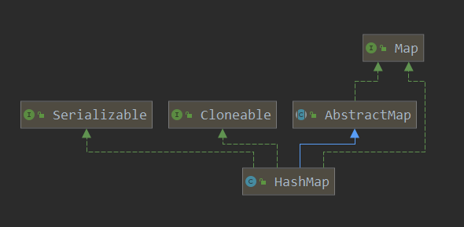

## HashMap

### 继承关系



### 重要内部类

#### Node 内部类

Node节点用来存储HashMap的一个个实例，其实现了 Map.Entry 接口。

```java
interface Entry<K,V> {
    K getKey();
    V getValue();
    V setValue(V value);
    boolean equals(Object o);
    int hashCode();
}

class Node<K,V> implements Map.Entry<K,V> {
    final int hash;
    final K key;
    V value;
    Node<K,V> next;
    // 构造函数及接口实现方法
}
```

#### KeySet 内部类

KeySet 类继承于 AbstractSet 抽象类，由 HashMap 中的 keyset() 方法创建 KeySet 实例，旨在对 HashMap 中的key键进行操作

```java
//返回一个set视图，包含了map中的key
public Set<K> keySet() {
    // keySet 指向的是 AbstractMap 中的 keyset
    Set<K> ks = keySet;
    if (ks == null) {
        ks = new KeySet();
        keySet = ks;
    }
    return ks;
}

final class KeySet extends AbstractSet<K> {
    public final int size() {...}
    public final void clear() {...}
    public final Iterator<K> iterator() {...}
    public final boolean contains(Object o) {...}
    public final boolean remove(Object key) {...}
    public final void forEach(Consumer<? super K> action) {...}
}
```

#### Values 内部类

Values 类的创建和 KeySet 类相似

```java
public Collection<V> values() {
    Collection<V> vs = values;
    if (vs == null) {
        vs = new Values();
        values = vs;
    }
    return vs;
}
final class Values extends AbstractCollection<V> {
    public final int size() {...}
    public final void clear() {...}
    public final Iterator<V> iterator() {...}
    public final boolean contains(Object o) {...}
    public final void forEach(Consumer<? super V> action) {...}
}
```

#### EntrySet 内部类

和 KeySet 和 Values 类相似，EntrySet 是对 key-value 键值对进行操作的内部类

```java
public Set<Map.Entry<K,V>> entrySet() {
    Set<Map.Entry<K,V>> es;
    return (es = entrySet) == null ? (entrySet = new EntrySet()) : es;
}
final class EntrySet extends AbstractSet<Map.Entry<K,V>> {
    public final int size() {...}
    public final void clear() {...}
    public final Iterator<Map.Entry<K,V>> iterator() {...}
    public final boolean contains(Object o) {...}
    public final boolean remove(Object o) {...}
    public final void forEach(Consumer<? super Map.Entry<K,V>> action) {...}
}
```

### 底层结构

#### HashMap 1.7

JDK1.7 中，HashMap采用位桶 + 链表的实现，使用链表来处理冲突，同一hash值的链表都存储在一个桶中，以链表的形式相连

#### HashMap 1.8

每个桶中的元素大于8时，会转变为红黑树，目的是优化查询效率

###### 初始容量 

```java
static final int DEFAULT_INITIAL_CAPACITY = 1 << 4;
```

###### 最大容量

``` java
static final int MAXIMUM_CAPACITY = 1 << 30; // 最高位为符号位
```

###### 默认负载因子

```java
static final float DEFAULT_LOAD_FACTOR = 0.75f; //第一次扩容：DEFAULT_INITIAL_CAPACITY * DEFAULT_LOAD_FACTOR = 12
```

###### 树化阈值

```java
static final int TREEIFY_THRESHOLD = 8;
```

###### 链表阈值

```java
static final int UNTREEIFY_THREESHOLD = 6;
```

###### 扩容临界值

```java
static final int MIN_TREEIFY_CAPACITY = 64; //桶数组容量小于该值时优先进行扩容而不是树化
```

### 构造函数

+ 带有初始容量 initialCapacity 和 负载因子 loadFactor 的构造函数

  ```java
  public HashMap(int initialCapacity, float loadFactor) {
      if (initialCapacity < 0)
          throw new IllegalArgumentException("Illegal initial capacity: " +
                                                 initialCapacity);
      if (initialCapacity > MAXIMUM_CAPACITY)
          initialCapacity = MAXIMUM_CAPACITY;
      if (loadFactor <= 0 || Float.isNaN(loadFactor))
          throw new IllegalArgumentException("Illegal load factor: " +
                                                 loadFactor);
      this.loadFactor = loadFactor;
      this.threshold = tableSizeFor(initialCapacity);
  }
  ```

+ 只带有 initialCapacity 的构造函数

  ```java
  public HashMap(int initialCapacity) {
      this(initialCapacity, DEFAULT_LOAD_FACTOR);
  }
  ```

+ 无参构造函数

  ```java
  public HashMap() {
      this.loadFactor = DEFAULT_LOAD_FACTOR;
  }
  ```

+ 带有 map 的构造函数

  ```java
  public HashMap(Map<? extends K, ? extends V> m) {
      this.loadFactor = DEFAULT_LOAD_FACTOR;
      putMapEntries(m, false);
  }
  ```

### Put 全过程

#### Hash 函数

hash 函数根据传递的 key 值计算 hashCode 值，然后对 hashCode 进行无符号右移操作，最后再和 hashCode 进行异或操作。

```java
static final int hash(Object key) {
    int h;
    return (key == null) ? 0 : (h = key.hashCode()) ^ (h >>> 16);
}
```

#### Put 函数

调用 hash 函数计算应插入的位置，然后调用 putVal 方法

```java
public V put(K key, V value) {
  return putVal(hash(key), key, value, false, true);
}
```

#### PutVal 函数

```java
final V putVal(int hash, K key, V value, boolean onlyIfAbsent, boolean evict) {
    Node<K,V>[] tab; Node<K,V> p; int n, i;
    // 如果table 为null 或者没有为 table 分配内存，就resize一次
    if ((tab = table) == null || (n = tab.length) == 0)
        n = (tab = resize()).length;
    // 指定hash值节点为空则直接插入，这个(n - 1) & hash才是表中真正的哈希
    if ((p = tab[i = (n - 1) & hash]) == null)
    tab[i] = newNode(hash, key, value, null);
    // 如果不为空
    else {
        Node<K,V> e; K k;
        // 计算表中的这个真正的哈希值与要插入的key.hash相比，hash 和 key内容都一致
        if (p.hash == hash && ((k = p.key) == key || (key != null && key.equals(k))))
            e = p;
        // 若不同的话，并且当前节点已经在 TreeNode 上了
        else if (p instanceof TreeNode)
        // 采用红黑树存储方式
            e = ((TreeNode<K,V>)p).putTreeVal(this, tab, hash, key, value);
        // key.hash 不同并且也不再 TreeNode 上，在链表上找到 p.next==null
        else {
            for (int binCount = 0; ; ++binCount) {
                if ((e = p.next) == null) {
                    // 在表尾插入
                    p.next = newNode(hash, key, value, null);
                    // 新增节点后如果节点个数到达阈值，则进入 treeifyBin() 进行再次判断
                    if (binCount >= TREEIFY_THRESHOLD - 1) // -1 for 1st
                        treeifyBin(tab, hash);
                    break;
                }
                // 如果找到了同 hash、key 的节点，那么直接退出循环
                if (e.hash == hash && ((k = e.key) == key || (key != null && key.equals(k))))
                    break;
                // 更新 p 指向下一节点
                p = e;
            }
        }
        // map中含有旧值，返回旧值
        if (e != null) { // existing mapping for key
            V oldValue = e.value;
            // 根据 onlyIfAbsent 参数决定是否覆盖
            if (!onlyIfAbsent || oldValue == null)
                e.value = value;
            afterNodeAccess(e);
            return oldValue;
        }
    }
    // map调整次数 + 1
    ++modCount;
    // 键值对的数量达到阈值，需要扩容
    if (++size > threshold)
        resize();
    afterNodeInsertion(evict);
    return null;
}
```

#### Resize 函数

```java
final Node<K,V>[] resize() {
    Node<K,V>[] oldTab = table;
    int oldCap = (oldTab == null) ? 0 : oldTab.length;
    int oldThr = threshold;
    int newCap, newThr = 0;
    // 若原 hashmap 已有元素
    if (oldCap > 0) {
        // 若原 hashmap 已大于最大容量，无法扩容，返回原hashMap
        if (oldCap >= MAXIMUM_CAPACITY) {
            threshold = Integer.MAX_VALUE;
            return oldTab;
        }
        // 若原 hashMap 容量大于16，扩容两倍，且未超过最大容量，阈值扩大两倍
        else if ((newCap = oldCap << 1) < MAXIMUM_CAPACITY && oldCap >= DEFAULT_INITIAL_CAPACITY)
            newThr = oldThr << 1;
    }
    // 初始化容量用阈值
    else if (oldThr > 0) {
        newCap = oldThr;
    }
    // 初始化使用默认容量和阈值
    else {
        newCap = DEFAULT_INITIAL_CAPACITY;
        newThr = (int)(DEFAULT_LOAD_FACTOR * DEFAULT_INITIAL_CAPACITY);
    }
    // 计算扩容后阈值
    if (newThr == 0) {
        float ft = (float)newCap * loadFactor;
        newThr = (newCap < MAXIMUM_CAPACITY && ft < (float)MAXIMUM_CAPACITY ? (int)ft : Integer.MAX_VALUE);
    }
    threshold = newThr;
    // 初始化新容量大小的 Node 数组
    Node<K,V>[] newTab = (Node<K,V>[])new Node[newCap];
    table = newTab;
    if (oldTab != null) {
        // 遍历 Node 数组
        for (int j = 0; j < oldCap; ++j) {
            Node<K,V> e;
            if ((e = oldTab[j]) != null) {
                oldTab[j] = null;
                // 若 当前元素没有 链式后继节点
                if (e.next == null)
                    // 重新计算在新数组中存放的位置并放入
                    // 部分元素放在原位 部分元素放在 j + oldcap 位置上
                    // e.hash = 3 的情况下 hash & (n - 1) 与 hash & (2 * n - 1) 保持原位
                    // e.hash = 19 的情况下 hash & (n - 1) 与 hash & (2 * n - 1) 移动了16长度
                    newTab[e.hash & (newCap - 1)] = e;
                else if (e instanceof TreeNode)
                    // 使用红黑树的方式 分裂成低阶树或退化为链表
                    ((TreeNode<K,V>)e).split(this, newTab, j, oldCap);
                else {
                    // 当前元素存在 链式后继节点
                    Node<K,V> loHead = null, loTail = null;
                    Node<K,V> hiHead = null, hiTail = null;
                    Node<K,V> next;
                    // 计算扩容之后 桶的位置变化 按原顺序分组
                    do {
                        next = e.next;
                        // 桶位置不变
                        if ((e.hash & oldCap) == 0) {
                            if (loTail == null)
                                loHead = e;
                            else 
                                loTail.next = e;
                            loTail = e;
                        }
                        // 桶位置变化，偏移量为oldCap
                        else {
                            if (hiTail == null)
                                hiHead = e;
                            else 
                                hiTail.next = e;
                            hiTail = e;
                        }
                    } while ((e = next) != null);
                    // 将分组后的链表映射到新桶中
                    if (loTail != null) {
                        loTail.next = null;
                        newTab[j] = loHead;
                    }
                    if (hiTail != null) {
                        hiTail.next = null;
                        newTab[j + oldCap] = hiHead;
                    }
                }
            }
        }
        return newTab;
    }
}
```

### Get 全过程

#### get 函数

计算 key 的哈希值，然后调用 getNode 方法

```java
public V get(Object key) {
    Node<K,V> e;
    return (e = getNode(hash(key), key)) == null ? null : e.value;
}
```

#### getNode 函数

```java
final Node<K,V> getNode(int hash, Object key) {
    Node<K,V>[] tab; Node<K,V> first, e; int n; K k;
    // 找到桶位置
    if ((tab = table) != null && (n = tab.length) > 0 && (first = tab[(n - 1) & hash]) != null) {
        // 检查桶中第一个元素
        if (first.hash == hash && // always check first node 
            ((k = first.key) == key || (key != null && key.equals(k))))
            return first;
        // 判断桶中的下一个元素是否存在
        if ((e = first.next) != null) {
            // 若是红黑树节点，调用 getTreeNode 方法获取
            if (first instanceof TreeNode)
                return ((TreeNode<K,V>)first).getTreeNode(hash, key);
            // 遍历链表元素 直到找到元素位置
            do {
                if (e.hash == hash && ((k = e.key) == key || (key != null && key.equals(k))))
                    return e;
            } while ((e = e.next) != null);
        }
    }
    return null;
}
```

### Remove  过程

#### remove 函数

计算 key 的哈希值 调用 removeNode 方法

```java
public V remove(Object key) {
    Node<K,V> e;
    return (e = removeNode(hash(key), key, null, false, true)) == null ? null : e.value;
}
```

### removeNode 函数

```java
// @param value : the value to match if matchValue, else ignored
// @param matchValue : if true only remove if value is equal
// @param movable : if false do not move other nodes while removing
final Node<K,V> removeNode(int hash, Object key, Object value, boolean matchValue, boolean) {
    Node<K,V>[] tab; Node<K,V> p; int n, index;
    // 根据 hash 计算桶的位置
    if ((tab = table) != null && (n = tab.length) > 0 && (p = tab[index = (n - 1) & hash]) != null) {
        // 判断桶的第一个节点是否是目标节点
        if(p.hash == hash && ((k = p.key) == key || (key != null && key.equals(k))))
            node = p;
        // 若桶的第一个节点有后继节点
        else if ((e = p.next) != null) {
            // 若为红黑树结构 调用 getTreeNode 方法
            if (p instanceof TreeNode)
                node = ((TreeNode<K,V>)p).getTreeNode(hash, key);
            // 单链表结构
            else {
                // 遍历往后寻找
                do {
                    if (e.hash == hash && 
                        ((k = e.key) == key || (key != null && key.equals(k)))) {
                        node = e;
                        break;
                    }
                    p = e;
                } while ((e = e.next) != null);
            }
        }
        // 已寻找到目标节点，开始remove...
        if (node != null && (!matchValue || (v = node.value) == value ||
                            (value != null && value.equals(v)))) {
            // 若为红黑树节点 调用 removeTreeNode 方法
            if (node instanceof TreeNode)
                ((TreeNode<K,V>)node).removeTreeNode(this, tab, movable);
            // 若为桶的第一个元素，把桶的第二个元素放至首位
            else if (node == p)
                tab[index] = node.next;
            else 
                p.next = node.next;
            ++modCount;
            --size;
            afterNodeRemoval(node);
            return node;
        }
    }
}
```

### 红黑树 源码分析

#### putTreeVal 函数

```java
final TreeNode<K,V> putTreeVal(HashMap<K,V> map, Node<K,V>[] tab, int h, K k, V v) {
    Class<?> kc = null;
    boolean searched = false;
    TreeNode<K,V> root = (parent != null) ? root() : this;//迭代向上寻找根节点
    for (TreeNode<K,V> p = root;;) {
        int dir, ph; K pk;
        // 根据 hash 值 判断方向
        if ((ph = p.hash) > h)
            // 大于 放左侧
            dir = -1;
        else if (ph < h) {
            // 小于 放右侧
            dir = 1;
        }
        // 如果 key 相同 返回
        else if ((pk = p.key) == k || (k != null && k.equals(pk)))
            return p;
        // hash 相同 但是 key 不相同
        // 没有实现 Comparable<C>接口 或者 实现该接口并且 k 与 pk Comparable比较结果相同
        else if ((kc == null && 
                 (kc = comparableClassFor(k)) == null) || 
                (dir = compareComparables(kc, k , pk)) == 0) {
            // 在左右子树递归寻找 hash key 相同的节点
            // 第二次迭代时就无需进入以下代码区域
            if (!search) {
                TreeNode<K,V> q, ch;
                searched = true;
                if (((ch = p.left) != null &&
                    (q = ch.find(h, k, kc)) != null) ||
                   ((ch = p.right) != null &&
                   (q = ch.find(h, k, kc)) != null))
                    return q;
            }
            // 没找到则需要进行插入操作
            // 通过hashCode 判断 插入方向
            dir = tieBreakOrder(k, pk);
        }
        
        //下面进行节点插入
        // xp 保存当前节点
        TreeNode<K,V> xp = p;
        // 结合外层for 循环 找到插入的位置
        if ((p = (dir <= 0) ? p.left : p.right) == null) {
            Node<K,V> xpn = xp.next;
            // 创建一个新节点
            TreeNode<K,V> x = map.newTreeNode(h, k, v, xpn);
            if (dir <= 0)
                xp.left = x;
            else
                xp.right = x;
            // 维护双链表的指针关系
            xp.next = x;
            x.parent = x.prev = xp;
            if (xpn != null) 
                ((TreeNode<K,V>)xpn).prev = x;
            //将root移到table数组的i位置的第一个节点
            // 红黑树进行插入操作后，重新调整平衡
            moveRootToFront(tab, balanceInsertion(root, x));
            return null;
        }
    }
    
}
```

### treeifyBin 函数

```java
final void treeifyBin(Node<K,V>[] tab, int hash) {
    int n, index; Node<K,V> e;
    // 如果桶的数量小于 最小树化容量 则只进行扩容
    if (tab == null || (n = tab.length) < MIN_TREEIFY_CAPACITY)
        resize();
    // 根据hash计算需要树化的目标桶的位置
    else if ((e = tab[index = (n - 1) & hash]) != null) {
        TreeNode<K,V> hd = null, tl = null;
        do {
            // 构造红黑树节点
            TreeNode<K,V> p = replacementTreeNode(e, null);
            // 设置双链表头结点
            if (tl == null) 
                hd = p;
            else {
                // 设置双链表非头节点
                p.prev = tl;
                tl.next = p;
            }
            tl = p;
        } while ((e = e.next) != null);
        // 将双链表头部 treeNode 设置到桶的首位 调用 teeify 进行树化
        if ((tab[index] = hd) != null)
            hd.treeify(tab);
    }
}
```

### treeify 函数

```java
final void treeify(Node<K,V>[] tab) {
    TreeNode<K,V> root = null;
    // 遍历链表，x 指向当前节点
    for (TreeNode<K,V> x = this, next; x != null; x = next) {
        next = (TreeNode<K,V>)x.next; // next 指向 下一个节点
        x.left = x.right = null;
        // 初始化 红黑树根节点
        if (root == null) {
            x.parent = null;
            x.red = false;
            root = x;
        }
        else {
            K k = x.key;
            int h = x.hash;
            Class<?> kc = null;
            for (TreeNode<K,V> p = root;;) {
                int dir, ph;
                K pk = p.key;
                // 树节点hash值大于链表节点hash值 当前链表节点会放到左子树
                if ((ph = p.hash) > h)
                    dir = -1;
                // 树节点hash值小于链表节点hash值 当前链表节点会放到右子树
                else if (ph < h)
                    dir = 1;
                // hash值相同
                // 没有实现 Comparable<C>接口 或者 
                // 实现该接口并且 k 与 pk Comparable比较结果相同
                else if ((kc == null &&
                         (kc = comparableClassFor(k)) == null) ||
                        (dir = compareComparables(kc, k, pk)) == 0)
                    dir = tieBreakOrder(k, pk);
                
                TreeNode<K,V> xp = p;
                // 迭代寻找目标节点应插入的位置
                if ((p = (dir <= 0) ? p.left : p.right) == null) {
                    x.parent = xp;
                    if (dir <= 0)
                        xp.left = x;
                    else
                        xp.right = x;
                    // 重新平衡
                    root = balanceInsertion(root, x);
                    break;
                }
            }
        }
    }
    // 将所有链表节点都遍历完后，最终构造出的树可能经过过个平衡操作，根节点对应目前链表的哪一个节点是不确定的，将树的根节点移动至桶的第一个元素处
    moveRootToFront(tab, root);
}
```

### split 函数

```java
final void split(HashMap<K,V> map, Node<K,V>[] tab, int index, int bit) {
    TreeNode<K,V> b = this;
    TreeNode<K,V> loHead = null, loTail = null;
    TreeNode<K,V> hiHead = null, hiTail = null;
    int lc = 0, hc = 0;
    // 遍历双链表
    for (TreeNode<K,V> e = b, next; e != null; e = next) {
        next = (TreeNode<K,V>)e.next;
        e.next = null;
        // 桶位置不变
        if ((e.hash & bit) == 0) {
            if ((e.prev = loTail) == null)
                loHead = e;
            else
                loTail.next = e;
            loTail = e;
            ++lc;
        }
        // 桶位置移动 偏移量为oldCap
        else {
            if ((e.prev = loTail) == null)
                hiHead = e;
            else 
                hiTail.next = e;
            hiTail = e;
            ++hc;
        }
    }
    
    // 判断UNTREEIFY_THRESHOLD阈值 决定是重新树化还是退化
    if (loHead != null) {
        if (lc <= UNTREEIFY_THRESHOLD)
            tab[index] = loHead.untreeify(map);
        else {
            tab[index] = loHead;
            if (hiHead != null) 
                loHead.treeify(tab);
        }
    }
    if (hiHead != null) {
        if (hc <= UNTREEIFY_THRESHOLD)
            tab[index + bit] = hiHead.untreeify(map);
        else {
            tab[index + bit] = hiHead;
            if (loHead != null)
                hiHead.treeify(tab);
        }
    }
}
```

### untreeify 函数

```java
final Node<K,V> untreeify(HashMap<K,V> map) {
    Node<K,V> hd = null, tl = null;
    for (Node<K,V> q = this; q != null; q = q.next) {
        Node<K,V> p = map.replacementNode(q, null);
        if (tl == null)
            hd = p;
        else
            tl.next = p;
        tl = p;
    }
    return hd;
}
```

### getTreeNode 函数

```java
final TreeNode<K,V> getTreeNode(int h, Object k) {
    // 找到根节点，然后调用 find 函数
    return ((parent != null) ? root() : this).find(h, k, null);
}
```

### find 函数

```java
final TreeNode<K,V> find(int h, Object k, Class<?> kc) {
    TreeNode<K,V> p = this;
    do {
        int ph, dir; K pk;
        TreeNode<K,V> pl = p.left, pr = p.right, q;
        // 当前节点 hash 值 大于 目标 hash 值，进入左子树查找
        if ((ph = p.hash) > h)
            p = pl;
        // 当前节点 hash 值 小于 目标 hash 值，进入右子树查找
        else if (ph < h)
            p = pr;
        // hash 值相等，且key值也相同 返回
        else if ((pk = p.key) == k || (k != null && k.equals(pk)))
            return p;
        
        // hash 值相同 但 key 不相同
        
        // 若左孩子为空 进入右子树
        else if (pl == null)
            p = pr;
        // 若右孩子为空 进入左子树
        else if (pr == null)
            p = pl;
        // 若左右孩子都不为空，通过comparable方法比较 key 大小
        else if ((kc != null ||
                  (kc = comparableClassFor(k)) != null) &&
                 (dir = compareComparables(kc, k, pk)) != 0)
            p = (dir < 0) ? pl : pr;
        // 无法通过comparable 比较或比较结果仍然一致，从右孩子节点递归查找
        else if ((q = pr.find(h, k, kc)) != null)
            return q;
        // 否则进入左孩子节点继续查找
        else
            p = pl;
    } while (p != null);
    return null;
}
```

### moveRootToFront 函数

```java
static <K,V> void moveRootToFront(Node<K,V>[] tab, TreeNode<K,V> root) {
    int n;
    if (root != null && tab != null && (n = tab.length) > 0) {
        // 定位到桶的第一个位置
        int index = (n - 1) & root.hash;
        TreeNode<K,V> first = (TreeNode<K,V>)tab[index];
        if (root != first) {
            Node<K,V> rn;
            tab[index] = root;// 将root放到桶的第一个位置
            TreeNode<K,V> rp = root.prev;//找到root在双链表中的前继节点
            if ((rn = root.next) != null)//找到root在双链表中的后继节点
                ((TreeNode<K,V>)rn).prev = rp;//将root从双链表中移除 prev 指针
            if (rp != null)
                rp.next = rn;//将root从双链表中移除 next 指针
            if (first != null)
                first.prev = root;//将root移动至原first的前边
            root.next = first;//更新root的next指针
            root.prev = null;//更新root的prev指针
        }
        assert checkInvariants(root);
    }
}
```

### removeTreeNode 函数

```java
final void removeTreeNode(HashMap<K,V> map, Node<K,V>[] tab, boolean movable) {
    // 双链表处理
    int n;
    // tab 为空 或 长度为0 直接返回
    if (tab == null || (n = tab.length) == 0) 
        return;
    // 计算桶的位置
    int index = (n - 1) & hash;
    // 将桶的头节点赋值给 root 和 first 节点，找到头节点的前继节点和后继节点
    TreeNode<K,V> first = (TreeNode<K,V>)tab[index], root = first, rl;
    TreeNode<K,V> succ = (TreeNode<K,V>)next, pred = prev;
    // 若头节点无前继节点，说明需要移除的节点为头节点，将tab索引位置的值和first赋值为succ节点
    if (pred == null)
        tab[index] = first = succ;
    else
        // 否则将pred的next指针指向succ节点
        pred.next = succ;
    // 若后继节点不为空，调整prev指针指向pred节点 此时相当于双链表中remove操作已完成
    if (succ != null)
        succ.prev = pred;
    if (first == null)
        return;
    // 查找树的根节点
    if (root.parent != null)
        root = root.root();
    // 通过root节点来判断此红黑树是否太小, 如果是则调用untreeify方法转为链表节点并返回
    if (root == null || root.right == null ||
       (rl = root.left) == null || rl.left == null) {
        tab[index] = first.untreeify(map);
        return;
    }
    
    // 红黑树处理
    TreeNode<K,V> p = this, pl = left, pr = right, replacement;
    // 若节点p的左孩子和右孩子节点不为空
    if (pl != null && pr != null) {
        TreeNode<K,V> s = pr, sl;
        // 寻找右子树中的最小节点
        while ((sl = s.left) != null)
            s = sl;
        // 交换 节点p 和节点s 的颜色
        boolean c = s.red; s.red = p.red; p.red = c;
        TreeNode<K,V> sr = s.right;
        TreeNode<K,V> pp = p.parent;
        // 交换 节点p 和 节点s
        if (s == pr) {
            p.parent = s;
            s.right = p;
        }
        else {
            TreeNode<K,V> sp = s.parent;
            if ((p.parent = sp) != null) {
                if (s == sp.left)
                    sp.left = p;
                else
                    sp.right = p;
            }
            if ((s.right = pr) != null)
                pr.parent = s;
        }
        p.left = null;
        if ((p.right = sr) != null)
            sr.parent = p;
        if ((s.left = pl) != null)
            pl.parent = s;
        if ((s.parent = pp) == null)
            root = s;
        else if (p == pp.left)
            pp.left = s;
        else 
            pp.right = s;
        // 若 sr 不为空 使用s的右节点来替换p的位置
        if (sr != null)
            replacement = sr;
        else 
            // 若 s 为叶子节点，将p节点直接去除
            replacement = p;
    }
    else if (pl != null)
        replacement = pl;
    else if (pr != null)
        replacement = pr;
    else
        replacement = p;
    // 将节点p从树结构中去除，调整上下指针关系
    if (replacement != p) {
        TreeNode<K,V> pp = replacement.parent = p.parent;
        if (pp == null)
            root = replacement;
        else if (p == pp.left)
            pp.left = replacement;
        else
            pp.right = replacement;
        p.left = p.right = p.parent = null;
    }
    // 如果p节点不为红色则进行红黑树删除平衡调整
    TreeNode<K,V> r = p.red ? root : balanceDeletion(root, replacement);
    // 节点p为叶子节点直接删除
    if (replacement == p) {
        TreeNode<K,V> pp = p.parent;
        p.parent = null;
        if (pp != null) {
            if (p == pp.left)
                pp.left = null;
            else if (p == pp.right)
                pp.right = null;
        }
    }
    if (movable)
        moveRootToFront(tab, r);
}
```

### rotateLeft 函数

```java
static <K,V> TreeNode<K,V> rotateLeft(TreeNode<K,V> root, TreeNode<K,V> p) {
    TreeNode<K,V> r, pp, rl;
    // 左旋操作需存在右子节点 节点p的右子节点赋值为节点r
    if (p != null && (r = p.right) != null) {
        // 节点r的左节点不为空 赋值为rl，将rl赋值到节点p的右子节点
        if ((rl = p.right = r.left) != null)
            rl.parent = p;
        // 判断节点p是否存在父亲节点
        if ((pp = r.parent = p.parent) == null)
            (root = r).red = false;
        else if (pp.left == p)
            pp.left = r;
        else
            pp.right = r;
        // 处理节点r和节点p的关系
        r.left = p;
        p.parent = r;
    }
    return root;
}
```

### balanceInsertion 函数

```java
 static <K,V> TreeNode<K,V> balanceInsertion(TreeNode<K,V> root, TreeNode<K,V> x) {
     x.red = true;// 当前节点设置为红色
     for (TreeNode<K,V> xp, xpp, xppl, xppr;;) {
         //父亲节点为空，表示当前节点为根节点
         if ((xp = x.parent) == null) {
             x.red = false;
             return x;
         }
         // 父亲节点为黑色 或 父亲节点为红色，爷爷节点为空
         else if (!xp.red || (xpp = xp.parent) == null)
             return root;
         // 父亲节点为红色 且爷爷节点不为空
         // 若父亲节点为爷爷节点的左孩子
         if (xp == (xppl = xpp.left)) {
             // 右叔叔节点不为空 且为红色
             // 父亲和叔叔节点置为黑色，爷爷节点置为红色，以爷爷节点为起点向上开启新一轮迭代
             if ((xppr = xpp.right) != null && xppr.red) {
                 xppr.red = false;
                 xp.red = false;
                 xpp.red =true;
                 x = xpp;
             }
             // 右叔叔为空 或者 右叔叔 不为空 但是为黑色
             else {
                 // 如果当前节点为父亲节点右孩子
                 if (x == xp.right) {
                     root = rotateLeft(root, x = xp);
                     xpp = (xp = x.parent) == null ? null : xp.parent;
                 }
                 if (xp != null) {
                     xp.red = false;
                     if (xpp != null) {
                         xpp.red = true;
                         root = rotateRight(root, xpp);
                     }
                 }
             }
         }
         // 父亲节点为爷爷节点的右孩子
         else {
             // 左叔叔节点不为空 且为红色
             // 父亲和叔叔节点置为黑色，爷爷节点置为红色，以爷爷节点为起点向上开启新一轮迭代
             if (xppl != null && xppl.red) {
                 xppl.red = false;
                 xp.red = false;
                 xpp.red = true;
                 x = xpp;
             }
             // 左叔叔为空 或者 右叔叔 不为空 但是为黑色
             else {
                 if (x == xp.left) {
                     root = rotateRight(root, x = xp);
                     xpp = (xp = x.parent) == null ? null : xp.parent;
                 }
                 if (xp != null) {
                     xp.red = false;
                     if (xpp != null) {
                         xpp.red = true;
                         root = rotateLeft(root, xpp);
                     }
                 }
             }
         }
     }
 }
```

### 常见面试题

1. HashMap 和 HashTable 的区别

   ##### 相同点

   HashMap 和 HashTable 都是基于哈希表实现的，其内部每个元素都是 key-value 键值对，两者都实现了 Map、Cloneable、Serializable 接口

   ##### 不同点

   + 父类不同：HashMap继承了 AbstractMap 类，HashTable继承了 Dictionary 类
   + 空值不同：HashMap允许空的 key 和 value值，HashTable不允许空的 key 和 value值。
   + 线程安全性：HashMap不是线程安全性的，如果多个外部操作同时修改 HashMap 的数据结构，必须进行同步操作，可选择 Collections.synchronizedMap 或者是 ConcurrentHashMap。
   + 性能：HashMap 进行 put 或者 get 可以达到常数时间的性能，HashTable的两个操作加了 synchroned 锁。
   + 初始容量不同：HashTable的初始长度为11，扩容为 2n + 1；HashMap初始长度为16，扩容为 2 倍。 
   + 底层数据结构：JDK1.8以后，HashMap引入了红黑树的概念

2. HashMap 和 HashSet 的区别

   HashSet 继承于 AbstractSet 接口，实现了 Set、Cloneable、Serializable 接口。HashSet不允许集合中出现重复的值。HashSet的底层就是HashMap，不保证集合的顺序。

3. HashMap 的数据结构

   JDK 1.7 中，HashMap 采用 位桶 + 链表 的实现，HashMap通过 key 的 hashCode 经过扰动函数处理后，然后通过 (n - 1) & h 判断当前元素存放的位置，如果当前位置存在元素，则比较hash值以及key，若相同则直接覆盖，不相同就即使用链表来处理冲突，同一 hash 值的链表都存储在一个数组中。但是位于一个桶中的元素较多，即 hash 值相等的元素较多时，通过 key 值查找效率较低。

   JDK 1.8 中，每个桶中元素数量大于8时会转变为红黑树，目的是优化查询效率

4. HashMap 的 put 过程

   首先使用 hash 方法计算对象的哈希码，根据哈希码来确定在 bucket 中存放的位置，如果 bucket 中没有 Node 节点则直接进行 put，如果对应 bucket 已经有 Node 节点，会对链表长度进行分析，判断长度是否大于 8，如果链表长度小于 8 ，在 JDK1.7 前会使用头插法，在 JDK1.8 之后更改为尾插法。如果链表长度大于8会进行树化操作，把链表转换为红黑树，在红黑树上进行存储。

5. HashMap 为啥线程不安全

   HashMap 遇到 多线程并发执行 put 操作时。如果有两个线程 A 和 B，A 希望插入一个键值对到 HashMap 中，在决定好桶位置进行 put 时，此时 A 的时间片正好用完了，轮到 B 运行，B运行后执行和 A 一样的操作，成功把键值对插入。线程 A 继续执行会覆盖 B 的记录，造成数据不一致问题。

   HashMap 在扩容时，因 resize 方法形成环，造成死循环，导致CPU提高。

6. HashMap 如何处理哈希碰撞

   HashMap 底层使用 位桶 + 链表实现的，位桶决定元素的插入位置，位桶是由 hash 方法决定的，当多个元素的 hash 计算得到相同的哈希值后，HashMap 会把多个Node元素都放在相应的位桶中，形成链表 (链地址法)

7. HashMap 线程安全的实现有哪些

   ConcurrentHashMap Collections.synchronizedMap

