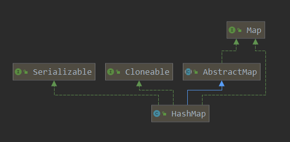

## HashMap

### 继承关系



### 重要内部类

#### Node 内部类

Node节点用来存储HashMap的一个个实例，其实现了 Map.Entry 接口。

```java
interface Entry<K,V> {
    K getKey();
    V getValue();
    V setValue(V value);
    boolean equals(Object o);
    int hashCode();
}

class Node<K,V> implements Map.Entry<K,V> {
    final int hash;
    final K key;
    V value;
    Node<K,V> next;
    // 构造函数及接口实现方法
}
```

#### KeySet 内部类

KeySet 类继承于 AbstractSet 抽象类，由 HashMap 中的 keyset() 方法创建 KeySet 实例，旨在对 HashMap 中的key键进行操作

```java
//返回一个set视图，包含了map中的key
public Set<K> keySet() {
    // keySet 指向的是 AbstractMap 中的 keyset
    Set<K> ks = keySet;
    if (ks == null) {
        ks = new KeySet();
        keySet = ks;
    }
    return ks;
}

final class KeySet extends AbstractSet<K> {
    public final int size() {...}
    public final void clear() {...}
    public final Iterator<K> iterator() {...}
    public final boolean contains(Object o) {...}
    public final boolean remove(Object key) {...}
    public final void forEach(Consumer<? super K> action) {...}
}
```

#### Values 内部类

Values 类的创建和 KeySet 类相似

```java
public Collection<V> values() {
    Collection<V> vs = values;
    if (vs == null) {
        vs = new Values();
        values = vs;
    }
    return vs;
}
final class Values extends AbstractCollection<V> {
    public final int size() {...}
    public final void clear() {...}
    public final Iterator<V> iterator() {...}
    public final boolean contains(Object o) {...}
    public final void forEach(Consumer<? super V> action) {...}
}
```

#### EntrySet 内部类

和 KeySet 和 Values 类相似，EntrySet 是对 key-value 键值对进行操作的内部类

```java
public Set<Map.Entry<K,V>> entrySet() {
    Set<Map.Entry<K,V>> es;
    return (es = entrySet) == null ? (entrySet = new EntrySet()) : es;
}
final class EntrySet extends AbstractSet<Map.Entry<K,V>> {
    public final int size() {...}
    public final void clear() {...}
    public final Iterator<Map.Entry<K,V>> iterator() {...}
    public final boolean contains(Object o) {...}
    public final boolean remove(Object o) {...}
    public final void forEach(Consumer<? super Map.Entry<K,V>> action) {...}
}
```

### 底层结构

#### HashMap 1.7

JDK1.7 中，HashMap采用位桶 + 链表的实现，使用链表来处理冲突，同一hash值的链表都存储在一个桶中，以链表的形式相连

#### HashMap 1.8

每个桶中的元素大于8时，会转变为红黑树，目的是优化查询效率

###### 初始容量 

```java
static final int DEFAULT_INITIAL_CAPACITY = 1 << 4;
```

###### 最大容量

``` java
static final int MAXIMUM_CAPACITY = 1 << 30; // 最高位为符号位
```

###### 默认负载因子

```java
static final float DEFAULT_LOAD_FACTOR = 0.75f; //第一次扩容：DEFAULT_INITIAL_CAPACITY * DEFAULT_LOAD_FACTOR = 12
```

###### 树化阈值

```java
static final int TREEIFY_THRESHOLD = 8;
```

###### 链表阈值

```java
static final int UNTREEIFY_THREESHOLD = 6;
```

###### 扩容临界值

```java
static final int MIN_TREEIFY_CAPACITY = 64; //桶数组容量小于该值时优先进行扩容而不是树化
```

### 构造函数

+ 带有初始容量 initialCapacity 和 负载因子 loadFactor 的构造函数

  ```java
  public HashMap(int initialCapacity, float loadFactor) {
      if (initialCapacity < 0)
          throw new IllegalArgumentException("Illegal initial capacity: " +
                                                 initialCapacity);
      if (initialCapacity > MAXIMUM_CAPACITY)
          initialCapacity = MAXIMUM_CAPACITY;
      if (loadFactor <= 0 || Float.isNaN(loadFactor))
          throw new IllegalArgumentException("Illegal load factor: " +
                                                 loadFactor);
      this.loadFactor = loadFactor;
      this.threshold = tableSizeFor(initialCapacity);
  }
  ```

+ 只带有 initialCapacity 的构造函数

  ```java
  public HashMap(int initialCapacity) {
      this(initialCapacity, DEFAULT_LOAD_FACTOR);
  }
  ```

+ 无参构造函数

  ```java
  public HashMap() {
      this.loadFactor = DEFAULT_LOAD_FACTOR;
  }
  ```

+ 带有 map 的构造函数

  ```java
  public HashMap(Map<? extends K, ? extends V> m) {
      this.loadFactor = DEFAULT_LOAD_FACTOR;
      putMapEntries(m, false);
  }
  ```

### Put 全过程

#### Hash 函数

hash 函数根据传递的 key 值计算 hashCode 值，然后对 hashCode 进行无符号右移操作，最后再和 hashCode 进行异或操作。

```java
static final int hash(Object key) {
    int h;
    return (key == null) ? 0 : (h = key.hashCode()) ^ (h >>> 16);
}
```

#### Put 函数

调用 hash 函数计算应插入的位置，然后调用 putVal 方法

```java
public V put(K key, V value) {
  return putVal(hash(key), key, value, false, true);
}
```

#### PutVal 函数

```java
final V putVal(int hash, K key, V value, boolean onlyIfAbsent, boolean evict) {
    Node<K,V>[] tab; Node<K,V> p; int n, i;
    // 如果table 为null 或者没有为 table 分配内存，就resize一次
    if ((tab = table) == null || (n = tab.length) == 0)
        n = (tab = resize()).length;
    // 指定hash值节点为空则直接插入，这个(n - 1) & hash才是表中真正的哈希
    if ((p = tab[i = (n - 1) & hash]) == null)
    tab[i] = newNode(hash, key, value, null);
    // 如果不为空
    else {
        Node<K,V> e; K k;
        // 计算表中的这个真正的哈希值与要插入的key.hash相比
        if (p.hash == hash && ((k = p.key) == key || (key != null && key.equals(k))))
            e = p;
        // 若不同的话，并且当前节点已经在 TreeNode 上了
        else if (p instanceof TreeNode)
        // 采用红黑树存储方式
            e = ((TreeNode<K,V>)p).putTreeVal(this, tab, hash, key, value);
        // key.hash 不同并且也不再 TreeNode 上，在链表上找到 p.next==null
        else {
            for (int binCount = 0; ; ++binCount) {
                if ((e = p.next) == null) {
                    // 在表尾插入
                    p.next = newNode(hash, key, value, null);
                    // 新增节点后如果节点个数到达阈值，则进入 treeifyBin() 进行再次判断
                    if (binCount >= TREEIFY_THRESHOLD - 1) // -1 for 1st
                        treeifyBin(tab, hash);
                    break;
                }
                // 如果找到了同 hash、key 的节点，那么直接退出循环
                if (e.hash == hash && ((k = e.key) == key || (key != null && key.equals(k))))
                    break;
                // 更新 p 指向下一节点
                p = e;
            }
        }
        // map中含有旧值，返回旧值
        if (e != null) { // existing mapping for key
            V oldValue = e.value;
            if (!onlyIfAbsent || oldValue == null)
                e.value = value;
            afterNodeAccess(e);
            return oldValue;
        }
    }
    // map调整次数 + 1
    ++modCount;
    // 键值对的数量达到阈值，需要扩容
    if (++size > threshold)
        resize();
    afterNodeInsertion(evict);
    return null;
}
```

#### Resize 函数

```java
final Node<K,V>[] resize() {
    Node<K,V>[] oldTab = table;
    int oldCap = (oldTab == null) ? 0 : oldTab.length;
    int oldThr = threshold;
    int newCap, newThr = 0;
    // 若原 hashmap 已有元素
    if (oldCap > 0) {
        // 若原 hashmap 已大于最大容量，无法扩容，返回原hashMap
        if (oldCap >= MAXIMUM_CAPACITY) {
            threshold = Integer.MAX_VALUE;
            return oldTab;
        }
        // 若原 hashMap 容量大于16，扩容两倍，且未超过最大容量，阈值扩大两倍
        else if ((newCap = oldCap << 1) < MAXIMUM_CAPACITY && oldCap >= DEFAULT_INITIAL_CAPACITY)
            newThr = oldThr << 1;
    }
    // 初始化容量用阈值
    else if (oldThr > 0) {
        newCap = oldThr;
    }
    // 初始化使用默认容量和阈值
    else {
        newCap = DEFAULT_INITIAL_CAPACITY;
        newThr = (int)(DEFAULT_LOAD_FACTOR * DEFAULT_INITIAL_CAPACITY);
    }
    // 计算扩容后阈值
    if (newThr == 0) {
        float ft = (float)newCap * loadFactor;
        newThr = (newCap < MAXIMUM_CAPACITY && ft < (float)MAXIMUM_CAPACITY ? (int)ft : Integer.MAX_VALUE);
    }
    threshold = newThr;
    // 初始化新容量大小的 Node 数组
    Node<K,V>[] newTab = (Node<K,V>[])new Node[newCap];
    table = newTab;
    if (oldTab != null) {
        // 遍历 Node 数组
        for (int j = 0; j < oldCap; ++j) {
            Node<K,V> e;
            if ((e = oldTab[j]) != null) {
                oldTab[j] = null;
                // 若 当前元素没有 链式后继节点
                if (e.next == null)
                    // 重新计算在新数组中存放的位置并放入
                    newTab[e.hash & (newCap - 1)] = e;
                else if (e instanceof TreeNode)
                    // 使用红黑树的方式 分裂成低阶树或退化为链表
                    ((TreeNode<K,V>)e).split(this, newTab, j, oldCap);
                else {
                    // 当前元素存在 链式后继节点
                    Node<K,V> loHead = null, loTail = null;
                    Node<K,V> hiHead = null, hiTail = null;
                    Node<K,V> next;
                    // 计算扩容之后 桶的位置变化 按原顺序分组
                    do {
                        next = e.next;
                        // 桶位置不变
                        if ((e.hash & oldCap) == 0) {
                            if (loTail == null)
                                loHead = e;
                            else 
                                loTail.next = e;
                            loTail = e;
                        }
                        // 桶位置变化，偏移量为oldCap
                        else {
                            if (hiTail == null)
                                hiHead = e;
                            else 
                                hiTail.next = e;
                            hiTail = e;
                        }
                    } while ((e = next) != null);
                    // 将分组后的链表映射到新桶中
                    if (loTail != null) {
                        loTail.next = null;
                        newTab[j] = loHead;
                    }
                    if (hiTail != null) {
                        hiTail.next = null;
                        newTab[j + oldCap] = hiHead;
                    }
                }
            }
        }
        return newTab;
    }
}
```

### Get 全过程

#### get 函数

计算 key 的哈希值，然后调用 getNode 方法

```java
public V get(Object key) {
    Node<K,V> e;
    return (e = getNode(hash(key), key)) == null ? null : e.value;
}
```

#### getNode 函数

```java
final Node<K,V> getNode(int hash, Object key) {
    Node<K,V>[] tab; Node<K,V> first, e; int n; K k;
    // 找到桶位置
    if ((tab = table) != null && (n = tab.length) > 0 && (first = tab[(n - 1) & hash]) != null) {
        // 检查桶中第一个元素
        if (first.hash == hash && // always check first node 
            ((k = first.key) == key || (key != null && key.equals(k))))
            return first;
        // 判断桶中的下一个元素是否存在
        if ((e = first.next) != null) {
            // 若是红黑树节点，调用 getTreeNode 方法获取
            if (first instanceof TreeNode)
                return ((TreeNode<K,V>)first).getTreeNode(hash, key);
            // 遍历链表元素 直到找到元素位置
            do {
                if (e.hash == hash && ((k = e.key) == key || (key != null && key.equals(k))))
                    return e;
            } while ((e = e.next) != null);
        }
    }
    return null;
}
```


### 常见面试题

1. HashMap 和 HashTable 的区别

   ##### 相同点

   HashMap 和 HashTable 都是基于哈希表实现的，其内部每个元素都是 key-value 键值对，两者都实现了 Map、Cloneable、Serializable 接口

   ##### 不同点

   + 父类不同：HashMap继承了 AbstractMap 类，HashTable继承了 Dictionary 类
   + 空值不同：HashMap允许空的 key 和 value值，HashTable不允许空的 key 和 value值。
   + 线程安全性：HashMap不是线程安全性的，如果多个外部操作同时修改 HashMap 的数据结构，必须进行同步操作，可选择 Collections.synchronizedMap 或者是 ConcurrentHashMap。
   + 性能：HashMap 进行 put 或者 get 可以达到常数时间的性能，HashTable的两个操作加了 synchroned 锁。
   + 初始容量不同：HashTable的初始长度为11，扩容为 2n + 1；HashMap初始长度为16，扩容为 2 倍。 

2. HashMap 和 HashSet 的区别

   HashSet 继承于 AbstractSet 接口，实现了 Set、Cloneable、Serializable 接口。HashSet不允许集合中出现重复的值。HashSet的底层就是HashMap，不保证集合的顺序。

3. HashMap 的数据结构

   JDK 1.7 中，HashMap 采用 位桶 + 链表 的实现，即使用链表来处理冲突，同一 hash 值的链表都存储在一个数组中。但是位于一个桶中的元素较多，即 hash 值相等的元素较多时，通过 key 值查找效率较低。

   JDK 1.8 中，每个桶中元素数量大于8时会转变为红黑树，目的是优化查询效率

4. HashMap 的 put 过程

   首先使用 hash 方法计算对象的哈希码，根据哈希码来确定在 bucket 中存放的位置，如果 bucket 中没有 Node 节点则直接进行 put，如果对应 bucket 已经有 Node 节点，会对链表长度进行分析，判断长度是否大于 8，如果链表长度小于 8 ，在 JDK1.7 前会使用头插法，在 JDK1.8 之后更改为尾插法。如果链表长度大于8会进行树化操作，把链表转换为红黑树，在红黑树上进行存储。

5. HashMap 为啥线程不安全

   HashMap 遇到 多线程并发执行 put 操作时。如果有两个线程 A 和 B，A 希望插入一个键值对到 HashMap 中，在决定好桶位置进行 put 时，此时 A 的时间片正好用完了，轮到 B 运行，B运行后执行和 A 一样的操作，成功把键值对插入。线程 A 继续执行会覆盖 B 的记录，造成数据不一致问题。

   HashMap 在扩容时，因 resize 方法形成环，造成死循环，导致CPU提高。

6. HashMap 如何处理哈希碰撞

   HashMap 底层使用 位桶 + 链表实现的，位桶决定元素的插入位置，位桶是由 hash 方法决定的，当多个元素的 hash 计算得到相同的哈希值后，HashMap 会把多个Node元素都放在相应的位桶中，形成链表 (链地址法)

7. HashMap 线程安全的实现有哪些

   ConcurrentHashMap Collections.synchronizedMap