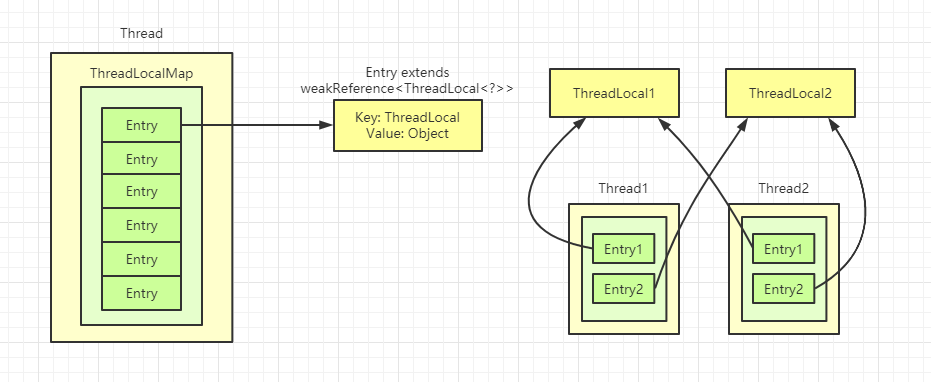
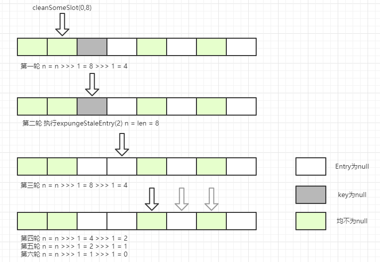
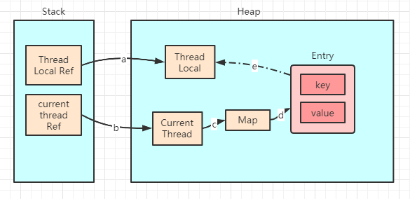

## ThreadLocal

ThreadLocal 叫做线程变量，意思是 ThreadLocal 中填充的变量属于当前线程，该变量对其他线程而言是隔离的。

### ThreadLocal 数据结构



Thread类有一个类型为ThreadLocal.ThreadLocalMap的实例变量threadLocals，ThreadLocalMap是ThreadLocal的静态内部类，其类似于HashMap的结构，但是没有链表结构，数组中存放Entry对象，其key是 ThreadLocal<?> 继承自 WeakReference，value是Object对象。每个线程往ThreadLocal里放值时，会往自己的ThreadLocalMap里存，读取时也是以ThreadLocal作为引用，在自己的map里找对应的key，从而实现线程隔离。

### Get 方法

```java
public T get() {
    Thread t = Thread.currentThread();
    ThreadLocalMap map = getMap(t); // 返回当前线程的成员变量 ThreadLocalMap
    if (map != null) {
        // 获取以当前线程ThreadLocal为key的Entity
        ThreadLocalMap.Entry e = map.getEntry(this); // ThreadLocalMap 私有方法
        if (e != null) {
            T result = (T)e.value;
            return result;
        }
    }
    // 返回 initialValue() 的值，并存入当前线程的 ThreadLocalMap，若无则新创建
    return setInitialValue();
}
```

### Set 方法

```java
public void set(T value) {
    Thread t = Thread.currentThread();
    ThreadLocalMap map = getMap(t);
    if (map != null) 
        map.set(this, value); // ThreadLocalMap 私有方法
    else 
        createMap(t, value);
}
void createMap(Thread t, T firstValue) {
    t.threadLocals = new ThreadLocalMap(this, firstValue);
}
```

### ThreadLocal Hash 算法

```java
private final int threadLocalHashCode = nextHashCode();

// nextHashCode是AtomicInteger类型，底层是UNSAFE的CAS操作
private static int nextHashCode() {
    return nextHashCode.getAndAdd(HASH_INCREMENT);
}
// 该数是斐波那契数，也叫黄金分割数，目的是使hash分布非常均匀，约为 2 ^ 32 * 0.618
private static final int HASH_INCREMENT = 0x61c88647;
```

#### ThreadLocalMap

```java
static class ThreadLocalMap {
    // ThreadLocalMap 中的 Entry 定义
    // key 是 ThreadLocal 包装的弱引用类型，value 是 Object 类型的值
    static class Entry extends WeakReference<ThreadLocal<?>> {
        Object value;
        Entry(ThreadLocal<?> k, Object v) {
            super(k);
            value = v;
        }
    }
    // 使用初始值构造 ThreadLocalMap
    ThreadLocalMap(ThreadLocal<?> firstKey, Object firstValue) {
        table = new Entry[INITIAL_CAPACITY];
        int i = firstkey.threadLocalHashCode & (INITIAL_CAPACITY - 1);
        table[i] = new Entry(firstKey, firstValue);
        size = 1;
        setThreshold(INITIAL_CAPACITY);
    }
    // ThreadLocalMap 扩容的阈值为 2/3
    private void setThreshold(int len) {
        threshold = len * 2 / 3;
    }
    // ..其他方法省略
}
```

#### ThreadLocalMap getEntry 方法

```java
private Entry getEntry(ThreadLocal<?> key) {
    int i = key.threadLocalHashCode & (table.length - 1);
    Entry e = table[i];
    if (e != null && e.get() == key)
        return e;
    else
        // 当前Entry已被清除或key已过期
        // 迭代向后查找key相同的值，若key过期则进行探测式清理，直至遇到空的entry
        return getEntryAfterMiss(key, i, e);
}
```

#### ThreadLocalMap set方法

```java
private void set(Thread<?>key, Object value) {
    Entry[] tab = table;
    int len = tab.length;
    int i = key.threadLocalHashCode & (len - 1); // hash 算法
    // 解决hash冲突：
    // 若发生hash冲突，判断当前位置entry的key是否与目标key一致，若一致直接更新
    // 若key为空，则调用 replaceStaleEntry 进行替换，迭代直到遇到entry为空的位置
    for (Entry e = tab[i]; e != null; e = tab[i = nextIndex(i, len)]) {
        ThreadLocal<?> k = e.get();
            
        if (k == key) {
            e.value = value;
            return;
        }
            
        if (k == null) {
            replaceStaleEntry(key, value, i);
            return;
        }
    }
    tab[i] = new Entry(key, value);
    int sz = ++size;
    // 若启发式清理没有清理数据且数组中元素数量超过阈值，进行rehash
    if (!cleanSomeSlots(i, sz) && sz >= threshold)
       rehash();
}
```

往Map中插入数据时，经过hash计算后，数组当前位置已有Entry数据，则会线性向后查找一直找到Entity为null的位置才停止。若当前位置已有位置，且key值相等，直接用value覆盖；若key为null，说明原ThreadLocal实例(弱引用)已被GC回收，故需替换，调用 replaceStaleEntry 方法。

### ThreadLocalMap 过期 key 的探测式清理和启发式清理流程

```java
// 旧值替换
// 1.向前找key过期的位置，直到遇到第一个null的位置，设置探测式清理起始点
// 2.向后找key过期的位置，判断是否更新探测式清理起始点
// 3.向后若找到相同的key，则旧值替换
// 4.最后触发探测式清理和启发式清理流程
private void replaceStaleEntry(ThreadLocal<?> key, Object value, int staleSlot) {
    Entry[] tab = table;
    int len = tab.length;
    Entry e;
    // 初始化探测式清理扫描数据的开始位置
    int slotToExpunge = staleSlot;
    // 向前迭代找到其他key过期的数据并更新slotToExpunge值，直到碰到Entry为null结束迭代
    for (int i = prevIndex(staleSlot, len);
        (e = tab[i]) != null;
        i = prevIndex(i, len))
        if (e.get() == null)
            slotToExpunge = i;
    // 向后迭代直到碰到Entry为null结束迭代
    for (int i = nextIndex(staleSlot, len);
        (e = tab[i]) != null;
        i = nextIndex(i, len)) {
        ThreadLocal<?> k = e.get();
        // 向后探测过程中直到key相同的位置,使用更新逻辑
        if (k == key) {
            e.value = value;
            // 当前位置与 staleSlot 交换
            tab[i] = tab[staleSlot];
            tab[staleSlot] = e;
            // 说明向前探测时未找到key过期的位置，将当前位置赋值给slotToExpunge，因为staleSlot位置数据已交换
            if (slotToExpunge = staleSlot)
                slotToExpunge = i;
            // 清理
            cleanSomeSlots(expungeStaleEntry(slotToExpunge), len);
            return;
        }
        // 若向后找到过期数据 且 向前探测未找到则将当前位置赋值给slotToExpunge
        if (k == null && slotToExpunge == staleSlot)
            slotToExpunge = i;
    }
    // 若key未找到，用新数据更新 staleSlot 位置的entry
    tab[staleSlot].value = null;
    tab[staleSlot] = new Entry(key, value);
    // 若存在其他过期的数据，则调用 cleanSomeSlots 进行清理
    if (slotToExpunge != staleSlot)
        cleanSomeSlots(expungeStaleEntry(slotToExpunge), len);
}
// 探测式清理
private int expungeStaleEntry(int staleSlot) {
    Entry[] tab = table;
    int len = tab.length;
    // 删除 staleSlot 位置的 entry
    tab[staleSlot].value = null;
    tab[staleSlot] = null;
    size--;
    
    Entry e;
    int i;
    // rehash 直到下个null的位置
    for (i = nextIndex(staleSlot, len);
        (e = tab[i]) != null;
        i = nextIndex(i, len)) {
        ThreadLocal<?> k = e.get();
        // 过期数据直接置为空
        if (k == null) {
            e.value = null;
            tab[i] = null;
            size--;
        } else {
            // rehash，计算新的位置
            int h = k.threadLocalHashCode & (len - 1);
            if (h != i) {
                tab[i] = null;
                // 冲突后，往后寻找空的位置插入
                while(tab[h] != null)
                    h = nextIndex(h, len);
                tab[h] = e;
            }
        }
    }
    return i;
}
// 启发式清理
private boolean cleanSomeSlots(int i, int n) {
    boolean removed = false;
    Entry[] tab = table;
    int len = tab.length;
    do {
        i = nextIndex(i, len);
        Entry e = tab[i];
        if (e != null && e.get() == null) {
            n = len;
            removed = true;
            i = expungeStaleEntry(i);
        }
    } while((n >>> 1) != 0);
    return moved;
}
```

启发式清理流程如下图



#### 扩容机制

```java
if (!cleanSomeSlots(i, sz) && sz >= threshold)
    rehash();
```

在 set 方法的最后有以上代码，若执行完启发式清理后，未清理到任何数据，且当前数组中Entry的数量已经达到了阈值（len * 2 / 3），就开始执行rehash逻辑

```java
private void rehash() {
    expungeStaleEntries();
    // 此时有可能有一些key为null的entry被清理掉
    if (size >= threshold - threshold / 4)
        reize();
}
```

threadLocalMap扩容为之前的两倍，将原数组中的数据重新hash计算，分布到新的数组中

```java
private void resize() {
    Entry[] oldTab = table;
    int oldLen = oldTab.length;
    int newLen = oldLen * 2;
    Entry[] newTab = new Entry[newLen];
    int count = 0;
    
    for (int j = 0; j < oldLen; ++j) {
        Entry e = oldTab[j];
        if (e != null) {
            ThreadLocal<?> k = e.get();
            if (k == null) {
                e.value = null; // help the GC
            } else {
                int h = k.threadLocalHashCode & (newLen - 1);
                while(newTab[h] != null)
                    h = nextIndex(h, newLen);
                 newTab[h] = e;
                 count++;
            }
        }
    }
    setThreshold(newLen);
    size = count;
    table = newTab;
}
```

#### ThreadLocal内存泄漏



> 每个 thread 中都存在一个类型为 ThreadLocal.ThreadLocalMap 的map，map 中的 key 为一个 threadLocal 实例。这个map仅仅是针对 key 使用了弱引用。当把 threadLocal 实例置为null后，没有任何强引用指向threadlocal实例，故threadLocal会被gc回收。但Map中的value无法被回收，因为存在一条 current thread连接过来的强引用。所以在 threadLocal设置为null，线程结束之前，就发生了我们所认为的内存泄露。

#### 使用场景

1. 在经i选哪个对象跨层传递时，可避免多次传递
2. 线程间数据隔离
3. 进行事务操作，用于存储线程事务信息
4. 数据库连接，Session会话管理
5. 非线程安全的变量放入ThreadLocal中可变成线程安全