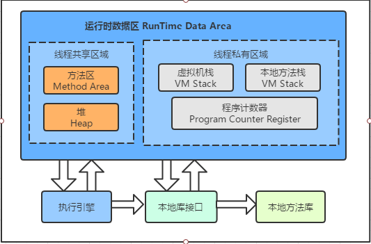
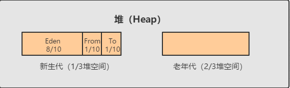
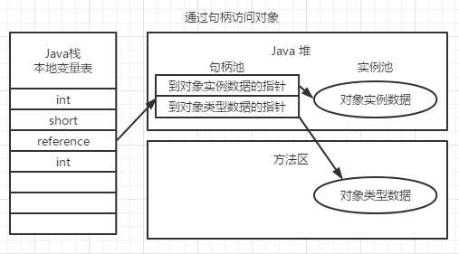
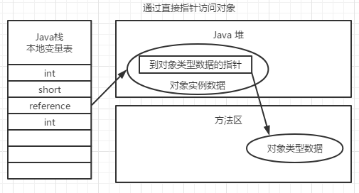

## Java 内存区域

### 运行时数据区域

#### 程序计数器

程序计数器（Program Counter Register）是一块较小的内存空间，可看作是当前线程所执行的字节码的行号指示器。Java虚拟机的多线程使用完处理器执行时间后进行线程切换时，需要改变这个计数器的值来选取吓一跳需要执行的字节码指令。此内存区域是唯一一个在Java虚拟机规范中没有规定任何OutOfMemory的区域

如果线程正在执行一个Java方法，计数器记录的是正在执行的虚拟机字节码指令的地址，如果执行的Native 方法则为空。

#### Java虚拟机栈

Java虚拟机栈（Java Virtual Machine Stacks）也是线程私有的，它的生命周期与线程相同。虚拟机栈描述的是Java方法执行的内存模型：每个方法在执行的同时都会创建一个栈帧（Stack Frame）用于存储局部变量表、操作数栈、动态链接、方法出入口等信息。每个方法从调用至执行完成的过程，就对应一个栈帧在虚拟机栈中入栈到出栈的过程。

局部变量表存放了编译期可知的各种 **基本数据类型**、**对象引用** 和 **returnAddress** 类型。局部变量表所需的内存空间在编译期间完成分配，当进入一个方法时，这个方法需要在栈帧中分配多大的局部变量空间是完全确定的，在方法运行期间不会改变局部变量表的大小。

此区域规定了两种异常情况：

+ StackOverflowError：线程请求的栈深度大于虚拟机所允许的深度.方法的嵌套调用层次太多(如递归调用),随着java栈中的帧的增多，最终导致这个线程的栈中的所有栈帧的大小的总和大于-Xss设置的值
+ OutOfMemoryError：虚拟机栈可以动态扩展且扩展时无法申请到足够的内存

#### 本地方法栈

本地方法栈（Native Method Stack）与虚拟机栈所发挥的作用比较类似，本地方法栈是为虚拟机使用到的Native方法服务。

#### Java堆

Java堆是被所有线程共享的一块内存区域，在虚拟机启动时创建，唯一目的是存放对象实例。Java堆是垃圾收集器管理的主要区域。

+ 从内存回收的角度看，可细分为新生代和老年代，新生代可再细分为 Eden 空间，From Survivor 空间，To Survivor 空间
+ 从内存分配的角度看，线程共享的Java堆中可能划分出多个线程私有的分配缓冲区（Thread Local Allocation Buffer，TLAB）

#### 方法区

方法区（Method Area）也叫做永久代（Permanent Generation），用于存储已被虚拟机加载的类信息、常量、静态变量、即时编译器编译后的代码等数据。方法区的内存回收目标主要是针对常量池的回收和堆类型的卸载，因此一般收益较小。

#### 运行时常量池

运行时常量池（Runtime Constant Pool）是方法区的一部分。Class文件中除了有类的版本、字段、方法、接口等信息外，还有一项信息是常量池，用于存放编译期生成的各种 **字面量** 和 **符号引用** 。这部分内容在类加载后进入方法区的运行时常量池。

### JVM运行时内存

Java堆从GC的角度还可细分为：新生代(Eden区、From Survivor区和 To Survivor区)和老年代

#### 新生代

用来存放新生的对象，一般占据堆的1/3空间。由于频繁创建对象，所以新生代会频繁触发MinorGC进行垃圾回收。新生代又分为Eden区、From Survivor区和 To Survivor区三个区

+ Eden：Java新对象的出生地（如果新创建的对象占用内存很大，则直接分配到老年代）。当Eden区内存不够时会触发MinorGC
+ ServivorFrom：上次GC的幸存者，作为这一次GC的被扫描者
+ ServivorTo：保留了这一次MinorGC过程中的幸存者

MincorGC的过程（复制->清空->互换）

1. eden、servivorFrom复制到ServivorTo，年龄+1（对象年龄到达老年标准或ServivorTo位置不够，移动至老年区）
2. 清空eden、servivorFrom
3. ServivorTo 和 ServivorFrom 互换

#### 老年代

主要存放生命周期长的内存对象，老年代的对象比较稳定，不会频繁执行MajorGC，在进行MajorGC前一般先进行一次MinorGC，使得有新生代的对象晋身入老年代，导致空间不够用时才触发。当无法找到足够大的连续空间分配给新创建的较大对象时也会提前触发一次MajorGC进行垃圾回收腾出空间。

MajorGC采用标记清除法。

#### 永久代

GC不会在主程序运行期对永久区域进行清理，所以永久代区域会随着加载的Class的增多而胀满，最终抛出OOM异常。最终触发Full GC

### HotSpot虚拟机 对象的创建过程

1. 类加载检查：检查这个new指令的参数是否能在常量池中定位到一个类的符号引用，并且检查这个符号引用代表的类是否已被加载、解析和初始化过，若没有则需先执行相应的类加载过程。

2. 为新生对象分配内存：对象所需的内存大小在类加载完成后便可完全确定，为对象分配空间的任务等同于把一块确定大小的内存从java堆中划分出来。

   + 指针碰撞：假设Java堆中内存是绝对规整的，所有用过的内存都放在一边，空闲的内存放在另一边，中间放着一个指针作为分界点的指示器。分配内存仅仅是把指针向空闲空间方向挪动一段与对象大小相等的距离。
   + 空闲列表：如果Java堆中内存并不是规整的，虚拟机必须维护一个列表，记录上哪些内存块是可用的，在分配的时候从列表中找到一块足够大的空间划分给对象实例，并更新列表上的记录。

   除如何划分可用空间外，还需考虑内存分配在并发情况下的线程安全问题：

   + 对分配内存空间的动作进行同步处理，实际上虚拟机采用CAS配上失败重试的方法保证原子性
   + 把内存分配的动作按照线程划分在不同的空间之间进行，即每个线程在Java堆中预先分配一小块内存，称为本地线程分配缓冲(TLAB)

3. 将分配到的内存空间初始化为零：这一步操作保证了对象的实例字段在Java代码中可以不赋初始值就直接使用，程序能访问到这些字段的数据类型对应的零值。

4. 对对象进行必要的设置：例如这个对象是哪个类的实例、对象的哈希码、对象的GC分代年龄等信息。这些信息存放在对象头中(Object Header)

### 对象的内存布局

+ 对象头：第一部分用于存储对象自身的运行时数据，如哈希码、GC分代年龄、锁状态标志等；第二部分是类型指针，即对象指向它的类元数据的指针，虚拟机通过这个指针来确定对象是哪个类的实例
+ 实例数据
+ 对齐填充

#### 对象的访问定位

+ 使用句柄访问。Java堆中会划分出一块内存作为句柄池，虚拟机栈的reference中存储的就是对象的句柄地址，而句柄中包含了对象实例数据与类型数据各自的具体地址信息

  

+ 使用直接指针访问。Java堆对象的布局中就需考虑如何放置访问类型数据的相关信息，而reference中存储的直接就是对象地址

   
+ 比较  
  使用句柄访问：在对象被移动时只会改变句柄中的实例数据指针。  
  使用直接指针访问：节省一次指针定位的时间开销，访问速度快。(HotSpot采用该方式)s
