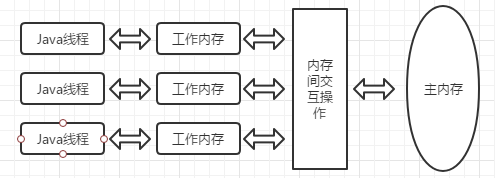

## Java 内存模型

JVM规范定义一种Java内存模型(Java Memory Model, JMM)来屏蔽各种硬件和操作系统的内存访问差异，以实现Java程序在各种平台下都能达到一致的内存访问效果。

JMM的主要目标是定义程序中各个变量的访问规则，即在JVM中将变量存储到内存和从内存中取出变量这样的底层细节，如下图所示



内存间相互操作，Java定义了如下八种操作来完成：

+ lock（锁定）：作用于主内存变量，它把一个变量标识为一条线程独占的状态
+ unlock（解锁）：作用于主内存变量，它把一个处于锁定状态的变量释放出来
+ read（读取）：作用于主内存的变量，它把一个变量的值从主内存传输到线程的工作内存中，以便随后的load动作使用
+ load（载入）：作用于工作内存的变量，它把read操作从主内存中得到的变量值放入工作内存的变量副本中
+ use（使用）：作用于工作内存的变量，它把工作内存中一个变量的值传递给执行引擎
+ assign（赋值）：作用于工作内存的变量，它把一个从执行引擎接收到的值赋给工作内存的变量
+ store（存储）：作用于工作内存的变量，它把工作内存中一个变量的值传送到主内存中，以便随后的write操作使用
+ write（写入）：作用于主内存的变量，它把store操作从工作内存中得到的变量的值放入主内存的变量中

### Volatile型变量的特殊规则

关键字volatile可以说是JVM提供的最轻量级的同步机制，当一个变量定义为volatile后，它具备两种特性，第一是保证此变量对所有线程的 **可见性** 和 **禁止指令重排序**

+ 可见性：当一条线程修改了这个变量的值，新值对于其他线程来说是可以立即得知的。而普通变量做不到这一点，普通变量的值在线程间传递均需要通过主内存来完成。

  在各个线程的工作内存中，volatile变量也可以存在不一致的情况，但由于每次使用之前都要先刷新，从主内存中获取最新值，所以执行引擎看不到不一致的情况，故认为不存在一致性问题。但Java里的运算并非原子操作，导致volatile变量的运算在并发下是不安全的，例子如下：

  ```java
  /*
   * volatile 变量自增运算测试
   */
  public class VolatileTest {
      public static volatile int race++;
      public static void increase() {
          race++;
      }
      private static final int THREADS_COUNT = 20;
      public static void main(String[] args) {
          Thread[] threads = new Thread(THREADS_COUNT);
          for (int i = 0; i < THREADS_COUNT; i++) {
              threads[i] = new Thread(new Runnable() {
                  @Override
                  public void run() {
                      for (int i = 0; i < 10000; i++)
                          increase();
                  }
              });
              threads[i].start();
          }
          // 其他代码略...
      }
  }
  ```

  测试结果发现，最后的输出结果都小于20000，问题就在于自增运算 race++ 中，当取到race时，由于volatile的可见性，此时取到的值是最新的，但是在执行 ++ 操作时，其他线程可能已经把race的值加大了，而当前操作完毕之后是对旧值的操作，故导致最终结果小于预期值。

  由于volatile变量只能保证可见性，在不符合以下两条规则的运算场景中，我们仍要通过加锁来保证原子性。

  1. 运算结果并不依赖变量的当前值，或者能够确保只有单一的线程修改变量的值
  2. 变量不需要与其他的状态变量共同参与不变约束

+ 禁止指令重排优化

  > 线程内表现为串行的语义：普通的变量仅仅会保证在该方法执行过程中所有依赖赋值结果的地方都能获取到正确的结果，而不能保证变量赋值操作的顺序与程序代码中的执行顺序一致，在一个线程的方法执行过程中无法感知到这一点

  对有volatile修饰的变量赋值后，会多执行一个相当于内存屏障的操作，指重排序时不能把后面的指令重排序到内存屏障之前的位置。该操作实际上相当于是JMM中store和write的空操作，让前面volatile变量对其他线程立即可见。

### 原子性、可见性与有序性

1. **原子性**(Atomicity)：JMM内存交互操作，对基本数据类型的访问读写是具备原子性的(long 和 double)除外。如果应用场景需要一个更大范围的原子性保证，JVM提供了更高层次的字节码指令 monitorenter 和 monitorexit 来保证原子性，反映到java代码中就是同步块----synchronized关键字
2. **可见性**(Visibility)：可见性是指当一个线程修改了共享变量的值，其他线程能够立即得知这个修改。
   + volatile保证可见性：变量修改后新值能立即同步到主内存，以及每次使用前立即从主内存刷新
   + synchronized保证可见性：对一个变量执行unlock操作前，必须先把此变量同步回主内存中
   + final保证可见性：被final修饰的字段在构造器中一旦初始化完成，并且构造器没有把 this 的引用传递出去，那在其他线程中就能看见final字段的值
3. 有序性(Ordering)：如果在本线程内观察，所有的操作都是有序的；如果在一个线程中关村另一个线程，所有的操作都是无序的。前半句是指 线程内表现为串行的语义，后半句是指执行重排序现象和工作内存与主内存同步延迟现象。

### 先行发生原则

先行发生原则(happens-before)是判断数据是否存在竞争、线程是否安全的主要依据。

先行发生是JMM中定义的两项操作之间的偏序关系，如果说操作A先行发生于操作B，其实就是说在发生操作B之前，操作A产生的影响能被操作B观察到，“影响”包括修改了内存中共享变量的值、发送了消息、调用了方法等。