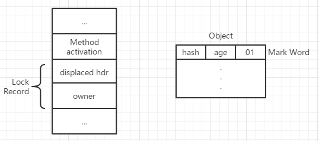
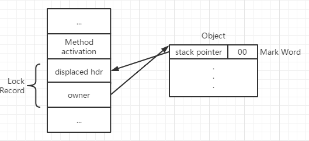

## 线程安全与锁优化

### 线程安全

1. 定义：当多个线程访问一个对象时，如果不用考虑这些线程在运行时环境下的调度和交替执行，也不需要进行额外的同步，或者在调用方进行任何其他的协调操作，调用这个对象的行为都可以获得正确的结果，那这个对象是线程安全的
2. 按照线程安全的“安全程度”由强至弱可划分为以下五类：
   + 不可变：final关键字修饰的变量
   + 绝对线程安全：vector的操作本身是线程安全的，但是需要在方法调用端加入同步才能保证线程安全
   + 相对线程安全：对象单独的操作是线程安全的，通常意义上的，如vector、HashTable、Collections等
   + 线程兼容：对象本身非线程安全，但可以通过在调用端正确使用同步手段保证并发的正确性，如ArrayList、HashMap等
   + 线程对立：无论调用端是否采取同步措施也无法保持线程安全，如Thread类的suspend和resume方法，一个尝试去中断线程，另一个尝试去恢复线程。

### 线程安全的实现方法

1. 互斥同步

   同步是指在多个线程并发访问共享数据时，保证共享数据在同一个时刻只被一个线程使用。

   互斥是实现同步的一种手段，如临界区、互斥量和信号量

   + synchronized关键字

     synchronized关键字经过编译后，会在同步块的前后分别形成 monitorenter 和 monitorexit 这两个字节码指令，这两个字节码都需要一个reference类型的参数来指明要锁定和解锁的对象。如果程序中没有指明对象参数，则会根据修饰的是实例方法还是类方法，去获取对应的对象实例或Class对象来作为锁对象。

     monitorenter指令会把锁的计数器加1，monitorexit指令会把锁的计数器减1；

     synchronized同步块对同一条线程来说是可重入的；同步块在已进入的线程执行完之前，会阻塞后面其他线程的进入

   + ReentrantLock

     ReentrantLock与synchronized类似，与之相比增加了如下的高级功能：

     + 等待可中断是指当持有锁的线程长期不释放锁的时候，正在等待的线程可以选择放弃等待，改为处理其他事情。
     + 公平锁是指多个线程在等待同一个锁时，必须按照申请锁的时间顺序来依次获得锁；非公平锁则不保证，在锁被释放时，后面等待的线程可能会抢占获取锁。
     + 锁绑定多个条件是指一个ReentrantLock对象可以绑定多个Condition对象。在synchronized中，锁对象的wait()和notify()方法可以实现一个隐含的条件，如果要和多于一个的条件关联的时候，就不得不额外添加一个锁，而ReentrantLock只需多次调用newCondition()方法即可

2. 非阻塞同步

   互斥同步最主要的问题是进行线程阻塞和唤醒所带来的性能问题，互斥同步算是一种悲观的并发策略。而非阻塞同步是基于冲突检测的乐观并发策略，其不需要把线程挂起，而是先进行操作，如果共享数据有争用发生了冲突，就采取其他补救措施(常见的就是不断重试)。

   CAS的ABA问题：如果一个变量V初次读取的时候是A，并且在准备赋值时检查仍然是A，但有可能它的值曾经被改成了B，然后又被改回了A。

   解决：AtomicStampedReference，底层是维护了一个时间戳进行比较

3. 无同步方案

   + 可重入代码：可重入代码也叫纯代码，可以在执行代码的任何时刻中断它，重新获得控制权返回后，原来的程序不会出现错误。可重入代码不依赖存储在堆上的数据和公用的系统资源。
   + 线程本地存储：ThreadLocal类可以实现线程本地存储的功能。Thread对象中有一个ThreadLocalMap对象，其Key是ThreadLocal对象，值是K-V值对。

### 锁优化

#### 自旋锁与自适应自旋

如果物理机器有一个以上的处理器，能让两个或以上的线程同时并行执行，我们就可让后面那个请求锁的线程稍等一下，但不放弃处理器的执行时间，看看持有锁的线程是否很快就会释放锁。为了让线程等待，我们只需让线程执行一个忙循环。

JDK1.6引入了自适应的自旋锁，其自旋的时间不是固定的，而是由前一次在同一个锁上的自旋时间及锁的拥有着状态来决定。

#### 锁消除

锁消除是指虚拟机即时编译器在运行时，对一些代码上要求同步，但是被检测到不可能存在共享数据竞争的锁进行消除。

锁消除的主要判定依据来源于逃逸分析的数据支持，如果判断在一段代码中，堆上的所有数据都不会逃逸出去从而被其他线程访问到，那就可以把它们当作栈上数据对待，认为其是线程私有的，无需同步加锁

#### 锁粗化

如果一系列的连续操作都对同一个对象反复加锁和解锁，甚至加锁操作是出现在循环体中的，那即使没有线程竞争，频繁地进行互斥同步操作也会导致不必要的性能损耗。

#### 轻量级锁

轻量级锁是JDK1.6之后引入的新型锁机制，它不是来代替重量级锁的，其本意是在没有多线程竞争的前提下，减少传统的重量级锁使用操作系统互斥量产生的性能消耗。

HotSpot虚拟机的对象头分为两个部分，第一部分称为“Mark Word”，用于存储对象自身的运行时数据，如哈希码、GC分代年龄等，它是实现轻量级锁和偏向锁的关键。另一部分用于存储指向方法区对象类型数据的指针。

| 存储内容                             | 标志位 | 状态             |
| ------------------------------------ | ------ | ---------------- |
| 对象哈希码、对象分代年龄             | 01     | 未锁定           |
| 指向锁记录的指针                     | 00     | 轻量级锁定       |
| 指向重量级锁的指针                   | 10     | 膨胀(重量级锁定) |
| 空，不需要记录信息                   | 11     | GC标记           |
| 偏向线程ID、偏向时间戳、对象分代年龄 | 01     | 可偏向           |

##### 轻量级锁加锁过程

代码进入同步块时，如果此同步对象没有被锁定(锁标志位为“01”状态)，虚拟机首先将在当前线程的栈帧中建立一个名为锁记录(Lock Record)的空间，用于存储锁对象目前的 Mark Word 拷贝。

然后，虚拟机将使用CAS操作尝试将对象的Mark Word更新为指向Lock Record的指针，如果这个更新动作成功了，那么这个线程就拥有了该对象的锁，并且对象 Mark Word 的锁标志位将转变为“00”，表示此对象处于轻量级锁定状态。

如果更新操作失败，虚拟机首先会检查对象的 Mark Word 是否指向当前线程的栈帧，如果当前线程已经拥有了这个对象的锁，那就可以直接进入同步块继续执行，否则说明这个锁对象已经被其他线程抢占了。如果有两条以上的线程争用同一个锁，那轻量级锁不再有效，要膨胀为重量级锁，锁标志位的状态值变为“10”，Mark Word 中存储的就是指向重量级锁的指针，后面等待锁的线程也要进入阻塞状态。

##### 轻量级锁解锁过程

解锁过程也是通过CAS操作来进行，如果对象的 Mark Word 仍然指向着线程的锁记录，那就用CAS操作把当前对象的 Mark Word 和线程中复制的 DisPlaced Mark Word 替换回来，如果替换成功，整个同步过程就完成了。如果替换失败，说明有其他线程尝试获取该锁，那就要在释放锁的同时，唤醒被挂起的线程。

#### 偏向锁

偏向锁也是JDK1.6引进的，其目的是消除数据在无竞争情况下的同步原语，进一步提高程序的运行性能。轻量级锁是在无竞争的情况下使用CAS操作区消除同步使用的互斥量，而偏向锁就是在无竞争的情况下把整个同步都消除掉，连CAS操作都不做了。

假设当前虚拟机启用了偏向锁。当锁对象第一次被线程获取的时候，虚拟机将会把对象头中的标志位设为“01”，即偏向模式。同时使用CAS操作把获取到这个锁的线程的ID记录在对象的 Mark Word 中，如果CAS成功，持有偏向锁的线程以后每次进入这个锁相关的同步块时，虚拟机都可不再进行任何同步操作。

当有另一个线程尝试获取这个锁时，偏向模式宣告结束。根据锁对象目前是否处于被锁定状态，撤销偏向后恢复到未锁定或轻量级锁定的状态，后续的同步操作就如轻量级锁那样执行。

### 锁的升级与降级

#### 锁的降级

锁降级发生的条件比较苛刻，锁降级发生在 Stop The World 期间，当JVM进入安全点的时候，会检查是否有闲置的锁，然后进行降级

#### 锁的升级

每一个线程在准备获取共享资源时：

1. 检查MarkWord里是不是存放自己的ThreadId，如果是，表示当前线程处于“偏向锁”
2. 如果MarkWord不是自己的ThreadId，锁升级，此时用CAS来执行切换，新的线程根据MarkWord里现有的ThreadId，通知之前线程暂停，之前线程将MarkWord内容置为空
3. 两个线程都把锁对象的HashCode复制到自己新建的用于存储锁的记录空间，接着开始通过CAS操作，把锁对象的MD内容修改为自己新建的记录空间的地址的方式竞争MarkWord
4. 第三步成功执行CAS获取资源，失败的则进入自旋
5. 自旋的线程在自旋过程中，成功获取资源(即之前已获取资源的线程执行完成并释放了资源)，则整个状态仍然处于轻量级锁的状态
6. 如果自旋失败，进入重量级锁的状态，此时自旋的线程进行阻塞，等待之前线程执行完成并唤醒自己。