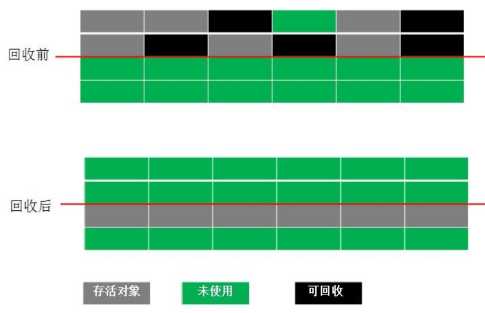
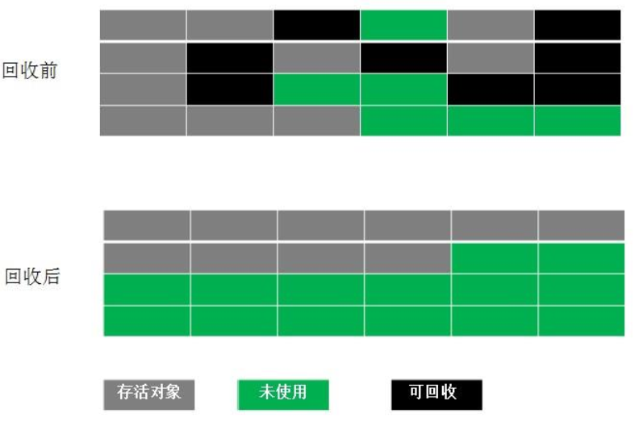
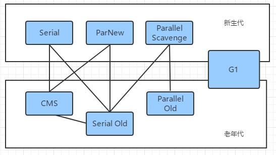

## 垃圾收集器与内存分配策略

### 如何确定对象已死

+ 引用计数法：给对象中添加一个引用计数器，每当有一个地方引用它时，计数器值就加1；当引用失效时，计数器值就减1；任何时刻计数器为0的对象就是不可能再被使用的。

  缺陷：对象间循环引用

+ 可达性分析算法：以一系列称为GC Roots的对象作为起始点，从这些节点开始向下搜索，搜索所走过的路径称为引用链(Reference Chain)，当一个对象到GC Roots没有任何引用链相连时，证明此对象是不可达的。

  可作为GC Roots的对象有：

  1. 虚拟机栈(栈帧中的本地变量表)中引用的对象
  2. 方法区中静态属性引用的对象
  3. 方法区中常量引用的对象
  4. 本地方法栈中Native方法引用的对象

在可达性分析算法中不可达的对象到真正被宣告死亡，至少要经历两次标记过程：对象在进行可达性分析后发现没有与GC Roots相连接的引用链，会被第一次标记且进行一次筛选，筛选的条件是此对象是否有必要执行finalize()方法。有必要执行finalize()方法的对象会被放入F-Queue队列中，稍后GC会建立一个低优先级的Finalizer线程去触发其finalize()方法，对那些成功拯救自己的对象进行第二次小规模的标记，使其被移除出即将回收的集合。

### 回收方法区

永久代的垃圾收集主要回收两部分内容：废弃常量和无用的类。

回收废弃常量与回收堆中的对象十分类似。

无用的类需要同时满足下面3个条件：

+ 该类所有实例都已经被回收
+ 加载该类的ClassLoader已经被回收
+ 该类对应的 java.lang.Class 对象没有在任何地方被引用，无；的方法

### Java中的四种引用

+ 强引用(Strong Reference)：类似”Object obj = new Object()“这类的引用，只要强引用还在，垃圾收集器永远不会回收掉被引用的对象。
+ 软引用(Soft Reference)：描述一些还有用但并非必需的对象。对于软引用关联着的对象，在系统将要发生内存溢出异常之前，将会把这些对象列进回收范围之中进行第二次回收。如果这次回收还没有足够的内存，才会抛出内存溢出异常。
+ 弱引用(Weak Reference)：描述非必需对象，其强度比软引用更弱一些，被弱引用关联的对象只能生存到下一次垃圾收集发生之前。当垃圾收集器工作时，无论当前内存是否足够，都会回收掉只被弱引用关联的对象。
+ 虚引用(Phantom Reference)：也称为幽灵引用或者幻影引用，是最弱的一种引用关系。一个对象是否有虚引用的存在，完全不会对其生存时间构成影响，也无法通过虚引用来取得一个对象实例。为一个对象设置虚引用关联的唯一目的是能在这个对象被收集器回收时收到一个系统通知。

### 垃圾收集算法

#### 标记清除算法

标记-清除算法有标记和清除两个阶段。其不足之处有两点：1.效率问题，标记和清除两个过程的效率都不太高. 2.空间问题，容易产生大量不连续的内存碎片，空间碎片太多可能会导致以后需要分配较大内存对象时，无法找到足够大的连续内存而不得不提前触发另一次垃圾收集动作。

#### 复制算法

为解决效率问题，提出了复制算法，其将可用内存容量划分为大小想等的两块，每次只使用其中的一块。当一块的内存用完后，就将还存活着的对象复制到另一块上，然后再把已使用过的内存空间一次清理掉。这样使得每次都对整个半区进行内存回收，内存分配时无需考虑内存碎片等情况，只要移动堆顶指针，按顺序分配就可。代价是，每次可用内存只有原来的一半，且存活对象如果还很多，复制的效率会降低。

#### 标记-整理算法

对存活的对象标记完毕后，让所有存活的对象都向一端移动，然后直接清理掉端边界以外的内存。

### 分代收集算法

分代收集算法是目前大部分JVM所采用的方法，其核心思想是根据对象存活的不同生命周期将内存划分为不同的域。GC划分为老年代和新生代，老年代因为对象存活率高、没有额外空间对它进行分配担保，就必需使用标记整理算法进行回收；新生代每次垃圾收集都有大批量对象死去，只有少量存活，可选用复制算法，只需要付出少量存活对象的复制成本就可完成收集。

#### 新生代与复制算法

目前大部分JVM的GC对于新生代都采用Copying算法。一般将新生代按照8:1:1划分为Eden区、Survivor From 和 Survivor To空间。每次GC时将Eden和Survivor From中存活的对象复制到另一块 Survivor To空间中。

#### 老年代与标记整理算法

老年代由于每次只回收少量的废弃常量和无用的类，故适合使用标记整理算法

1. 对象的内存分配主要在新生代的 Eden 空间和 Survivor From空间，少数情况会直接分配到老年代
2. 当新生代的Eden和Survivor From空间不足时就会发生一次Minor GC，Eden 和 Survivor From空间的存活对象会被复制到 Survivor To空间，然后将 Eden和From空间进行清理
3. 如果Survivor To空间没有足够空间存储某个对象，则将该对象存储到老年代（空间分配担保）
4. 当对象在Survivor 区躲过一次GC后，其年龄会+1。默认情况下年龄到达15的对象会被移动到老年代
5. 如果在Survivor空间中相同年龄所有对象大小的总和大于Survivor空间的一半，年龄大于或等于该年龄的对象就可以直接进入老年代，无需等到15年龄

### 垃圾收集器

1. Serial 垃圾收集器（单线程、复制算法）

   Serial 是最基本垃圾收集器，使用复制算法。Serial 是单线程的收集器，它只会使用一个CPU或一条收集线程去完成垃圾收集工作，并且在进行垃圾收集的同时，必须暂停其他所有的工作线程，直到垃圾收集结束。

   其优势是简单高效，对于限定单个CPU的环境来说，其由于没有线程交互的开销，可以获得最高的单线程垃圾收集效率，因此Serial垃圾收集器依然是JVM在client模式下默认的新生代垃圾收集器

2. ParNew垃圾收集器（Serial + 多线程）

   ParNew垃圾收集器其实是Serial收集器的多线程版本，也使用复制算法，ParNew收集器默认开启和CPU数目相同的线程数，可以通过 -XX:ParallelGCThreads 参数来限制垃圾收集器的线程数。ParNew收集器是除了Serial以外唯一能和CMS垃圾收集器配合工作的新生代垃圾收集器，且其是JVM在Server模式下新生代的默认垃圾收集器。

3. Parallel Scavenge收集器（多线程复制算法、高效）

   Parallel Scavenge收集器也是一个新生代垃圾收集器，同样使用复制算法，它重点关注的是程序达到一个可控制的吞吐量（Throughput，CPU用于运行用户代码的时间 / CPU总消耗时间 即 吞吐量 = 运行用户代码时间 / (运行用户代码时间 + 垃圾收集时间)），停顿时间越短越适合需要与用户交互的程序，良好的响应速度能提升用户体验，而高吞吐量则可以高效率地利用CPU时间，尽快完成程序的运算任务，主要适合在后台运算而不需要太多交互的任务。参数 -XX:+UseAdaptiveSizePolicy，虚拟机会根据当前系统的运行情况收集性能监控信息，动态调整其他参数以提供最大的吞吐量，该方式也叫 **GC自适应的调节策略** 。

4. Serial Old收集器（单线程标记整理算法）

   Serial Old 是 Serial垃圾收集器年老代版本，它同样是个单线程的收集器，使用标记整理算法，这个收集器也是JVM在Client模式下默认的老年代垃圾收集器。在Server模式下有两个用途：

   1. 在JDK1.5之前版本中与新生代的Parallel Scavenge 收集器搭配使用
   2. 作为年老代中使用CMS收集器的后备垃圾收集方案

5. Parallel Old收集器（多线程标记整理算法）

   Parallel Old收集器是Parallel Scavenge的年老代版本，使用多线程的标记整理算法，在JDK1.6才开始i提供，在JDK1.6之前，新生代若使用Parallel Scavenge收集器只能搭配年老代的Serial Old收集器，只能保证新生代的吞吐量优先，无法保证整体的吞吐量，Parallel Old正是为了在年老代同样提供吞吐量优先的垃圾收集器，如果系统对吞吐量要求比较高，可优先考虑 Parallel Scavenge + Parallel Old的组合

6. CMS收集器（多线程标记清除算法）

   Concurrent mark sweep(CMS)收集器是一种年老代垃圾收集器，其主要目标是获取最短垃圾回收停顿时间，其使用的是多线程的标记-清除算法。

   CMS工作过程分为以下四个阶段：

   + 初始标记：只是标记一下GC Roots能直接关联的对象，速度很快，需要暂停所有工作线程
   + 并发标记：进行GC Roots跟踪的过程，和用户线程一起工作，不需要暂停工作线程
   + 重新标记：为了修正在并发标记期间，因用户程序继续运行而导致标记产生变动的标记记录，需要暂停所有的工作线程
   + 并发清除：清除GC Roots不可达对象，和用户线程一起工作，不需要暂停工作线程。

   由于耗时最长的并发标记和并发清除过程中，垃圾收集线程可以和用户一起并发工作，所以总体上来看CMS收集器的内存回收和用户线程是一起并发地执行

   CMS收集器的缺点：

   + 对CPU资源非常敏感，占用了部分CPU资源导致应用程序变慢，总吞吐量降低
   + 无法处理浮动垃圾。CMS并发清理阶段用户线程还在运行，导致有新的垃圾不断产生，只能留到下一次GC时清理
   + 标记清除算法易产生空间碎片

7. G1收集器

   G1收集器避免全区域垃圾收集，它把堆内存划分为大小固定的几个独立区域，并且跟踪这些区域的垃圾收集进度，同时后台维护一个优先级列表，每次根据所允许的收集时间，优先回收垃圾最多的区域。区域划分和优先级区域回收机制，确保G1收集器可以在有限时间获得最高的垃圾收集效率。其与CMS相比，最突出的改进是：

   1. 基于标记整理算法，不产生内存碎片
   2. 可以非常精确控制停顿时间，在不牺牲吞吐量前提下，实现低停顿垃圾回收