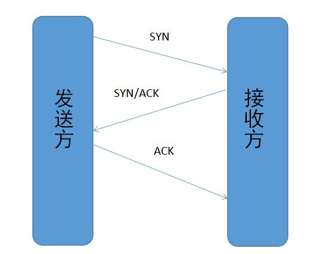

## 网络编程

### tcp 和 udp 协议的区别

TCP(Transfer Control Protocol)：一种面向连接的、可靠的、基于字节流的传输层协议。TCP不提供广播或多播服务。TCP提供可靠传输(TCP在传送数据前，会有三次握手来建立连接，而在数据传递时，有确认、窗口、重传、拥塞控制机制，在数据传送完后，会断开连接以节约系统资源)，故会占用较多系统资源。TCP一般用于文件传输、发送和接受邮件、远程登陆等场景。

UDP(User Datagram Protocol)：一种简单的面向数据报的运输层协议。UDP在传送数据前不需要先建立连接，远地主机收到UDP报文后，不需要给出任何确认。一般用于即时通信场景，如QQ语言、QQ视频、直播等。

### tcp协议如何保证可靠传输

+ 应用数据被分割成TCP认为最适合发送的数据块
+ TCP给发送的每个包进行编号，接收方对数据包进行排序，把有序数据传送给应用层
+ 校验和：TCP将保持它首部和数据的校验和。这是端到端的校验和，目的是检测数据在传输过程中的任何变化。如果收到段的校验和有差错，TCP将丢弃这个报文段
+ TCP的接收端会丢弃重复的数据
+ 流量控制：TCP连接的每一方都有固定大小的缓冲空间，TCP接收端只允许发送端发送接收端缓冲区能接纳的数据。当接收方来不及处理发送方的数据，发送的确认报文中的窗口字段能提示发送方窗口大小，从而影响发送方的发送速率，防止包丢失。TCP使用的流量控制协议是可变大小的滑动窗口协议。
+ 拥塞控制：当网络拥塞时，减少数据的发送
+ ARQ协议：如下
+ 超时重传：当TCP发送一个段后，它启动一个定时器，等待目的端确认收到。否则重发

### arq协议

自动重传请求(Automatic Repeat-reQuest)是OSI模型中数据链路层和传输层的错误纠正协议之一。其通过使用确认和超时两个机制，在不可靠服务的基础上实现可靠的信息传输。

+ 停止等待arq协议

  其基本原理是每发完一个分组就停止发送，等待对方确认(回复ACK)。如果等待超过超时时间，说明没有发送成功，需要重新发送，直到收到确认后再发下一个分组。在停止等待协议中，若接收方收到重复分组，就丢弃该分组，但同时要发送确认

+ 连续arq协议

  其可提高信道利用率。发送方维持一个发送窗口，凡位于发送窗口内的分组可以连续发送出去，而不需要等待对方确认。接收方一般采用累计确认，对按序到达的最后一个分组发送确认。

### tcp连接建立时3次握手，4次挥手的具体过程

#### 三次握手

+ 客户端-发送带有SYN标志的数据包
+ 服务端-发送带有SYN/ACK标志的数据包
+ 客户端-发送带有ACK标志的数据包

#### 四次挥手

+ 客户端-发送一个FIN，用来关闭客户端到服务端的数据传送
+ 服务端-收到FIN，它发回一个ACK，确认序号为收到的序号加1
+ 服务端-关闭与客户端的连接，发送一个FIN给客户端
+ 客户端-发回ACK报文确认，并将确认序号设置为收到序号加1

### Http长连接、短连接

HTTP/1.0默认使用短连接。客户端和服务器每进行一次HTTP操作，就建立一次连接，任务结束就中断连接。

HTTP/1.1起，默认使用长连接，用以保持连接特性。使用长连接的HTTP的协议，会在响应头加上 Connection:Keep-alive

### Cookie的作用是什么？和Session的区别？

Cookie和Session都是用来跟踪浏览器用户身份的会话方式。

Cookie 一般用来保存用户信息，存储在客户端。在下次访问网站的时候页面可以自动帮你登陆

Session 通过服务端记录用户的状态，存储在服务端。购物车场景，当需要添加商品到购物车时，系统不知道是哪个用户操作的，服务端给特定的用户创建特定的session之后就可以标识并且跟踪这个用户。

### URI和URL的区别是什么？

+ URI(Uniform Resource Identifier) 统一资源标志符，可以唯一标识一个资源
+ URL(Uniform Resource Location) 统一资源定位符，可以提供该资源的路径

URI的作用类似身份证号，URL的作用更像家庭住址

### 什么是阻塞IO？什么是非阻塞IO？

IO操作包括：对硬盘的读写、对socket的读写一级外设读写

1. 查看内核中要读取的数据是否就绪
2. 进行数据拷贝(内核将数据拷贝到用户线程)

Java中传统的IO都是阻塞IO，以socket读数据为例，调用read方法以后，如果数据没有就绪，当前线程会一直阻塞，直到有数据才返回；如果是非阻塞IO，read方法应该返回一个标志信息，告知当前线程数据没有就绪。

### 什么是同步IO？什么是异步IO？

同步IO：当用户发出IO请求操作之后，如果数据没有就绪，需要通过用户线程或者内核不断地去轮询数据是否就绪，当数据就绪时，再将数据从内核拷贝到用户线程

异步IO：只有IO请求发出的操作是用户线程来进行的，IO操作的两个阶段都是由内核自动完成，然后发送通知告知用户线程IO操作已经完成。

同步IO与异步IO的关键区别反映在数据拷贝阶段是由用户线程完成还是内核完成。异步IO必须要有操作系统的底层支持

### IO模型有几种？分别是什么？

1. 阻塞型IO

   当用户线程发出IO请求后，内核会去查看数据是否就绪，如果没有就绪就会等待数据就绪，而用户线程就会处于阻塞状态，用户线程交出CPU。当数据就绪之后，内核会将数据拷贝到用户线程，并返回结果给用户线程，用户线程才解除block状态

2. 非阻塞型IO

   当用户线程发起一个read操作之后，并不需要等待，而是马上得到一个结果。用户线程需要不断询问内核数据是否就绪，非阻塞IO一直占用CPU，一旦内核中的数据准备好，且又再次收到用户线程的请求，则会将数据拷贝至用户线程并返回

3. 多路复用IO

   Java NIO实际上就是多路复用IO，有一个线程不断去轮询多个socket的状态，只有当socket真正有读写事件时，才真正调用实际的IO读写操作，大大减少了资源占用。通过Selector.select()去查询每个通道是否有到达事件，如果没有事件，则会一直阻塞在那里。

   多路复用IO比非阻塞IO效率高的原因是，在非阻塞IO中，轮询socket状态时是通过用户线程进行的，而在多路复用IO中，轮询socket状态是在内核进行的。

4. 信号驱动IO

   当用户线程发起一个IO请求操作，会给对应的socket注册一个信号函数，然后用户线程会继续执行，当内核数据就绪时会发送一个信号给用户线程，用户线程收到信号之后，便在信号函数中调用IO读写操作来进行实际的IO请求操作

5. 异步IO模型

   当用户线程发起read操作之后，立刻可以开始做其他事情。内核收到一个 asynchronous read之后会立即返回，然后内核会等待数据准备完成，然后将数据拷贝到用户线程，给用户线程发送一个信号表示read操作完成

### Reactor设计模式是什么？

Reactor模式是同步IO，是处理并发I/O常见的一种模式，其中心思想是将所有要处理的I/O事件注册到一个中心I/O多路复用器上，同时主线程阻塞在多路复用器上，一旦有I/O事件到来或是准备就绪，多路复用器将返回并将相应I/O事件分发到对应的处理器中。

### Select、poll和epoll的区别

1. 支持一个进程所能打开的最大连接数

   select：单个进程能打开的最大连接数由FD_SETSIZE宏定义，其大小是32个整数的大小

   poll：本质上与select没有区别，但是其没有最大连接数的限制

   epoll：连接数有上限但是很大

2. FD剧增后带来的IO效率问题

   select：因为每次调用时都会对连接进行线性遍历，所以随着FD的增加会造成遍历速度慢的问题

   poll：同上

   epoll：因为epoll内核中实现是根据每个fd上的callback函数来实现的，只有活跃的socket才会主动调用callback，所以在活跃socket很多的情况，可能会有性能问题

3. 消息传递方式

   select：内核需要将消息传递到用户空间，都需要内核拷贝动作

   poll：同上

   epoll：epoll通过内核和用户空间共享一块内存来实现的

### 网络编程的一般步骤

TCP：

+ Server端：create - bind - listen - accept - recv/send - close
+ Client端：create - connect - send/recv - close

UDP：

+ Server端：create - bind - recvfrom/sendto - close
+ Client端：create - sendto/recvfrom - close

### 常见的HTTP状态码有哪些？

|      | 类别             | 原因短语                   |
| ---- | ---------------- | -------------------------- |
| 1XX  | 信息性状态码     | 接收的请求正在处理         |
| 2XX  | 成功状态码       | 请求正常处理完毕           |
| 3XX  | 重定向状态码     | 需要进行附加操作以完成请求 |
| 4XX  | 客户端错误状态码 | 服务器无法处理请求         |
| 5XX  | 服务端错误状态码 | 服务器处理请求出错         |

### http协议和https协议的区别？

1. 端口：HTTP协议默认端口80 HTTPS协议默认端口443

2. 安全性和资源消耗：HTTP协议运行在TCP之上，所有传输的内容都是明文，客户端和服务器端都无法验证对方的身份。HTTPS协议是运行在SSL/TLS之上的HTTP协议。所有传输的内容都经过加密，加密采用对称加密，但对称加密的密钥用服务器方的证书进行了非对称加密。

   HTTPS安全性比HTTP高但是需要耗费更多服务器资源

   + 对称加密：密钥只有一个，加解密为同一个密码，且加解密速度快，典型的对称加密算法有DES、AES等
   + 非对称加密：密钥成对出现，加解密使用不同密钥，相对来说加解密速度较慢 ，典型的非对称加密算法有RSA、DSA等

### 简要说下https协议的加密过程

1. 客户端发起握手请求，以明文传输请求信息 随机数random1
2. 服务器有配置数字证书，即一对公钥和私钥
3. 服务端返回协商的信息结果，即返回证书公钥、随机数random2
4. 客户端验证证书合法性
5. 客户端 生成random3 使用公钥对其进行非对称加密，发送给服务端
6. 服务器用私钥解密，拿到密钥，至此双方都拥有 random1 + random2 + random3 双方使用同样的算法可生成一份密钥
7. 使用密钥对传输内容进行对称加密

### 在浏览器输入url地址 -> 显示主页的过程

1. DNS解析(浏览器缓存->路由器缓存->DNS缓存->本地域名服务器->根域名服务器->COM顶级域名服务器->baidu.com域名服务器)
2. TCP连接
3. 发送HTTP请求
4. 服务器处理请求并返回HTTP报文
5. 浏览器解析渲染页面

### DNS优化

+ DNS缓存：浏览器缓存、系统缓存、路由器缓存、IPS服务器缓存、根域名服务器缓存、顶级域名服务器缓存、主域名服务器缓存
+ DNS负载均衡：也叫DNS重定向，DNS会返回一个合适的机器IP给用户，例如可以根据每台机器的负载量，该机器离用户地理位置的距离等等。