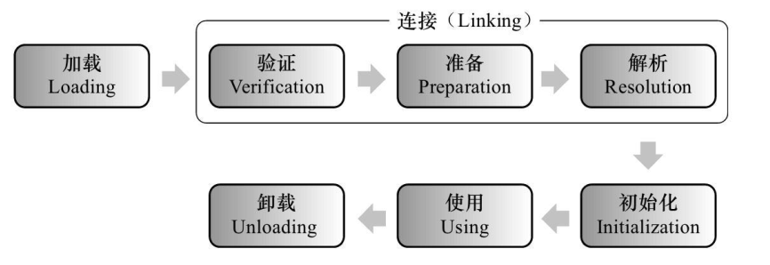

## 虚拟机类加载机制

### 类的生命周期

类从被加载到虚拟机内存开始，到卸载出内存为止，其整个生命周期包括：加载(Loading)、验证(Verification)、准备(Preparation)、解析(Resolution)、初始化(Initialization)、使用(Using)和卸载(Unloading)，其中验证、准备、解析3个部分统称为连接(Linking)。如下图所示



### 类加载的时机

虚拟机规范严格规定了*有且仅有* 以下五种情况必须立即对类进行 初始化(包括前面的加载、验证、准备阶段)

+ 遇到 new、getstatic、putstatic 或 invokestatic 这4条字节码指令时，如果类没有进行过初始化，则需要先触发其初始化。上述四条指令出现的代码场景分别是：*使用 new 关键字实例化对象*、*读取或设置一个类的静态字段(被 final 修饰、已在编译期把结果放入常量池的静态字段除外)*、*调用一个类的静态方法*

+ 使用 reflect 包的方法对类进行反射调用的时候，如果类没有进行过初始化，则需要先触发其初始化

+ 当初始化一个类的时候，如果其父类没有进行过初始化，则需要先触发其父类的初始化

+ 当虚拟机启动时，会先初始化主类(包含 main() 方法的那个类)

+ 当使用JDK 1.7的动态语言支持时，如果一个java.lang.invoke.MethodHandle实例最后的解析结果 REF_getStatic REF_putStatic REF_invokeStatic 的方法句柄，且这个方法句柄对应的类没有进行过初始化，则需要先触发其初始化

  上述五种场景中的行为称为是对一个类进行主动引用。除此以外所有引用类的方式称为 *被动引用*且不会触发初始化。以下为三个被动引用的例子：

  ```java
  /*被动引用 例子一*/
  /*通过子类引用父类的静态字段，不会导致子类初始化*/
  /*Hint:对于静态字段，只有直接定义这个字段的类才会被初始化*/
  public class SuperClass {
      static {
          System.out.println("Super Class Init !");
      }
  
      public static int value = 123;
  }
  
  public class SubClass extends SuperClass{
      static {
          System.out.println("SubClass Init !");
      }
  }
  
  public class ClassLoadTest {
      public static void main(String[] args) {
          System.out.println(SubClass.value);
      }
  }
  ```

  ```java
  /*被动引用 例子二*/
  /*通过通过数组定义来引用类，不会触发类的初始化*/
  public class ClassLoadTest {
      public static void main(String[] args) {
          SuperClass[] sca = new SuperClass[10];
      }
  }
  ```

  第二个例子并没有输出“SuperClass init !”，说明没有触发SuperClass类的初始化阶段。实际上这段代码触发了另一个类名为 [LSuperClass 的类的初始化过程，其是由虚拟机自动生成的、直接继承于 java.lang.Object 的子类，创建动作由字节码指令 newarray 触发。这个类代表了一个元素类型为SuperClass的一维数组，包含了数组应有的属性和方法。

  ```java
  /*被动引用 例子三*/
  /*常量在编译阶段会存入调用类的常量池中，本质上并没有直接引用到定义常量的类，因此不会触发定义常量的类的初始化*/
  public class ConstClass {
      static {
          System.out.println("ConstClass Init !");
      }
      public static final String HEELOWORLD = "hello world";
  }
  
  public class ClassLoadTest {
      public static void main(String[] args) {
          System.out.println(ConstClass.HEELOWORLD);
      }
  }
  ```

  第三个例子也没有输出“ConstClass Init !”。原因是编译阶段通过常量传播优化，已经将常量的值“hello world” 存储到了 ClassLoadTest 类的常量池中，以后ClassLoadTest 对常量Const.HELLOWORLD 的引用实际都转化为 ClassLoadTest  对自身常量池的引用

  > 接口也有初始化过程，接口与类初始化过程的区别在于 “当一个类初始化时，要求其父类全部都已经初始化”、“当一个接口初始化时，不要求其父接口全部完成初始化，只有在真正使用到父接口时在会初始化”