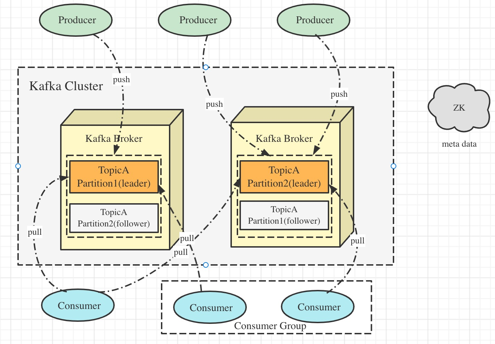

## kafka基础概念

### Kafka是什么？主要应用场景有哪些？

Kafka是一个分布式流式处理平台，具有三个关键功能

1. 消息队列：发布和订阅消息流
2. 容错的持久方式存储记录消息流：Kafka会把消息持久化到磁盘，有效避免了消失丢失的风险
3. 流式处理平台：在消息发布时进行处理，Kafka提供了一个完整的流式处理类库

Kafka主要有两大应用场景：

1. 消息队列：建立实时流数据管道，以可靠地在系统或应用程序之间获取数据
2. 数据处理：构建实时的流数据处理程序来转换或处理数据流

### 和其他消息队列相比，kafka的优势在哪里？

1. 极致的性能：基于Scala和Java语言开发，设计中大量使用了批量处理和异步的思想，最高可每秒处理千万级别的消息
2. 生态系统兼容性无可匹敌

### Kafka的架构图

+ Producer
  生产者，负责创建消息，投递到kafka集群中，投递时需指定Topic和partition
+ Consumer
  消费者，根据所订阅的Topic及所属的消费组，决定从哪些Partition中拉取消息
+ Broker
  消息服务器，可水平扩展，负责分区管理，消息持久化、故障自动转移等
+ Zookeeper
  集群的元数据管理功能

### Kafka的多副本机制了解么，带来了什么好处

partition的多副本冗余机制是指在其他Broker节点上有该partition的拷贝备用副本(follower)  
leader副本负责与生产者和消费者的读写请求。follower副本只负责同步leader副本的数据  
当leader副本发生故障时会从follower中选举出一个leader，确保高可靠。

#### Kafka的多分区(Partition)以及多副本(Replica)机制的好处有

1. Kafka通过给特定Topic指定多个Partition，而各个Partition可以分布在不同的Broker上，这样能提供比较好的并发能力(负载均衡)
2. Partition可以指定对应的Replica数，这极大地提高了消息存储的安全性，提高了容灾能力

### ZooKeeper 在 Kafka 中的作用了解么

1. Broker注册

   在ZooKeeper上有一个专门进行Broker服务器列表记录的节点。每个Broker在启动时会到ZooKeeper上进行注册，即到/broker/ids下创建属于自己的节点。每个节点就会将自己的IP地址和端口等信息记录到该节点中去

2. Topic注册

   在Kafka中，同一个Topic的消息会被分成多个分区并将其分布在多个Broker上，这些分区信息及与Broker的对应关系也都在ZK上维护。比如创建了一个名为my-topic的主题并且有两个分区，对应ZK上就会有 /brokers/topics/my-topic/partitions/0  /brokers/topics/my-topic/partitions/1

3. 负载均衡

   Kafka通过给特定Topic指定多个Partition，而各个Partition可以分布在不同的Broker上，这样便能提供较好的并发能力。对于同一个Topic的不同Partition，Kafka会尽力将这些Partition分布到不同Broker服务器上。当生产者生产消息后也会尽量投递到不同Broker的Partition里面。当Consumer消费的时候，ZK可以根据当前的Partition数量以及Consumer数量来实现动态负载均衡。