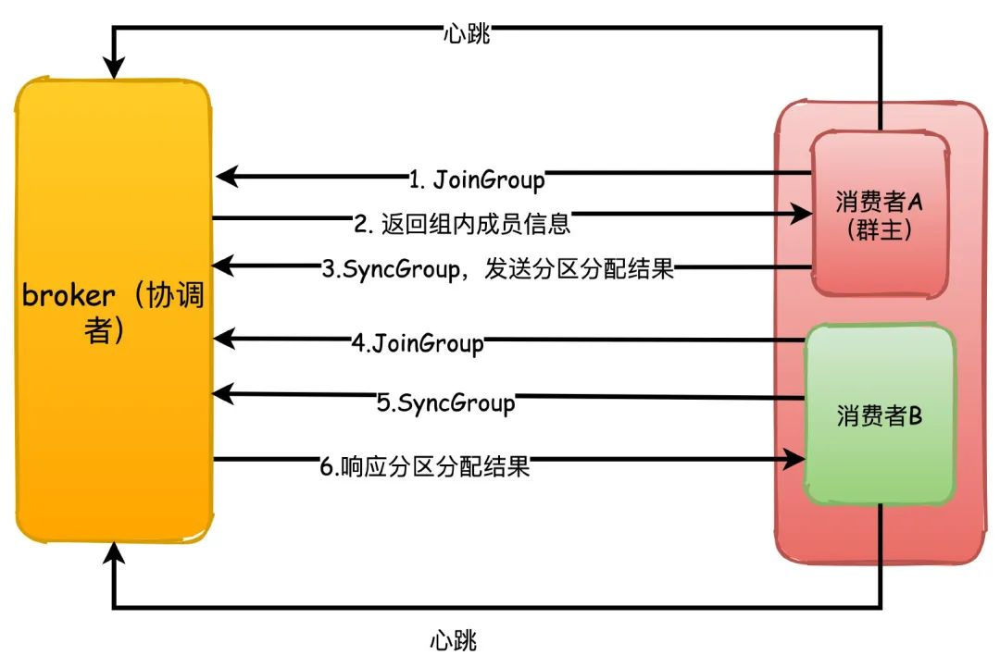

## Kafka常见面试题

### Kafka如何保证消息的消费顺序

1. 1个Topic只对应一个Partition
2. 发送消息的时候指定 key/Partition

### Kafka如何保证消息不丢失

#### 生产端 Producer

ISR机制：ZK中给每个Partition维护一个ISR列表，包含Leader以及跟Leader保持同步的Follower

1. 必须要求至少一个Follower在ISR列表里
2. 每次写入数据时，要求Leader和至少一个ISR里的Follower写入成功

> request.required.acks = -1 生产者发送消息要等到leader及所有副本都同步了才会返回ack
>
> min.insync.replicas 最小同步副本数量，如果没有达到这个要求，生产者会抛异常

#### 消费端 Consumer

消费者会自动每隔一段时间将offset保存到ZK上，此时如果刚好将偏移量提交到ZK上后，但是数据还没消费完，机器发生宕机，此时数据就丢失了

关闭自动提交，改为手动提交，每次数据处理完后再提交

### Kafka如何保证消息不重复消费

消费者组：由一个或多个消费者实例组成，多个实例共同订阅若干个主题，共同消费。当某个实例挂掉，其他实例会自动承担消费的分区

消费者组的位移提交机制

批量提交 顺序写 零拷贝

### 数据传输的事务定义有哪些

+ 最多一次：消息不会被重复发送，最多被传输一次，但也有可能一次不传输
+ 最少一次：消息不会被漏发送，最少被传输一次，但也有可能被重复传输
+ 精确的一次：不会漏传也不会重复传输，每个消息都传输一次且仅仅被传输一次

### kafka consumer 是否可以消费指定分区的消息

kafka consumer 消费消息时，向broker发出fetch请求去消费特定分区的消息，consumer指定消息在日志中的偏移量(offset)，就可以消费从这个位置开始的消息，customer拥有了offset的控制权，可以向后回滚去重新消费之前的消息

### kafka 的 ack 机制

request.required.acks 有三个值 0 1 -1

+ 0：生产者不会等待 broker 的 ack 这个延迟最低但是存储的保证最弱，当 server 挂掉的时候会丢数据
+ 1：服务端会等待 ack 值，leader 副本确认接收到消息后发送 ack 但是如果 leader 挂掉后他不确保是否复制完成，新的 leader 可能会导致数据丢失
+ -1：在 1 的基础上，服务端会等待所有的 follower 的副本收到数据才会收到 leader 发出的 ack

### kafka 的消费者如何消费数据

消费者每次消费数据的时候，消费者都会记录消费的物理偏移量(offset)的位置，等到下次消费时会接着上次位置继续消费

### kafka 生产数据时数据的分组策略

+ 生产者决定数据产生到集群的哪个 partition 中
+ 每条消息都是以(key value)格式
+ key 是由生产者发送数据传入

### kafka 是如何进行复制的

### kafka 是如何处理来自生产者和消费者请求的

### kafka的存储细节是怎样的

### kafka 通信过程原理
1. 首先kafka broker启动的时候，会去向ZK注册自己的ID(创建临时节点)，同时会去订阅ZK的brokers/ids路径，当有新的broker加入或退出时，可以得到当前所有broker信息
2. 生产者启动的时候会指定 bootstrap.servers，通过指定的broker地址，kafka会和这些broker创建TCP连接
3. 随便连接到任何一台broker之后，然后再发送请求获取元数据信息
4. 创建和所有broker的TCP连接
5. 发送消息
6. 消费者和生产者一样，也会指定 bootstrap.servers 属性，然后选择一台broker创建TCP连接，发送请求找到协调者所在的broker
7. 然后再和协调者broker创建TCP连接，获取元数据
8. 根据分区leader节点所在的broker节点，和这些broker分别创建连接
9. 最后开始消费消息

### 发送消息时如何选择分区的
1. 轮询，按照顺序消息依次发送到不同的分区
2. 随机，随机发送到某个分区
3. 对key取hash，然后对partition分区数取模，决定落在哪个分区

### 说说消费者组和消费者重平衡
kafka中消费者组订阅topic主题的消息，一般来说消费者的数量最好要和所有主题分区的数量保持一致最好。  
当消费者数量小于分区数量的时候，就会有一个消费者消费多个分区的消息。  
当消费者数量多于分区数量的时候，就会有消费者没有分区可以消费。

重平衡：消费者数量、主题数量、分区数量任何一个一旦发生变化，都会发送请求给协调者，由协调者的分区分配算法来重新获取分区的分配

重平衡的过程：
重平衡机制依赖消费者和协调者之间的心跳来维持，消费者会有一个独立的线程去定时发送心跳给协调者
1. 每个消费者第一次加入组的时候会向协调者发送 JoinGroup 请求，第一个发送这个请求的消费者会成为群主，协调者会返回组成员泪奔给群主
2. 群主执行分区分配策略，然后把分配结果通过SyncGroup 请求发送给协调者，协调者收到分区分配结果
3. 其他组内成员也向协调者发送SyncGroup，协调者把每个消费者的分区分配分别响应给他们

