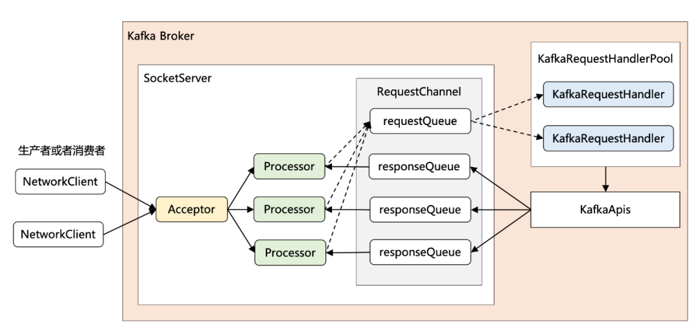
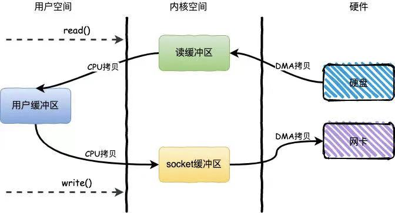

### kafka 高性能设计

### 生产消息的性能优化手段

##### 批量发送消息

Kafka作为一个IO密集型应用，其所面临的挑战主要是磁盘IO和网络IO  
磁盘IO方面，kafka采用**磁盘顺序IO**，其性能不亚于内存随机读写  
网络IO方面，kafka采用批量发送消息的方式，通过将多条消息按照分区进行分组，然后每次发送一个消息集合，减少网络传输的overhead

##### 消息压缩

消息压缩的目的是**减少网络传输贷款，降低磁盘IO，提供写磁盘的效率**

kafka 支持三种压缩算法：gzip snappy lz4。gzip压缩效果好，但生成耗时更长，综合比对lz4性能最佳

##### 高效序列化

kafka消息中的key和value，都支持自定义类型，只需要提供相应的序列化和反序列化器即可。因此用户可选择快速且紧凑的序列化方式来减少实际的网络传输量及磁盘存储量

##### 内存池复用

由于Producer发送消息是批量的，因此消息都会先写入Producer的内存中进行缓冲，直到多条消息组成了一个Batch，才会通过网络把Batch发给Broker。  
正常来说Batch发送完毕后，Producer的JVM内存中这部分数据会被JVM回收，但当JVMGC时，一定会存在Stop The World过程，这会影响Kafka高并发的性能  

在此背景下，引入kafka的内存池机制，其和连接池、线程池的本质一样，是为了提高复用，减少频繁的创建和释放。  

实现方式：Producer在启动时会占用一个固定大小的内存块，比如64M，然后划分成M个小内存块，比如小内存块大小是16KB。当需要创建一个新的Batch时，直接从内存池中取出
一个16KB的内存块，进行消息写入(容量上限为16KB)，接着将Batch发送给Broker后，此内存块就可以回到缓冲池里复用，根本不涉及垃圾回收。

### 存储消息的性能优化手段

##### I/O多路复用

kafka采用的是Reactor网络通信模型  
1个Accepter线程，负责监听新的连接，然后将新连接交给Processor线程处理  
N个Processor线程，每个Processor线程都有自己的selector，负责从socket中读写数据  
M个KafkaRequestHandler业务处理线程，通过调用KafkaApis进行业务处理，然后生成response再交由给Processor线程

##### 磁盘顺序写

Kafka作为消息队列，是先进先出的，消息一旦生成了就不可变。这种有序性和不可变性使得Kafka完全可以顺序写日志文件，即将消息追加到文件末尾

##### Page Cache

Kafka 利用操作系统本身的缓存技术，在读写磁盘日志文件时，操作的其实是内存，然后由操作系统决定什么时候将Page Cache里的数据真正刷入磁盘

Kafka作为消息队列，消息顺序写入，且立马被消费者读取，契合Page Cache 两大经典原理，是kafka做到高吞吐的重要因素之一
+ 时间局部性原理：最近访问的数据很可能接下来再访问到
+ 空间局部性原理：数据往往是连续访问的

##### 分区分段结构

磁盘顺序写加页缓存很好解决了日志文件的高性能读写问题。但如果一个Topic只对应一个日志文件，显然只能放在一台Broker机器上，面对海量消息时，
单机的存储容量和读写性能是有限的。  
Kafka 使用 分区分段 的存储设计  
分区：partition，是kafka并发处理的最小粒度，能解决存储的水平扩容问题，提升吞吐量  
分段：在存储底层，分区对应文件夹，分段对应真正的日志文件

+ 单体大文件不利于查找和维护
+ 作历史消息删除时，只需将旧的segment文件删除即可，保证了每个segment的顺序写

### 消费消息的性能优化手段

##### 稀疏索引

Kafka 所面临的查询场景较简单：按照offset 或者 timestamp 查询消息  

相比与B+树和哈希索引，稀疏索引是在磁盘空间、内存空间、查找性能等多方面的折中。  
当给定一个offset时，Kafka采用的是二分查找来高效定位不大于offset的物理位移，然后找到目标消息

##### mmap (memory mapped files)

常规的文件操作为了提高读写性能，使用来 page cache机制。但页缓存处在内核空间中，不能被用户进程直接寻址，所以读文件时还需要通过系统调用，将页缓存但数据再次拷贝到用户空间中  
采用mmap后，它将磁盘文件与进程虚拟地址做了映射，不会导致系统调用，及额外的内存copy开销，从而提高文件读取效率

##### 零拷贝 (zero copy)

消息借助稀疏索引被查询后，下一步是将消息从磁盘文件中读出来，然后通过网卡发送给消费者。  
零拷贝：数据直接从磁盘文件复制到网卡设备，无需经过应用程序，减少零内核和用户模式之间的上下文切换

###### 批量拉取

消费者每次拉取一个消息集合，从而减少网络传输的overhead