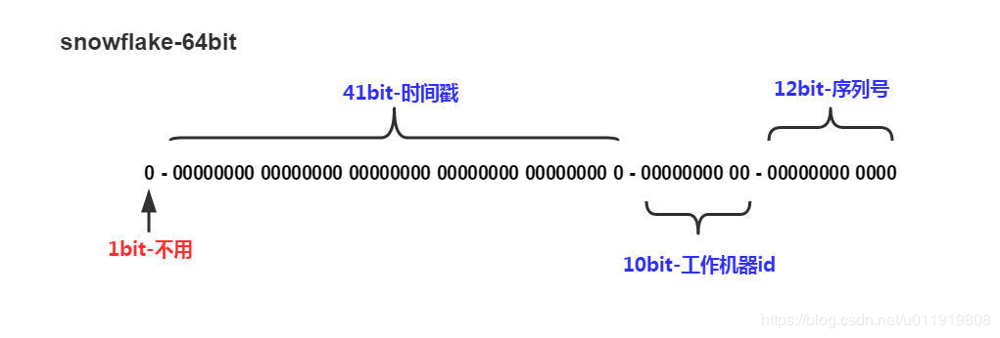

## 分布式id 生成方案

+ UUID
+ 雪花算法
+ 滴滴(Tinyid)
+ 美团(Leaf)
+ 百度(uid-generator)
+ Redis

### UUID

UUID的标准型包含32个16进制数字，以连字号分为五段，形式为8-4-4-4-12的36个字符

#### 优点

+ 性能非常高；本地生成，没有网络消耗

#### 缺点

+ 不易于存储：UUID太长
+ 信息不安全：基于MAC地址生成UUID的算法可能会造成MAC地址泄漏
+ ID作为主键时在特定的环境会存在一些问题，比如做DB主键的场景

### 雪花算法

雪花算法的核心思想是；分布式ID固定是long型的数字，一个long型占8个字节，也就是64个bit

+ 第一个bit位是标识部分，在java中由于long的最高位是符号位，正数是0，负数是-1，一般生成的ID为正数，所以固定为0
+ 时间戳部分占41bit，这个是毫秒级的时间，一般实现上不会存储当前的时间戳，而是时间戳的差值(当前时间-固定的开始时间)，这样可以使产生的ID从更小值开始；41位的时间戳可以使用69年
+ 工作机器id占10bit，这里比较灵活，比如，可以使前5位作为数据中心机房标识，后五位作为单机房机器标识，可以部署1024个节点
+ 序列号部分占用12bit，支持同一毫秒内同一节点可以生成4096个id

MongoDB的ObjectId就是类snowflake算法

#### 优点

+ 毫秒数在高位，自增序列在低位，整个ID都是趋势递增的
+ 不依赖数据库等第三方系统，生成ID的性能高，稳定性高
+ 可根据自身业务特性分配bit位，非常灵活

#### 缺点

+ 强制机器时钟，如果机器上时钟回拨，会导致发号重复或服务不可用
+ 机器很多的场景下，人力维护成本大且容易出错，雪花算法中的工作机器id较难实践

### 滴滴 Tinyid

常见的id生成方式就是db的auto_increment，该方案优点是简单，缺点是每次只能向db获取一个id，性能比较差，对db访问比较频繁，db的压力会比较大，优化的方案是一次向db获取一批id -- 号段模式

#### DB号段算法描述

| id   | biz_type | max_id | step | version |
| ---- | -------- | ------ | ---- | ------- |
| 1    | 1000     | 2000   | 1000 | 0       |

+ biz_type：代表业务类型，不同的业务的id隔离
+ max_id：代表当前最大的可用id
+ step：代表号段长度，可根据每个业务的qps来设置一个合理的长度
+ version：乐观锁，每次更新都加上version，保证并发更新的正确性

可通过以下步骤来获取一个可用的号段

1. 查询当前的max_id信息
2. 计算新的max_id
3. 更新db中的max_id
4. 如果更新成功则可用号段获取成功
5. 如果更新失败，则号段可能被其他线程获取，回到步骤A，进行重试

#### 号段生成方案的简单架构

id生成系统向外提供http服务，请求经过负载均衡router，到达其中一台tinyid-server，从事先加载好的号段中获取一个id，如果号段还没有加载，或者已经用完，则向db再申请一个新的可用号段，多台server之间因为号段生成算法的原子性，而保证每台server上的可用号段不重，从而使id生成不重

可以看到如果tinyid-server重启了，那么号段就作废了，会浪费一部分id；同时id也不会连续；每次请求可能会达到不同的机器上，id也不是单调递增的，而是趋势递增，不过这对于大部分业务都是可接收的。

#### 简单架构的问题

+ 当id用完时需要访问db加载新的号段，db更新可能存在version冲突，此时id生成耗时明显增加
+ db是一个单点，虽然db可以建设主从等高可用架构，但始终是一个单点
+ 使用http方式获取一个id，存在网络开销，性能和可用性都不太好

#### 优化方法

##### 双号段缓存

对于号段用完需要访问db，可以容易象到在号段用到一定程度的时候，就异步加载下一个号段，保证内存中始终有可用号段

##### 增加多db支持

db只有一个master时，如果db不可用，则获取号段不可用。实际上可以支持多个db，比如两个db，A和B，我们获取号段可以随机从其中一台上获取。那么如果A B都获取到了同一号段，如何保证生成的id不重呢？让A只生成偶数id，B只生产奇数id，对应的db设计增加了两个字段

| id   | biz_type | max_id | step | delta | remainder | version |
| ---- | -------- | ------ | ---- | ----- | --------- | ------- |
| 1    | 1000     | 2000   | 1000 | 2     | 0         | 0       |

+ delta 表示id每次的增量，remainder代表余数。例如可以将A B的delta都设置为2，remainder分别设置为0 1，则A的号段只生成偶数号段，B是奇数号段

##### 增加tinyid-client

使用http获取一个id，存在网络开销，是否可以本地生成id？为此我们提供了tinyid-client，我们可以向tinyid-server发送请求来获取可用号段，之后在本地构建双号段、id生成，由本地有双号段缓存，即可容忍tinyid-server一段时间down掉，可用性也有了较大的提升

#### 缺点

+ 系统水平扩展比较困难
+ ID没有单调递增特性

### 美团 Leaf

Leaf这个名字来自德国数学家莱布尼茨的一句话 There are no two identical leaves in the world

综合雪花算法和号段模式，Leaf在对应方案上做了优化，实现了Leaf-segment和Leaf-snowflake方案

#### Leaf-segment数据库方案

和号段模式类似

#### Leaf-snowflake方案

Leaf中workId是基于ZK的顺序id来生成的，每个应用在使用Leaf-snowflake时，在启动时会在ZK中生成一个顺序id，相当于一台机器对应一个顺序节点

### 百度 uid-generator

uid-generator中的workId是由uid-generator自动生成的，应用在启动时会往数据库表(uid-generator需要新增一个WORKER_NODE表)中去插入一条数据，数据插入成功后返回的该数据对应的自增唯一id就是该机器的workId，而数据由host，post组成。

对于uid-generator中的workId，占用了22个bit位，时间占用了28个bit位，序列化占用了13个bit位