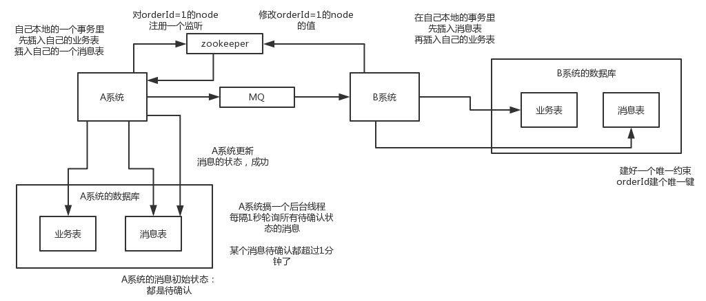

## 分布式事务

+ XA方案
+ TCC方案
+ SAGA方案
+ 本地消息表
+ 可靠消息最终一致性方案
+ 最大努力通知方案

### 两阶段提交方案/XA方案

系统中存在一个 **事务管理器**，负责协调多个数据库的事务，事务管理器先询问每个数据库是否准备好，如果每个数据库都回复OK，就正式提交事务，在各个数据库上执行操作；如果任何其中一个数据库回答不OK，那么就回滚事务。

缺点：严重依赖于数据库层面来实现复杂的事务，效率较低；而且微服务场景下，每个服务只允许操作自己对应的数据库，需要操作其他服务的库，通过调用其他服务的接口来实现。

### TCC方案

TCC的全称是：Try、Confirm、Cancel

+ Try阶段：这个阶段是对各个服务的资源做检测以及对资源进行锁定或预留
+ Confirm阶段：这个阶段是在各个服务中执行实际的操作
+ Cancel阶段：如果任务一个服务的业务方法执行出错，那么就需要补偿，即执行已经执行成功的业务逻辑的回滚操作

缺点：事务回滚严重依赖于手写代码来回滚和补偿，较难维护

### Saga方案

#### 基本原理

业务流程中每个参与者都提交本地事务，若某个参与者失败，则补偿前面已经成功的参与者。

#### 使用场景

对于一致性要求高、短流程、并发高的场景，如：金融核心系统，会优先考虑TCC方案。而在另外一些场景我们只需要保证最终一致性即可。

比如很多金融核心的上层业务(渠道层、产品层、系统集成层)，这些系统的特点是最终一致就可、流程多、流程长、还可能调用其他公司的服务。这种情况下如果选择TCC方案的话，成本高，无法要求其他公司服务也遵循TCC模式，同时流程长，事务边界长，加锁时间长，会影响并发性能。

故Saga模式的适用场景是：

+ 业务流程长、业务流程多；
+ 参与者包含其他公司或遗留系统服务，无法提供TCC模式要求的三个接口

#### 优势

+ 一阶段提交本地事务，无锁，高性能；
+ 参与者可异步执行，高吞吐；
+ 补偿服务易于实现，因为一个更新操作的反向操作是比较容易理解的

#### 缺点

+ 不保证事务的隔离性

### 本地消息表

1. A系统在自己本地一个事务里操作同时，插入一条数据到消息表；
2. 接着A系统将这个消息发送到MQ中去；
3. B系统接收到消息之后，在一个事务里，往自己本地消息表里插入一条数据，同时执行其他的业务操作，如果这个消息已经被处理过，那么此时这个事务会回滚，保证不会重复处理消息；
4. B系统执行成功之后，会更新自己本地消息表的状态以及A系统消息表的状态；
5. 如果B系统处理失败了，那么就不会更新消息表状态，那么此时A系统会定时扫描自己的消息表，如果有未处理的消息，会再次发送到MQ中去，让B再次处理；
6. 这个方案保证了最终一致性，哪怕B事务失败了，但是A会不断重发消息，直到B成功为止

缺点：严重依赖于数据库的消息表来管理事务，不适用于高并发场景，不易扩展

### 可靠消息最终一致性方案

1. A系统先发送一个prepared消息到mq，如果这个prepared消息发送失败那么就直接取消操作
2. 如果这个消息发送成功，那么接着执行本地事务，如果成功就告诉mq发送确认消息，如果失败就告诉mq回滚消息
3. 如果发送了确认消息，那么此时B系统会收到确认消息，然后执行本地的事务
4. mq会自动定时轮询所偶prepared消息回调你的接口，询问这个消息是否本地事务处理失败了，所有没发送确认的消息，是继续重试还是回滚？一般来说可以查下数据库看之前本地事务是否执行，如果回滚则回滚。避免可能本地事务执行成功而确认消息却发送失败
5. 要是系统B的事务失败了咋办？不断重试直到成功，如果实在不行，要么就是针对重要的资金类业务进行回滚，比如B系统本地回滚后，想办法通知系统A也回滚；或者是发送报警由人工来手工回滚和补偿。

