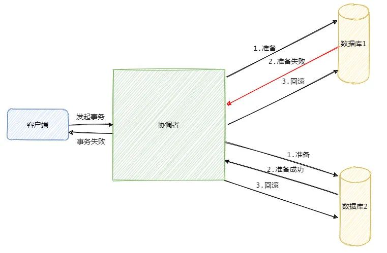
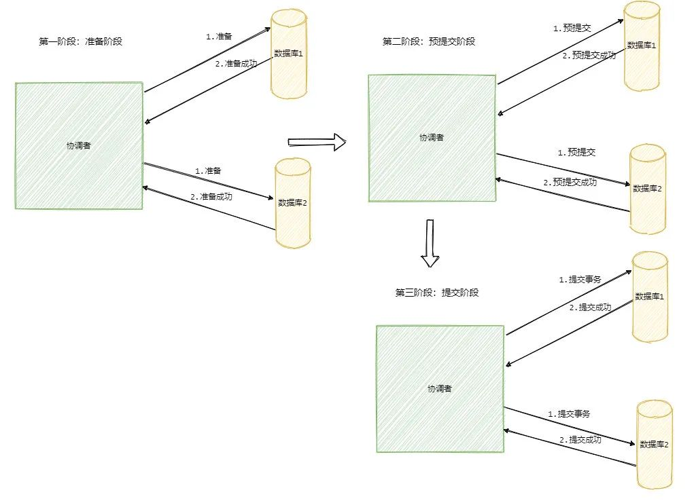
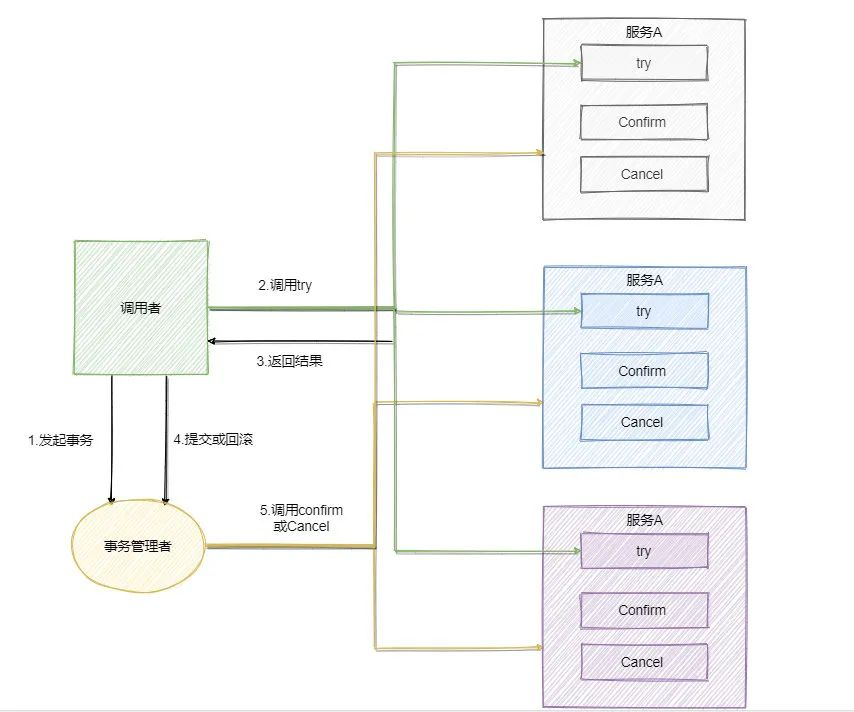
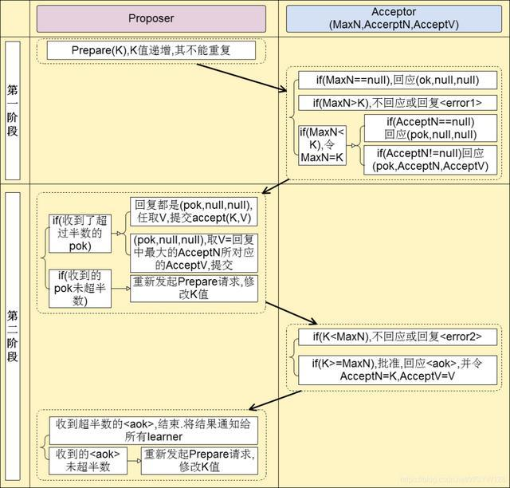
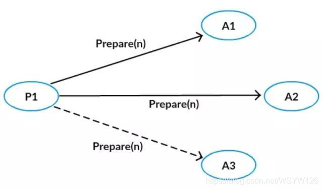
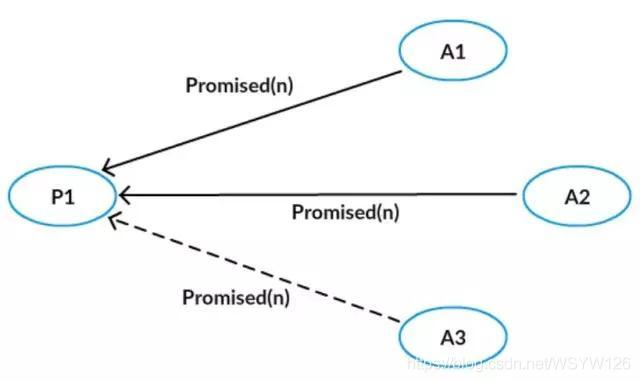
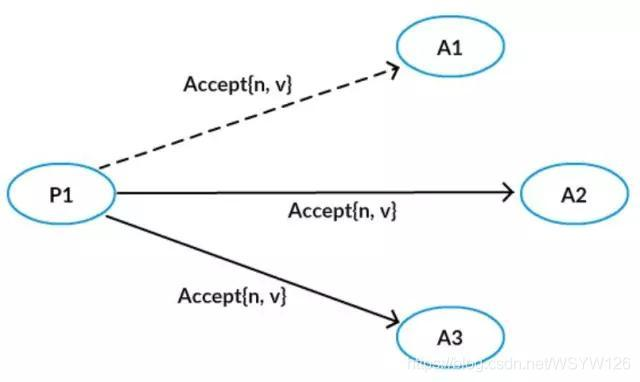
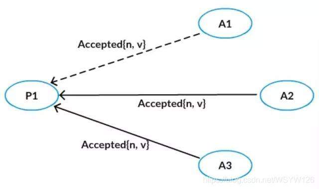

### 背景

在常见的分布式系统中，总会发生诸如机器宕机或网络异常(包括消息的延迟、丢失、重复、乱序、网络分区等)情况。  

一致性算法需要解决的问题就是如何在一个可能发生上述异常的分布式系统中，快速且正确地在集群内部对某个数据的值达成一致，且保证不论发生以上任何异常，都不会破坏整个系统的一致性。

### CAP 定理

CAP理论指出对于一个分布式系统来说，当涉及读写操作时，只能同时满足以下三点中的两个：

+ 一致性(Consistence)：所有节点访问同一份最新的数据副本
+ 可用性(Availablity)：非故障的节点在合理的时间内返回合理的响应
+ 分区容错性(Partition tolerance)：以实际效果而言，分区相当于对通信的时限要求。系统如果不能在时限内达成数据一致性，就意味着发生了分区的情况，必须就当前操作在C和A之间做出选择

> 网络分区：分布式系统中，多个节点之前的网络本来是连通的，但因为某些故障某些节点之间不连通了，整个网络就分成了几块区域

### 分布式系统理论上只能选择CP或AP架构

当发生网络分区的时候，如果我们要继续服务，那么强一致性和可用性只能二选一。也就是说当网络分区之后P是前提，决定了P之后才有C和A的选择。也就是说分区容错性是一定要满足的。

常见的CP架构：ZooKeeper HBase

常见的AP架构：Cassandra Eureka

### BASE理论

Base 理论是对CAP中一致性C 和可用性A权衡的结果，其来源于对大规模互联网系统分布式实践的总结，是基于CAP定理逐步演化而来的，它大大降低了我们对系统的要求。BASE理论本质上是对CAP中AP方案的一个补充

+ Basically Available 基本可用
+ Soft-state 软状态
+ Eventually Consistent 最终一致性

#### 基本可用

基本可用是指分布式系统在出现不可预知故障的时候，允许损失部分可用性

+ 响应时间上的损失：正常情况下处理请求需要0.5s，由于系统出现故障，处理请求的时间为3s
+ 系统功能上的损失：正常情况下用户可使用系统全部功能，由于系统访问量激增，部分非核心功能不可用

#### 软状态

软状态是指允许系统中的数据存在中间状态(CAP理论中的数据不一致)，并认为该中间状态的存在不会影响系统的整体可用性，即允许系统在不同节点的数据副本之间进行数据同步的过程存在延时

#### 最终一致性

最终一致性强调的是系统所有的数据副本，在经过一段时间的同步后，最终能够达到一个一致的状态。

> 分布式一致性的三种级别：
>
> 1. 强一致性：系统写入什么，读出来就是什么
> 2. 弱一致性：不一定可以读取到最新写入的值，也不保证多少时间之后读取到的数据是最新的，只是会尽量保证某个时刻达到数据一致的状态
> 3. 最终一致性：弱一致性的升级版，系统会保证在一定时间内达到数据一致的状态

### 2PC (Two-phase Commit)

1. 准备阶段 (Prepare)

   协调者向所有参与者发送准备命令，同步等待所有资源的响应；参与者执行事务内容，除了最后一步提交，执行结果同步响应给协调者。

2. 提交阶段 (Commit)

   第一阶段所有参与者均准备成功，协调者向所有参与者发送提交事务命令；若第一阶段有一个参与者返回失败，那么协调者向所有参与者发送回滚事务的请求。参与者释放整个事务执行期间占用的事务资源向协调者发送Ack消息，反馈结果。

缺点：

1. 同步阻塞问题

   第一阶段需要等待所有参与者响应结果，协调者会进行不断重试，可根据超时机制触发第二阶段回滚。第二阶段等待ack没有超时机制，只能不断重试直至人工介入处理。

2. 单点故障

   发送回滚命令或者提交命令前协调者出现故障，那么会导致参与者阻塞，占用事务资源。**通过选举机制，选举新的协调者** 

3. 数据不一致

   协调者向参与者发送回滚或提交命令后宕机，部分参与者收到了命令并执行，导致整个系统出现了数据不一致的现象

> 无法解决的问题：协调者发出二阶段命令后宕机，而参与者也宕机的情况下，事务的状态是不能确定的

### 3PC (Three-phase Commit)

1. 准备阶段 (CanCommit)

   协调者向参与者发送准备请求，询问是否可以执行事务操作，然后开始等待参与者响应；参与者**不会锁资源执行事务**，而是判断自身是否可以顺利执行该事务，并将结果反馈给协调者

2. 预提交阶段 (PreCommit)

   如果准备阶段所有参与者都反馈正常，协调者向参与者发送预提交请求；参与者执行事务直至提交阶段，并响应Ack给协调者。

   如果有参与者反馈了no响应，或者等待超时后，协调者都没收到响应，则触发回滚

3. 提交阶段 (DoCommit)

   协调者接收预提交阶段的所有ACK响应，向所有参与者发送提交请求；参与者正式提交事务并释放所有事务资源，响应Ack给协调者

> 本质上，3PC引入了参与者超时机制，并且增加了预提交阶段使得故障恢复之后协调者的决策复杂度降低，但整体的交互过程更长了，性能有所下降，并且还是会存在数据不一致问题

### TCC

TCC的全称是：Try、Confirm、Cancel

+ Try阶段：这个阶段是对各个服务的资源做检测以及对资源进行锁定或预留
+ Confirm阶段：这个阶段是在各个服务中执行实际的操作
+ Cancel阶段：如果任务一个服务的业务方法执行出错，那么就需要补偿，即执行已经执行成功的业务逻辑的回滚操作

缺点：事务回滚严重依赖于手写代码来回滚和补偿，较难维护

### Paxos

一个或多个节点可提出提议。系统针对所有提案中的某个提案必须达成一致。最多只能对一个确定的提案达成一致。只要超过半数的节点存活且可互相通信，整个系统一定能达到一致状态。

+ 倡议者proposer：提交一个提案，等待大家批准为结案，一般是客户端
+ 接受者acceptor：负责对提案进行投票，一般是服务端，超过半数的接受者投票及被选中
+ 学习者learner：被告知提案结果，不参与投票过程

#### 过程

1. 第一阶段A

   Proposer选择一个提议编号n，向所有的Accepter广播Prepare(n)请求。

   

2. 第一阶段B

   

   Acceptor接收到Prepare(n)请求，若提议编号n比之前接收的Prepare请求都要大，则承诺不会接收提议编号比n小的提议，并且带上之前Accept的提议中编号小于n的最大的协议

3. 第二阶段A

   

   Proposer得到了多数Acceptor的承诺后，如果没有发现有一个Acceptor接受过一个值，那么向所有的Acceptor发起自己的值和提议编号n，否则，从所有接受过的值中选择对应的提议编号最大的，作为提议的值，提议编号仍为n

4. 第二阶段B

   

   Acceptor接收到提议后，如果该提议编号不违反自己做过的承诺，则接受该提议。

##### Paxos 举例

在Paxos岛上有A1,A2,A3,A4,A5五位议员，就税率问题进行决议。

1. 假设A1说：税率应该是10%，而此时只有他一个人提议。

   A2-5都会回应他：我们收到了你的提案，等待最终的批准。A1收到2份回复后就可以发布最终的决议：税率定为10%，不用再讨论了。

2. 假设A1,A5分别同时提出10%和20%的税率，A1的草案由4位侍从送到A2-A5那里，但由于网络等原因，只送到了A2和A3。同样的情况，A5的草案送到了A4和A3的手中。现在，A1，A2，A3收到了A1的提案，A3，A4，A5收到了A5的提案，需要由A3进行决策批准哪一个：

   1. 假设A1的提案先送到了A3，而A5的侍从耽搁了很久才到(决议已成型)，A3回复A5：兄弟，你来的太晚了，税率已经定好，不用折腾了

   2. 假设A1的提案先送到了A3，而A5的侍从只是稍晚一些(决议未成型)，A3依然将接受回复给A1.如果A5的地位很高，则回复A5：我已收到您的提案，等待最终批准，但您之前有人提出税率定位10%，请明察(A1广播时未超半数，A5广播超半数)。如果A5没地位，则直接不回复。等待A1广播：税率定为10%

   3. A1和A5同样提出上述提案，A1可以正常联系A2和A3，A5也可以正常联系这两个人，这次A2先收到A1的提案；A3先收到A5的提案。A5更有地位。

      在这种情况下，已经回答A1的A2发现有比A1更有地位的A5提出了税率20%的新提案，于是回复A5:我已收到您的提案，等待最终批准

      而回复A5的A3发现A1是个小人物，不予回答。此时A5超过半数的回复，广播最后结果

#### Paxos协议最终解决的问题

​	将所有节点都写入同一个值，且被写入后不能更改。当一个提议被多数派接受后，这个提议对应的值被Chosen，一旦有一个值被Chosen，那么只要按照协议的规则继续交互，后续被Chosen的值都是同一个值

### Raft

三个角色

+ follower：所有节点都以follower状态开始
+ candidate：如果没有收到leader消息则会变成candidate状态，会向其他节点拉选票，如果得到大部分票则成为leader
+ leader：所有对系统的修改都会先经过leader

两个基本过程

http://thesecretlivesofdata.com/raft/

+ Leader选举：每个follower会等待随机的一段election timeout时间变成candidate触发选举，其立马投自己一票，并发送请求给其他节点，其他节点若在本轮选举中还未投票则投票给候选人，并重置自己election timeout时间，一旦一个候选人获得了超过半数的选票则被选为leader。leader周期发送Append Entries消息给其他followers，内容是心跳超时时间，followers接收并作响应。直到某个follower停止接收心跳并处于candidate状态，leader停止，其他节点开始重新选举。
+ Log Replication：系统的更新操作会先记录到leader的log entry里。此时事务还未提交，不会真正修改node的value。leader将操作记录同步给followers，当半数以上节点写入其log并返回ok，leader才提交事务，同时通知followers提交事务