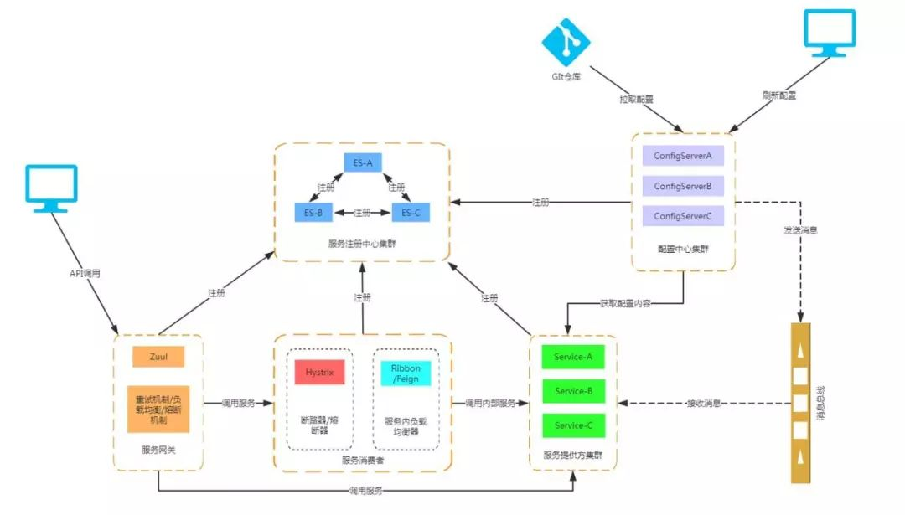

## Spring Cloud

### 什么是Spring Cloud

Spring Cloud 是微服务系统架构的一站式解决方案，为分布式系统模式提供了一种简单且易于接收的编程模型，帮助开发人员构建有弹性的、可靠的、协调的应用程序。Spring Cloud 构建于 Spring Boot之上，轻松地实现微服务项目的构建

+ Eureka 服务发现框架
+ Ribbon 进程内负载均衡器
+ Open Feign 服务调用映射
+ Hystrix 服务降级熔断器
+ Zuul 微服务网关
+ Config 微服务统一配置中心
+ Bus 消息总线

### 服务发现框架 - Eureka

#### 服务发现

​	扮演中介的角色，整个过程有三个角色：服务提供者、服务消费者、服务中介

#### 服务提供者

​	提供一些自己能够执行的一些服务给外界

#### 服务消费者

​	需要使用一些服务的用户

#### 服务中介

​	服务提供者和服务消费者之间的桥梁，服务提供者可以把自己注册到服务中介，而服务消费者如需要消费一些服务就可以在服务中介中寻找注册在服务中介的服务提供者。

#### 服务注册 Register

​	当 Eureka 客户端向 Eureka Server 注册时，它提供自身的元数据，比如IP地址、端口等

#### 服务续约 Renew

​	Eureka 客户会每隔30秒(默认情况下)发送一次心跳来续约。通过续约告知Eureka Server 该 Eureka 客户仍然存在，没有出现问题。正常情况下，如果Eureka Server 在90秒内没有收到Eureka客户的续约，它会将实例从其注册表中删除。

#### 获取注册列表信息 Fetch Registries

​	Eureka 客户端从服务器获取注册表信息，并将其缓存在本地。客户端会使用该信息查找其他服务，从而进行远程调用。该注册列表定期更新。每次返回注册列表信息可能与Eureka客户端的缓存信息不同，Eureka客户端自动处理。在默认情况下，Eureka客户端使用压缩JSON格式来获取注册列表的信息。

#### 服务下线 Cancel

​	Eureka客户端在程序关闭时向Eureka服务器发送取消请求。发送请求后，该客户端实例信息将从服务器的实例注册表中删除。

#### 服务剔除 Eviction

​	在默认情况下，当Eureka客户端连续90秒(3个续约周期)没有向Eureka服务器发送服务续约，即心跳，Eureka服务器会将该服务实例从服务注册列表删除

### 负载均衡之Ribbon

Ribbon 是 Netflix 公司的一个开源的负载均衡项目，是一个客户端/进程内负载均衡器，运行在消费者端。

#### 原理：

​	Consumer 端获取到了所有的服务列表之后，在其内部使用负载均衡算法，进行对多个系统的调用

#### Nginx 和 Ribbon 的对比

Nginx是一种集中式的负载均衡器，将所有请求都集中起来，然后再进行负载均衡

#### Ribbon的几种负载均衡算法

+ RoundRobinRule：轮询策略(默认)，若经过一轮轮询没有找到可用的provider，其最多轮询10轮。若最终还没有找到，则返回null
+ RandomRule：随机策略，从所有可用的provider中随机选择一个
+ RetryRule：重试策略。先按照RoundRobinRule策略获取Provider，若获取失败，则在指定的时限内重试。默认时限为500ms

### Open Feign

OpenFeign 也是运行在消费者端，使用Ribbon进行负载均衡，所以OpenFeign直接内置了Ribbon

### Hystrix

在分布式环境中，不可避免地会有许多服务依赖项中的某些失败。Hystrix是一个库，可通过添加等待时间容限和容错逻辑来帮助您控制这些分布式服务之间的交互。Hystrix通过隔离服务之间的访问点，停止服务之间的级联故障并提供后备选项来实现此目的，所有这些都可以提高系统的整体弹性。

+ 熔断：Hystrix的断路器模式，防止服务雪崩，@HystrixCommand，每当调用时间超过指定时间时，断路器将会中断对这个方法的调用
+ 降级：Hystrix的后备处理模式，为了更好的用户体验，当一个方法调用异常时，通过执行另一种代码逻辑来给用户友好的回复

### 微服务网关 - Zuul

网关是系统唯一对外的入口，介于客户端与服务端之间，用于对请求进行鉴权、限流、路由、监控等功能。

#### Zuul的路由功能

+ 简单配置 注册Eureka + @EnableZuulProxy
+ 统一前缀
+ 路由策略配置
+ 服务名屏蔽
+ 路径屏蔽

#### Zuul的过滤功能

继承 ZuulFilter，然后将这个过滤器以 @Component 注解注入到Spring 容器中

+ 请求时间日志打印功能
+ 令牌同限流功能

